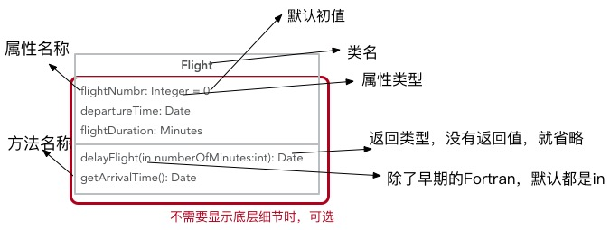
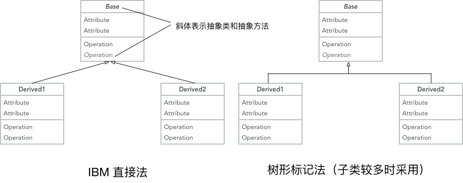
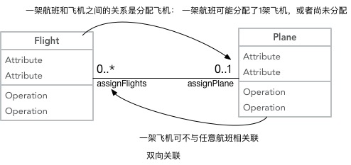

# 20180528 UML

------

原文链接： https://www.ibm.com/developerworks/cn/rational/rationaledge/content/feb05/bell/index.html

在 UML 2 中有二种基本的图范畴：**结构图和行为图**。每个 UML 图都属于这二个图范畴。

1）结构图的目的是显示建模系统的静态结构。它们包括类，组件和（或）对象图。

2）另一方面，行为图显示系统中的对象的动态行为，包括如对象的方法，协作和活动之类的内容。行为图的实例是活动图，用例图和序列图。

## 1- 基础

如先前所提到的，类图的目的是显示建模系统的类型。在大多数的 UML 模型中这些类型包括：

- 类
- 接口
- 数据类型
- 组件

UML 为这些类型起了一个特别的名字：“分类器”。通常地，你可以把分类器当做类，但在技术上，分类器是更为普遍的术语，它还是引用上面的其它三种类型为好。

### 基本类图

一个基本类图如下，

### 带继承关系的类图

两种方式，一种是在IBM Rational Rose和IBM Rational XDE中使用的方法， 另一种采用树形标记。

## 2- 关联

有5种关联类型。

### 双向关联

彼此之间都知道对方的联系

多重值和它们的表示，

| 序号 | 表示 | 含义              |
| ---- | ---- | ----------------- |
| 1    | 0..1 | 0个或者1个        |
| 2    | 1    | 有且有1个         |
| 3    | 0..* | 0个或者多个       |
| 4    | *    | 0个或者多个(同上) |
| 5    | 1..* | ``>=1`` 个        |
| 6    | 3    | 只能有3个         |
| 7    | 0..5 | 0~5个             |

参考：

UML 基础：https://www.ibm.com/developerworks/cn/rational/rationaledge/content/feb05/bell/index.html

 [UML建模之时序图（Sequence Diagram）教程](http://www.cnblogs.com/langtianya/p/3825764.html)

UML类图简明教程：https://blog.csdn.net/AllenWells/article/details/47398091

 深入浅出UML类图（一）：https://blog.csdn.net/lovelion/article/details/7838679

UML实践详细经典教程----用例图、顺序图、状态图、类图、包图、协作图：https://blog.csdn.net/zfrong/article/details/4086424

