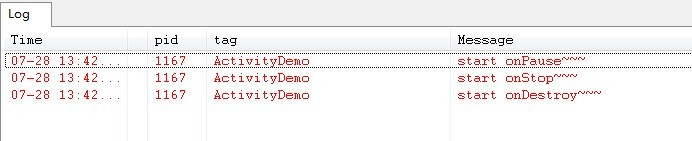
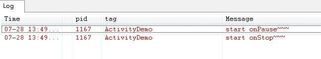
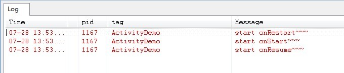
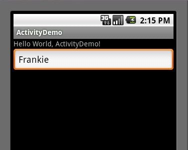

# 20180413 activity 的生命周期

```java
1- 开始启动： onCreate() --> onStart() --> onResume();
2- Back 键：程序结束， onPause()--> onStop() --> onDestroy();
3- Home 键：程序挂起， onPause() 【保存当前信息】--> onStop() --> 启动另一个程序
4- 重启， onRestart()  【恢复当前信息】--> onStart() --> onResume()
```


------

原文链接：https://blog.csdn.net/android_tutor/article/details/5772285

大家好，今天给大家详解一下Android中Activity的生命周期，我在前面也曾经讲过这方面的内容，但是像网上大多数文章一样，基本都是翻译Android API，过于笼统，相信大家看了，会有一点点的帮助 ，但是还不能完全吃透，所以我今天特意在重新总结一下.

首先看一下Android api中所提供的Activity生命周期图(不明白的，可以看完整篇文章，在回头看一下这个图，你会明白的):


Activity其实是继承了ApplicationContext这个类，我们可以重写以下方法，如下代码:

```java
public class Activity extends ApplicationContext {  
       protected void onCreate(Bundle savedInstanceState);           
       protected void onStart();              
       protected void onRestart();           
       protected void onResume();           
       protected void onPause();           
       protected void onStop();           
       protected void onDestroy();  
   }  
```

为了便于大家更好的理解，我简单的写了一个Demo,不明白Activity周期的朋友们，可以亲手实践一下，大家按照我的步骤来。

第一步:新建一个Android工程，我这里命名为ActivityDemo.

第二步:修改ActivityDemo.java(我这里重新写了以上的七种方法，主要用Log打印),代码如下:

```java
package com.tutor.activitydemo;  
import android.app.Activity;  
import android.os.Bundle;  
import android.util.Log;  
public class ActivityDemo extends Activity {       
    private static final String TAG = "ActivityDemo";  
      
    public void onCreate(Bundle savedInstanceState) {  
        super.onCreate(savedInstanceState);  
        setContentView(R.layout.main);  
          
        Log.e(TAG, "start onCreate~~~");  
    }  
      
    @Override  
    protected void onStart() {  
        super.onStart();  
        Log.e(TAG, "start onStart~~~");  
    }  
      
    @Override  
    protected void onRestart() {  
        super.onRestart();  
        Log.e(TAG, "start onRestart~~~");  
    }  
      
    @Override  
    protected void onResume() {  
        super.onResume();  
        Log.e(TAG, "start onResume~~~");  
    }  
      
    @Override  
    protected void onPause() {  
        super.onPause();  
        Log.e(TAG, "start onPause~~~");  
    }  
      
    @Override  
    protected void onStop() {  
        super.onStop();  
        Log.e(TAG, "start onStop~~~");  
    }  
      
    @Override  
    protected void onDestroy() {  
        super.onDestroy();  
        Log.e(TAG, "start onDestroy~~~");  
    }        
}   
```

第三步:运行上述工程,效果图如下(没什么特别的):


核心在Logcat视窗里,如果你还不会用Logcat你可以看一下我的这篇文章[ Log图文详解(Log.v,Log.d,Log.i,Log.w,Log.e)](http://blog.csdn.net/Android_Tutor/archive/2009/12/26/5081713.aspx) ，我们打开应用时先后执行了onCreate()->onStart()->onResume三个方法，看一下LogCat视窗如下:


**BACK键：**

当我们按BACK键时，我们这个**应用程序将结束**，这时候我们将先后调用onPause()->onStop()->onDestory()三个方法，如下图所示:



**HOME键:**

当我们打开应用程序时，比如浏览器，我正在浏览NBA新闻，**看到一半时，我突然想听歌，这时候我们会选择按HOME键，然后去打开音乐应用程序，而当我们按HOME的时候**，Activity先后执行了onPause()->onStop()这两个方法，这时候**应用程序并没有销毁**。如下图所示:



而当我们再次启动ActivityDemo应用程序时，则先后分别执行了onRestart()->onStart()->onResume()三个方法，如下图所示:



这里我们会引出一个问题，当我们按HOME键，然后再进入ActivityDemo应用时，我们的应用的状态应该是和按HOME键之前的状态是一样的，同样为了方便理解，在这里我将ActivityDemo的代码作一些修改，就是增加一个EditText。

第四步:修改main.xml布局文件（增加了一个EditText),代码如下:

```java
<?xml version="1.0" encoding="utf-8"?>  
<LinearLayout xmlns:android="http://schemas.android.com/apk/res/android"  
    android:orientation="vertical"  
    android:layout_width="fill_parent"  
    android:layout_height="fill_parent"  
    >  
<TextView    
    android:layout_width="fill_parent"   
    android:layout_height="wrap_content"   
    android:text="@string/hello"  
    />  
<EditText  
    android:id="@+id/editText"  
    android:layout_width="fill_parent"  
    android:layout_height="wrap_content"  
/>  
</LinearLayout>  
```

第五步:然后其他不变，运行ActivityDemo程序,在EditText里输入如"Frankie"字符串(如下图:)



这时候，大家可以按一下HOME键，然后再次启动ActivityDemo应用程序，这时候EditText里并没有我们输入的"Frankie"字样，如下图:


这显然不能称得一个合格的应用程序，所以我们需要**在Activity几个方法里自己实现**，如下第六步所示:

第六步修改ActivityDemo.java代码如下:

```java
package com.tutor.activitydemo;  
import android.app.Activity;  
import android.os.Bundle;  
import android.util.Log;  
import android.widget.EditText;  
public class ActivityDemo extends Activity {  
     
    private static final String TAG = "ActivityDemo";  
    private EditText mEditText;  
    //定义一个String 类型用来存取我们EditText输入的值  
    private String mString;  
    public void onCreate(Bundle savedInstanceState) {  
        super.onCreate(savedInstanceState);  
        setContentView(R.layout.main);  
        mEditText = (EditText)findViewById(R.id.editText);  
        Log.e(TAG, "start onCreate~~~");  
    }  
      
    @Override  
    protected void onStart() {  
        super.onStart();  
        Log.e(TAG, "start onStart~~~");  
    }  
    //当按HOME键时，然后再次启动应用时，我们要恢复先前状态  
    @Override  
    protected void onRestart() {  
        super.onRestart();  
        mEditText.setText(mString);  
        Log.e(TAG, "start onRestart~~~");  
    }  
      
    @Override  
    protected void onResume() {  
        super.onResume();  
        Log.e(TAG, "start onResume~~~");  
    }  
      
    //当我们按HOME键时，我在onPause方法里，将输入的值赋给mString  
    @Override  
    protected void onPause() {  
        super.onPause();  
        mString = mEditText.getText().toString();  
        Log.e(TAG, "start onPause~~~");  
    }  
      
    @Override  
    protected void onStop() {  
        super.onStop();  
        Log.e(TAG, "start onStop~~~");  
    }  
      
    @Override  
    protected void onDestroy() {  
        super.onDestroy();  
        Log.e(TAG, "start onDestroy~~~");  
    }  
      
}  
```

第七步:重新运行ActivityDemo程序，重复第五步操作，当我们按HOME键时，再次启动应用程序时，EditText里有上次输入的"Frankie"字样，如下图如示:


OK,大功基本告成，这时候大家可以在回上面看一下Activity生命周期图，我想大家应该完全了解了Activity的生命周期了，不知道你了解了没？


