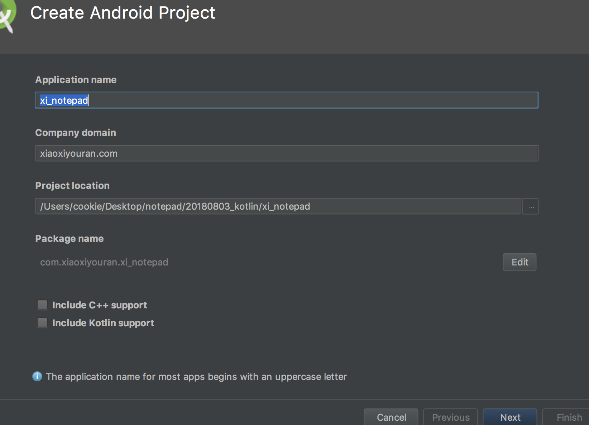
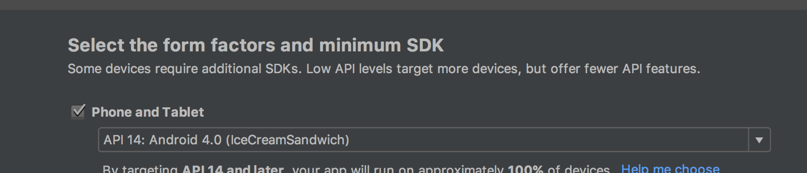
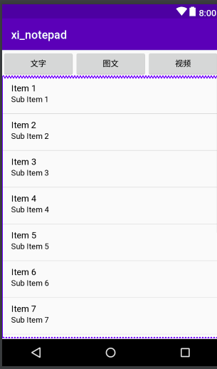
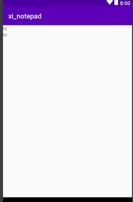
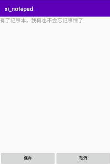

# 20180803创建一个记事本的功能

## 创建数据库

1- 新建一个工程，名字随意



2- 选择的平台是Android.4.0



3- 下一步下一步，创建一个Empty activity.

4- 创建一个 NotesDB 数据库类；

```java
package com.xiaoxiyouran.xi_notepad;

import android.content.Context;
import android.database.sqlite.SQLiteDatabase;
import android.database.sqlite.SQLiteOpenHelper;

/**
 * Created by cookie on 2018/8/3.
 */

public class NotesDB extends SQLiteOpenHelper {

        public static final String TABLE_NAME = "notes";    // 指定表名
        public static final String CONTENT = "content";     // 指定表名
        public static final String ID = "_id";              // 每个数据库都需要指定一个id，注意id 是下划线id
        public static final String TIME = "time";           // 数据库的创建时间


        public NotesDB(Context context){
            super(context, "notes", null, 1);   // 第二个参数是名字，第三个是库， 第四个是版本号（第一次创建）
//             public SQLiteOpenHelper(Context context, String name, SQLiteDatabase.CursorFactory factory, int version) {
        }

         public  void onCreate(SQLiteDatabase db){
            //Todo: 创建数据库
             db.execSQL("CREATE TABLE " + TABLE_NAME + "("
             + ID +" INTEGER PRIMARY KEY AUTOINCREMENT,"
             + CONTENT + " TEXT NOT NULL,"  // 不是真正的空，而是一个不能为空的字符串
             + TIME + " TEXT NOT NULL)"
             );
         }


        public  void onUpgrade(SQLiteDatabase db, int oldVersion, int newVersion){

        }

}
```

然后在MainActivity.java 中启动，

```java
package com.xiaoxiyouran.xi_notepad;

import android.content.ContentValues;
import android.database.sqlite.SQLiteDatabase;
import android.support.v7.app.AppCompatActivity;
import android.os.Bundle;

import java.text.SimpleDateFormat;
import java.util.Date;

public class MainActivity extends AppCompatActivity {

    private  NotesDB notesDB;           // 创建一个工具类
    private SQLiteDatabase dbWriter;    // 创建一个数据库对象
    @Override
    protected void onCreate(Bundle savedInstanceState) {
        super.onCreate(savedInstanceState);
        setContentView(R.layout.activity_main);

        notesDB = new NotesDB(this);
        dbWriter = notesDB.getWritableDatabase();       // 获得写入权限

    }

    public void addDB(){
        // 添加具体的内容
        ContentValues cv = new ContentValues();
        cv.put(NotesDB.CONTENT, "Hello");       // cv 是数据库中的键和值
        cv.put(NotesDB.TIME, getTime());        // cv 是数据库中的键和值
        dbWriter.insert(NotesDB.TABLE_NAME, null,cv);   // 获取表明，添加条件，添加内容


    }

    public String getTime(){
        // 获取当期系统的具体时间
        SimpleDateFormat format = new SimpleDateFormat("yyyy年MM月dd日 HH:mm:ss");
        Date curDate = new Date();
        String str = format.format(curDate);

        return str;

    }
}

```

通过DMSS的file Explore 工具，在data/com.xiaoxiyouran.xi_notepad/ db/ 可以找到notes文件，将其导出存为notes.db 文件。然后用一个查看.db的插件就能看到数据库内的内容。

得找个视频看一下 DMSS的视频教程。

<br>

## 添加UI

1- 首先更改了activity_main.xml 的主页面布局；

```xml
<?xml version="1.0" encoding="utf-8"?>

<!--
1- 改为 LinearLayout
2- 指定垂直布局


-->
<LinearLayout xmlns:android="http://schemas.android.com/apk/res/android"
    xmlns:app="http://schemas.android.com/apk/res-auto"
    xmlns:tools="http://schemas.android.com/tools"
    android:layout_width="match_parent"
    android:layout_height="match_parent"
    android:orientation="vertical"
    tools:context="com.xiaoxiyouran.xi_notepad.MainActivity">

    <!--
    1-
    上面显示图片，视频和文字，下面显示列表
    宽度填满
    高度：自适应

    2- 布局方向为横向布局

    3- 添加三个button，指定 weight，三个按钮都能撑开布局

    -->
    <LinearLayout
        android:layout_width="fill_parent"
        android:layout_height="wrap_content"
        android:orientation="horizontal"
        >
        <Button
            android:layout_weight="1"
            android:layout_width="wrap_content"
            android:layout_height="wrap_content"
            android:id="@+id/text"
            android:text="文字"
            />

        <Button
            android:layout_weight="1"
            android:layout_width="wrap_content"
            android:layout_height="wrap_content"
            android:id="@+id/img"
            android:text="图文"
            />
        <Button
            android:layout_weight="1"
            android:layout_width="wrap_content"
            android:layout_height="wrap_content"
            android:id="@+id/video"
            android:text="视频"
            />

    </LinearLayout>
    
    <!--
    ListView 来承载我们添加的每一条内容
    1- 高度自适应，有多少内容，加载多少

    -->
    <ListView
        android:id="@+id/list"
        android:layout_width="fill_parent"
        android:layout_height="wrap_content">


    </ListView>
    
</LinearLayout>

```

效果如下： 




2- 添加一个cell.xml 视图文件，显示具体编辑的页面

```xml
<?xml version="1.0" encoding="utf-8"?>
<LinearLayout xmlns:android="http://schemas.android.com/apk/res/android"
    android:layout_width="match_parent"
    android:layout_height="match_parent"
    android:orientation="vertical"
    >

    <!--
    1- 使用一个 LinearLayout 来承载相应的图片，视频
    2- 第二个 ImageView 来承载视频

    -->
    <LinearLayout
        android:layout_width="fill_parent"
        android:layout_height="wrap_content"
        android:orientation="horizontal"
        >
        <ImageView
            android:id="@+id/list_img"
            android:layout_width="wrap_content"
            android:layout_height="wrap_content" />
        <ImageView
            android:id="@+id/list_video"
            android:layout_width="wrap_content"
            android:layout_height="wrap_content" />

        <!--
        文字是垂直居中的；
        高度是100dp 稍微高点好看一些；
        -->
        <LinearLayout
            android:layout_width="fill_parent"
            android:layout_height="100dp"
            android:layout_gravity="center_vertical"
            android:orientation="vertical"
            >
            
            <!--
            TextView 来承载具体的文字
            -->
            <TextView
                android:layout_width="wrap_content"
                android:layout_height="wrap_content"
                android:id="@+id/list_content"
                android:text="tv"
                />

            <TextView
                android:layout_width="wrap_content"
                android:layout_height="wrap_content"
                android:id="@+id/list_time"
                android:text="tv"
                />

        </LinearLayout>

    </LinearLayout>
</LinearLayout>

```

效果如下：



3- 在MainActivity 中添加各个按钮的监听事件：

```java
package com.xiaoxiyouran.xi_notepad;

import android.content.ContentValues;
import android.content.Intent;
import android.database.sqlite.SQLiteDatabase;
import android.support.v7.app.AppCompatActivity;
import android.os.Bundle;
import android.view.View;
import android.widget.Button;
import android.widget.ListView;

import java.text.SimpleDateFormat;
import java.util.Date;

public class MainActivity extends AppCompatActivity implements View.OnClickListener {

    private  NotesDB notesDB;           // 创建一个工具类
    private SQLiteDatabase dbWriter;    // 创建一个数据库对象


    private Button textbtn, imgbtn, videobtn;
    private ListView lv;

    private Intent i;   // 作为标识，指示是从哪个按钮跳到 addConent 视图

    @Override
    protected void onCreate(Bundle savedInstanceState) {
        super.onCreate(savedInstanceState);
        setContentView(R.layout.activity_main);

        notesDB = new NotesDB(this);
        dbWriter = notesDB.getWritableDatabase();       // 获得写入权限
        addDB();
        initView();                                     // 测试能否跳转
    }

    public void addDB(){
        // 添加具体的内容
        ContentValues cv = new ContentValues();
        cv.put(NotesDB.CONTENT, "Hello");       // cv 是数据库中的键和值
        cv.put(NotesDB.TIME, getTime());        // cv 是数据库中的键和值
        dbWriter.insert(NotesDB.TABLE_NAME, null,cv);   // 获取表明，添加条件，添加内容


    }

    public String getTime(){
        // 获取当期系统的具体时间
        SimpleDateFormat format = new SimpleDateFormat("yyyy年MM月dd日 HH:mm:ss");
        Date curDate = new Date();
        String str = format.format(curDate);

        return str;

    }


    public void initView(){
        // 初始化试图
        lv = (ListView) findViewById(R.id.list);
        textbtn = (Button) findViewById(R.id.text);
        imgbtn = (Button) findViewById(R.id.img);
        videobtn = (Button) findViewById(R.id.video);

        textbtn.setOnClickListener(this);
        imgbtn.setOnClickListener(this);
        videobtn.setOnClickListener(this);


    }

    @Override
    public void onClick(View v) {
        //  因为有三个按钮，实现OnclickLister 接口比较好

        i = new Intent(this, AddContent.class);
        switch (v.getId()){
            case R.id.text:
                i.putExtra("flag", "1");
                startActivity(i);                       // 跳转的时候把值传过去
                break;
            case R.id.img:
                i.putExtra("flag", "2");
                startActivity(i);
                break;

            case R.id.video:
                i.putExtra("flag", "3");
                startActivity(i);
                break;

        }

    }
}

```

4- 创建一个编辑内容的activity： AddContent.java

```java
package com.xiaoxiyouran.xi_notepad;

import android.app.Activity;
import android.os.Bundle;
import android.support.annotation.Nullable;

/**
 * Created by cookie on 2018/8/3.
 */

public class AddContent extends Activity{
    private  String val;        // 作为接收的值


    @Override
    protected void onCreate(@Nullable Bundle savedInstanceState) {
        super.onCreate(savedInstanceState);
        setContentView(R.layout.addcontent);

        val = getIntent().getStringExtra("flag");
    }
}

```

该activity 的布局文件暂时为空：

```xml
<?xml version="1.0" encoding="utf-8"?>
<LinearLayout xmlns:android="http://schemas.android.com/apk/res/android"
    android:layout_width="match_parent"
    android:layout_height="match_parent">

</LinearLayout>
```

5- 添加完一个activity 之后，需要将它添加到manifest.xml 中：

```xml
<?xml version="1.0" encoding="utf-8"?>
<manifest xmlns:android="http://schemas.android.com/apk/res/android"
    package="com.xiaoxiyouran.xi_notepad">

    <application
        android:allowBackup="true"
        android:icon="@mipmap/ic_launcher"
        android:label="@string/app_name"
        android:roundIcon="@mipmap/ic_launcher_round"
        android:supportsRtl="true"
        android:theme="@style/AppTheme">
        <!--
        android:screenOrientation="portrait": 切换过去是竖屏
        -->
        <activity
            android:screenOrientation="portrait"
            android:name=".MainActivity"
            android:label="@string/app_name"
            >
            <intent-filter>
                <action android:name="android.intent.action.MAIN" />

                <category android:name="android.intent.category.LAUNCHER" />
            </intent-filter>
        </activity>

        <activity
            android:screenOrientation="portrait"
            android:name=".AddContent">

        </activity>

    </application>

</manifest>
```

<br>

## 添加文字内容

1- 设置 addcontent.xml 试图的布局：

```xml
<?xml version="1.0" encoding="utf-8"?>
<LinearLayout xmlns:android="http://schemas.android.com/apk/res/android"
    android:layout_width="match_parent"
    android:layout_height="match_parent"
    android:orientation="vertical"
    >

    <!--
    显示图片
    因为刚开始添加的是文字，可以先将图片隐藏
    -->
    <ImageView
        android:id="@+id/c_img"
        android:layout_width="300dp"
        android:layout_height="500dp"
        android:visibility="gone"
        />

    <!--
    播放视频
    -->
    <VideoView
        android:layout_width="300dp"
        android:layout_height="500dp"
        android:id="@+id/c_video"
        android:visibility="gone"
        />


    <!--
    指定一个编辑框
     android:layout_weight="1": 让它尽量的充满全屏

    把背景去掉，要不然背景有个边框

    android:gravity="top": 光标自动置顶
    -->
    <EditText
        android:layout_width="fill_parent"
        android:layout_height="wrap_content"
        android:layout_weight="1"
        android:background="@null"
        android:gravity="top"

        android:id="@+id/ettext"
        android:hint="有了记事本，我再也不会忘记事情了"
        />
    
    <!--
    创建两个按钮，保存，取消
    -->
    <LinearLayout
        android:layout_width="fill_parent"
        android:layout_height="wrap_content"
        android:orientation="horizontal"
        >

        <Button
            android:layout_width="wrap_content"
            android:layout_height="wrap_content"
            android:layout_weight="1"
            android:text="保存"
            android:id="@+id/save"
            />

        <Button
            android:layout_width="wrap_content"
            android:layout_height="wrap_content"
            android:layout_weight="1"
            android:text="取消"
            android:id="@+id/delete"
            />

    </LinearLayout>
</LinearLayout>

```

效果如下：




2- 点击保存按钮时，会将文本存到数据库，如下：

```java
// AddContent.java
package com.xiaoxiyouran.xi_notepad;

import android.app.Activity;
import android.content.ContentValues;
import android.database.sqlite.SQLiteDatabase;
import android.os.Bundle;
import android.support.annotation.Nullable;
import android.view.View;
import android.widget.Button;
import android.widget.EditText;
import android.widget.ImageView;
import android.widget.VideoView;

import java.text.SimpleDateFormat;
import java.util.Date;

/**
 * Created by cookie on 2018/8/3.
 */

public class AddContent extends Activity implements View.OnClickListener{
    private  String val;        // 作为接收的值

    private Button savebtn, deletebtn;
    private EditText ettext;
    private ImageView c_img;
    private VideoView v_video;

    private NotesDB notesDB;
    private SQLiteDatabase dbWriter;


    @Override
    protected void onCreate(@Nullable Bundle savedInstanceState) {
        super.onCreate(savedInstanceState);
        setContentView(R.layout.addcontent);

        val = getIntent().getStringExtra("flag");
        savebtn = findViewById(R.id.save);
        deletebtn = findViewById(R.id.delete);
        ettext = findViewById(R.id.ettext);

        c_img = findViewById(R.id.c_img);
        v_video = findViewById(R.id.c_video);

        savebtn.setOnClickListener(this);
        deletebtn.setOnClickListener(this);

        notesDB = new NotesDB(this);
        dbWriter = notesDB.getWritableDatabase();
    }

    @Override
    public void onClick(View v) {
        switch (v.getId()){
            case R.id.save:
                addDB();
                finish();
                break;
            case R.id.delete:
                finish();       // 关闭当前的activity
                break;


        }
    }

    public void addDB(){
        ContentValues cv = new ContentValues();
        cv.put(NotesDB.CONTENT, ettext.getText().toString());
        cv.put(NotesDB.TIME, getTime());
        dbWriter.insert(NotesDB.TABLE_NAME, null, cv);

    }

    private String  getTime(){
        SimpleDateFormat format = new SimpleDateFormat("yyyy年MM月dd日 HH:mm:ss");
        Date date = new Date();
        String str = format.format(date);
        return  str;


    }
}
```

<br>

## 添加适配器

1- 有一个SimpleTextAdapter? 可以显示文本，但是没法显示视频和图像，就需要自己去创建一个Adapter。

```java
package com.xiaoxiyouran.xi_notepad;

import android.content.Context;
import android.database.Cursor;
import android.view.LayoutInflater;
import android.view.View;
import android.view.ViewGroup;
import android.widget.BaseAdapter;
import android.widget.ImageView;
import android.widget.LinearLayout;
import android.widget.TextClock;
import android.widget.TextView;

/**
 * Created by cookie on 2018/8/3.
 */

public class MyAdapter extends BaseAdapter {

    private Context context;    // 上下文环境
    private Cursor cursor;      // 从数据库中查询出来的对象
    private LinearLayout layout;    // 创建一个视图对象

    public MyAdapter(Context context, Cursor cursor){
        // 将这两个变量传进来
        this.context = context;
        this.cursor = cursor;
    }

    @Override
    public int getCount() {
        // 应该返回的是Cursor的 长度，但 cursor是一个游标，又该如何返回呢？

        return cursor.getCount();
    }

    @Override
    public Object getItem(int position) {
        return cursor.getPosition();
    }

    @Override
    public long getItemId(int position) {
        return position;
    }

    @Override
    public View getView(int position, View convertView, ViewGroup parent) {
        LayoutInflater inflater = LayoutInflater.from(context);     // 创建一个加载视图的权限
        layout = (LinearLayout) inflater.inflate(R.layout.cell, null);
        TextView contenttv = (TextView) layout.findViewById(R.id.list_content);    // 获取列表的内容
        TextView timetv = (TextView) layout.findViewById(R.id.list_time);
        ImageView imgiv = (ImageView) layout.findViewById(R.id.list_img);           // 显示图片
        ImageView videoiv = (ImageView) layout.findViewById(R.id.list_video);       // 截取视频的第一张图片
        cursor.moveToPosition(position);        // 移到要查询的位置
        String content = cursor.getString(cursor.getColumnIndex("content"));    // 查询第一个内容列
        String time = cursor.getString(cursor.getColumnIndex("time"));          // 获取第二列查询的内容
        contenttv.setText(content);
        timetv.setText(time);

        return layout;
    }
}

```

2- 添加完成后，就可以在MainActivity.java 中使用：

注意数据库读取内容的使用；

```java
package com.xiaoxiyouran.xi_notepad;

import android.content.ContentValues;
import android.content.Intent;
import android.database.Cursor;
import android.database.sqlite.SQLiteDatabase;
import android.support.v7.app.AppCompatActivity;
import android.os.Bundle;
import android.view.View;
import android.widget.Button;
import android.widget.ListView;

import java.text.SimpleDateFormat;
import java.util.Date;

public class MainActivity extends AppCompatActivity implements View.OnClickListener {

    private  NotesDB notesDB;           // 创建一个工具类
    private SQLiteDatabase dbWriter;    // 创建一个数据库对象


    private Button textbtn, imgbtn, videobtn;
    private ListView lv;

    private Intent i;                   // 作为标识，指示是从哪个按钮跳到 addConent 视图

    private MyAdapter adapter;          // 先创建一个adapter对象
    private SQLiteDatabase dbReader;    // 需要获取数据库读取的权限

    @Override
    protected void onCreate(Bundle savedInstanceState) {
        super.onCreate(savedInstanceState);
        setContentView(R.layout.activity_main);

        notesDB = new NotesDB(this);
        dbWriter = notesDB.getWritableDatabase();       // 获得写入权限
        dbReader = notesDB.getReadableDatabase();       // 获得读取权限
//        addDB();
        initView();                                     // 测试能否跳转
    }

    public void addDB(){
        // 添加具体的内容
        ContentValues cv = new ContentValues();
        cv.put(NotesDB.CONTENT, "Hello");       // cv 是数据库中的键和值
        cv.put(NotesDB.TIME, getTime());        // cv 是数据库中的键和值
        dbWriter.insert(NotesDB.TABLE_NAME, null,cv);   // 获取表明，添加条件，添加内容


    }

    public String getTime(){
        // 获取当期系统的具体时间
        SimpleDateFormat format = new SimpleDateFormat("yyyy年MM月dd日 HH:mm:ss");
        Date curDate = new Date();
        String str = format.format(curDate);

        return str;

    }


    public void initView(){
        // 初始化试图
        lv = (ListView) findViewById(R.id.list);
        textbtn = (Button) findViewById(R.id.text);
        imgbtn = (Button) findViewById(R.id.img);
        videobtn = (Button) findViewById(R.id.video);

        textbtn.setOnClickListener(this);
        imgbtn.setOnClickListener(this);
        videobtn.setOnClickListener(this);


    }

    @Override
    public void onClick(View v) {
        //  因为有三个按钮，实现OnclickLister 接口比较好

        i = new Intent(this, AddContent.class);
        switch (v.getId()){
            case R.id.text:
                i.putExtra("flag", "1");
                startActivity(i);                       // 跳转的时候把值传过去
                break;
            case R.id.img:
                i.putExtra("flag", "2");
                startActivity(i);
                break;

            case R.id.video:
                i.putExtra("flag", "3");
                startActivity(i);
                break;

        }

    }

    public void selectDB(){
        // 创建一个方法专门来读取数据库

        Cursor cursor = dbReader.query(NotesDB.TABLE_NAME,null,null, null,
                null,null,null);		// 从数据库读取的一个游标
        adapter = new MyAdapter(this, cursor);
        lv.setAdapter(adapter);
    }

    @Override
    protected void onResume() {
        // 在onResume 中去调用 selectDB() 函数
        super.onResume();
        selectDB();
    }
}
```

<br>

## 添加图片

下次接着学：https://www.bilibili.com/video/av18875281/?p=6


