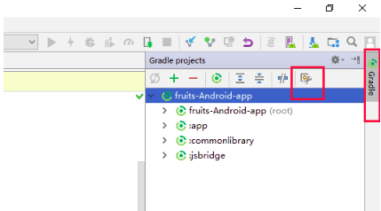
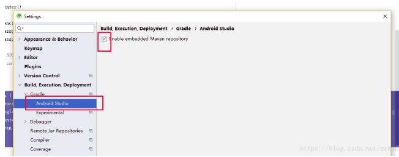

# 20180730 Android studio 无法读取pom 文件

参考： https://blog.csdn.net/zengmingen/article/details/79877676

设置了也没用。

<br>


Android studio 3.1 导入app项目后，gradle无法获取 pom文件

具体保存内容如下：

 Could not GET 'https://dl.google.com/dl/android/maven2/com/android/tools/build/transform-api/2.0.0-deprecated-use-gradle-api/transform-api-2.0.0-deprecated-use-gradle-api.pom 
'. Received status code 400 from server: Bad Request
Enable Gradle 'offline mode' and sync project

方法：

配置maven地址为国内的，Android studio 勾选生效

1、build.gradle文件中增加：

```
allprojects {
    repositories {
        google()
        jcenter()
        maven { url 'http://maven.aliyun.com/nexus/content/groups/public/' }

    }
}
```






