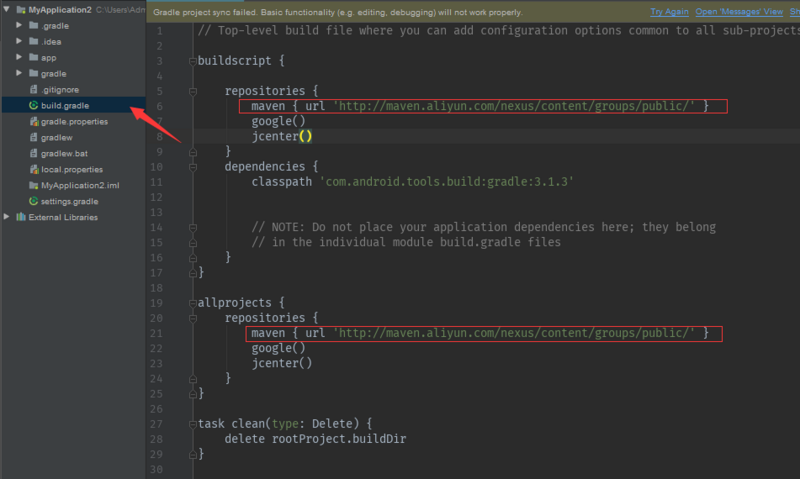
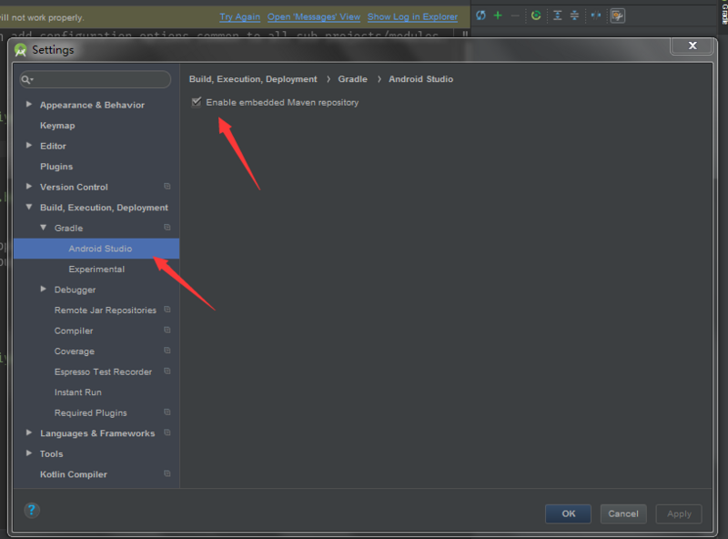

# 20180730 无法获取到pom的终极解决方案

参考：https://segmentfault.com/a/1190000015552313

之前都是通过科学上网可以解决，最近不知怎么的就是获取不到pom文件，类似这样：

`org.gradle.internal.resource.transport.http.HttpRequestException: Could not HEAD 'https://dl.google.com/dl/android/maven2/com/android/support/appcompat-v7/27.0.2/appcompat-v7-27.0.2.pom'`

解决方案：

1. 修改build.gradle文件
   `maven { url 'http://maven.aliyun.com/nexus/content/groups/public/' }`

注意: ==阿里云的代理一定要在顶层==

设置Android studio 勾选Enable embedded Maven repository  

