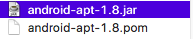

# 20180730顶层文件夹build_gradle 下载文件错误

在Android studio中的错误如下： 

```shell
Error:Could not GET 'https://jcenter.bintray.com/com/jakewharton/butterknife-compiler/8.2.1/butterknife-compiler-8.2.1.pom'. Received status code 400 from server: Bad Request
<a href="toggle.offline.mode">Enable Gradle 'offline mode' and sync project</a>
```

对应顶层文件夹下 build.gradle 内容如下：

刚开始是` classpath 'com.neenbedankt.gradle.plugins:android-apt:1.8'` 这个下载不下来，但是打开上面的错误提示网址`https://jcenter.bintray.com/com/jakewharton/butterknife-compiler/8.2.1/butterknife-compiler-8.2.1.pom` 发现浏览器能打开，可就是下不来，orz。

```shell
// Top-level build file where you can add configuration options common to all sub-projects/modules.

buildscript {
  repositories {
    jcenter()
  }
  dependencies {
    classpath 'com.android.tools.build:gradle:2.2.0'
    classpath 'com.neenbedankt.gradle.plugins:android-apt:1.8'
//    classpath 'com.google.gms:google-services:3.0.0'
    // NOTE: Do not place your application dependencies here; they belong
    // in the individual module build.gradle files
  }
}

allprojects {
  repositories {
//    google()
    jcenter()
//    maven { url "https://www.jitpack.io" }
//    maven { url "https://maven.google.com" }
    maven { url 'http://maven.aliyun.com/nexus/content/groups/public/' } // 参考https://blog.csdn.net/zengmingen/article/details/79877676 修改源也没用
  }
}

task clean(type: Delete) {
  delete rootProject.buildDir
}

```

[参考](https://blog.csdn.net/jia4525036/article/details/48523477) , 网络无法下载1.2.2的插件，所以我们可以更换我们studio里已经下载好的插件：

插件位置：

XXXX\Android Studio\gradle\m2repository\com\android\tools\build\gradle\xxx  

可以看到你目前已经安装好的插件，那么修改build.gradle:

```
buildscript {
    repositories {
        jcenter()
    }
    dependencies {
        classpath 'com.android.tools.build:gradle:1.2.3'
        // NOTE: Do not place your application dependencies here; they belong
        // in the individual module build.gradle files
   }
}

allprojects {
    repositories {
        jcenter()
    }
```

 根据`classpath 'com.neenbedankt.gradle.plugins:android-apt:1.8'` 这个路径，手动创建文件夹`/Applications/Android Studio.app/Contents/gradle/m2repository/com/neenbedankt/gradle/plugins/android-apt/1.8/`, 在文件夹下有如下两个文件：

**注意：**要特别注意脚本中定义的路径和实际路径名一致，否则会找不到。



这两个文件的下载地址为： http://book2s.com/java/jar/a/android-apt/download-android-apt-1.8.html

至此，切换到offline模式下就能读到了。


