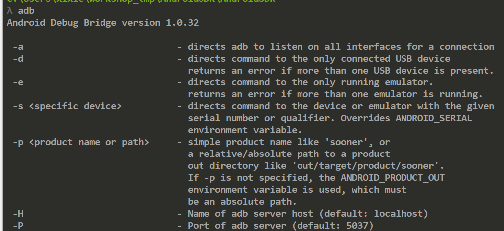

# 20180713 Android sdk的环境配置

配置这个环境主要是为了使用 android 和 adb 相关的命令。

1- 先添加**系统**环境变量：

```shell
SDK_HOME
C:\Users\xixie\workshop_tmp\AndroidSDK\AndroidSDK
```

2- 

在环境变量PATH的最后面添加一下内容：

;%SDK_HOME%\platform-tools;%SDK_HOME%\tools;   注意前面的分号，如果PATH中最后没有分号“;”的话要加上，有的话就可去除。

<br>

## adb 测试

在命令行下输入 adb，  这就是可以的。

