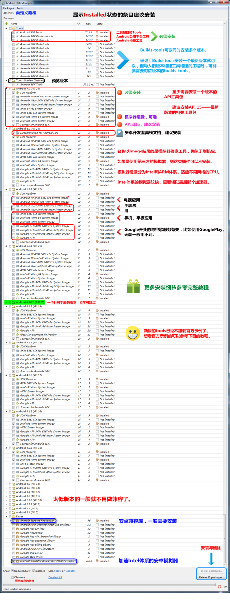

# 20180716安装Android sdk的简单过程

1- [参考](http://www.cnblogs.com/zoupeiyang/p/4034517.html) 安装 sdk 后， 设置jdk 和 jre的环境变量

2- 有需要下载免安装 Eclipse

3- 下载免安装版的sdk, 在 unmd 有压缩包，打开就可以。

[参考](https://www.jianshu.com/p/4ac1313b50cb), 需要安装的包：

 

