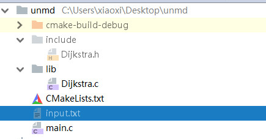

# 20180412_第一个CMakeLIsts

目录结构如下：



创建第一个CMakeLists.txt ，

lib  下的文件一般会#inlcue "../include/xx.h"  这样的头文件。

```cpp
CMAKE_MINIMUM_REQUIRED(VERSION 2.8) # 没有这个会出错？
project(Dijstra)

include_directories(include)

add_library(libDijstra lib/Dijkstra.c)

add_executable(Dijstra_exe main.c)

target_link_libraries(Dijstra_exe libDijstra)
```

