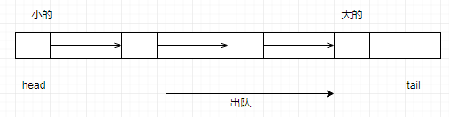

# Queue 容器

 

C++队列queue模板类的定义在<queue>头文件中,queue 模板类需要两个模板参数，一个是元素类型，一个容器类型，元素类型是必要的，容器类型是可选的，默认为deque 类型。

 C++队列Queue是一种容器适配器，它给予程序员一种先进先出(FIFO)的数据结构。

## 1- queue

**C++队列Queue类成员函数如下:**

back()返回最后一个元素

empty()如果队列空则返回真

front()返回第一个元素

pop()删除第一个元素

push()在末尾加入一个元素

size()返回队列中元素的个数


queue 的基本操作举例如下：

```cpp
queue入队，如例：q.push(x); 将x 接到队列的末端。
queue出队，如例：q.pop(); 弹出队列的第一个元素，注意，并不会返回被弹出元素的值。
访问queue队首元素，如例：q.front()，即最早被压入队列的元素。
访问queue队尾元素，如例：q.back()，即最后被压入队列的元素。
判断queue队列空，如例：q.empty()，当队列空时，返回true。
访问队列中的元素个数，如例：q.size()
```

**C++ stl队列queue示例代码1:**

```cpp
#include<iostream>
#include<algorithm> 
#include<queue> 
using namespace std;

int main(){
    int e,n,m;
    queue q1;

    for(int i=0;i<10;i++)
       q1.push(i);

    if(!q1.empty())
    	cout<<"dui lie  bu kong\n";

    n=q1.size();
    cout<n;
```

------

## 2- priority_queue

在头文件`<queue> `中还包含一种特殊的队列，priority_queue(优先队列）。优先队列与队列的差别在于优先队列不是按照入队的顺序出队，而是按照队列中元素的优先权顺序出队（默认为大者优先，也可以通过指定算子来指定自己的优先顺序）。

priority_queue模板类有三个模板参数，**第一个是元素类型，第二个容器类型，第三个是比较算子**。其中后两个都可以省略，默认容器为vector，默认算子为less，即小的往前排，大的往后排（出队时序列尾的元素出队）。



定义priority_queue对象的示例代码如下：

```cpp
priority_queue<int> q1;
priority_queue< pair<int, int> > q2; 					// 注意在两个尖括号之间一定要留空格。
priority_queue<int, vector<int>, greater<int> > q3; 	 // 定义小的先出队

```

priority_queue的基本操作与queue相同。

初学者在使用priority_queue时，最困难的可能就是如何定义比较算子了。

1- 如果是基本数据类型，或已定义了比较运算符的类，可以直接用STL的less算子和greater算子——**默认为使用less算子，即小的往前排，大的先出队。**

2- 如果要定义自己的比较算子，方法有多种，这里介绍其中的一种：重载比较运算符。**优先队列试图将两个元素x和y代入比较运算符(对less算子，调用 x<y，对greater算子，调用x>y)，若结果为真，则x排在y前面，y将先于x出队，反之，则将y排在x前面，x将先出队。** ？？？ 【用greater，就是小的先出列，用less，就是大的先出列。】

看下面这个简单的示例：

```cpp
#include <iostream>
#include <queue>
using namespace std;

class T{
public:
int x, y, z;
T(int a, int b, int c):x(a), y(b), z(c){}
};

bool operator < (const T &t1, const T &t2){
	return t1.z < t2.z; // 按照z的顺序来决定t1和t2的顺序
}

main(){				  /// 可以没有返回值？
  priority_queue<T> q;
  q.push(T(4,4,3));
  q.push(T(2,2,5));
  q.push(T(1,5,4));
  q.push(T(3,3,6));

  while (!q.empty()){
      T t = q.top(); q.pop();		// 取完之后要pop
      cout << t.x << " " << t.y << " " << t.z << endl;
  }
  return 1;
}
```

输出结果为(注意是按照z的顺序从大到小出队的)：

```
3 3 6
2 2 5
1 5 4
4 4 3
```

如果上面的运算符改了比较的函数

```cpp
bool operator > (const T &t1, const T &t2){
	return t1.z > t2.z;
}
```

从小到大出队，结果为： 

```cpp
4 4 3
1 5 4
2 2 5
3 3 6
```

如果我们把第一个例子中的比较运算符重载为：

```cpp
bool operator < (const T &t1, const T &t2){
	return t1.z > t2.z; // 按照z的顺序来决定t1和t2的顺序
}
```

则第一个例子的程序会得到和第二个例子的程序相同的输出结果。


