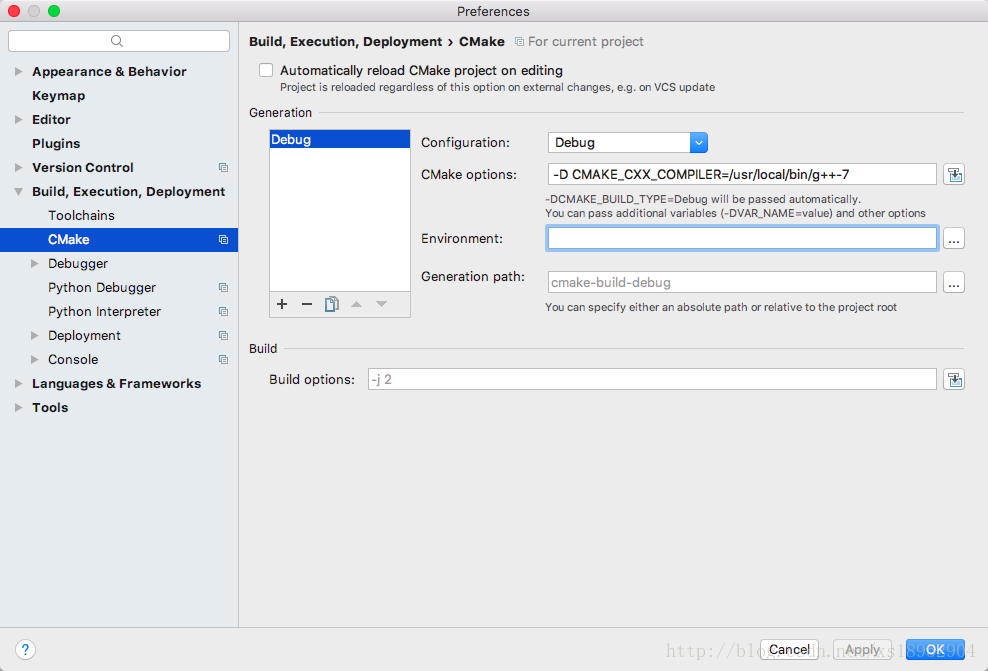
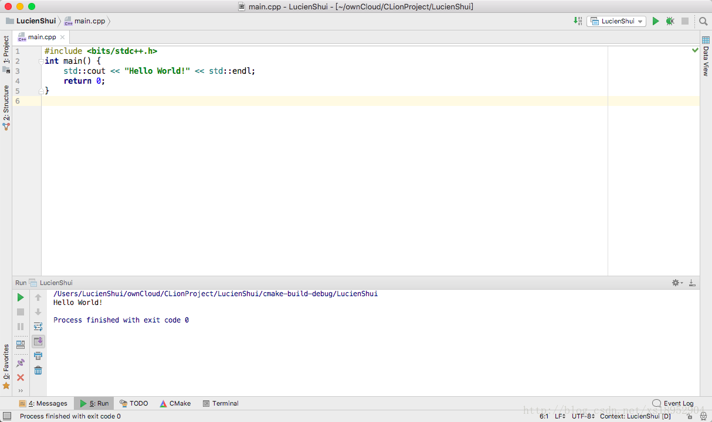

# [Error]20180324_Mac下CLion使用<bits/stdc++.h>头文件

之前一直纠结我的一个问题就是Mac没办法使用这个万能头文件，导致我每次都得加一堆头文件，强行加长代码强度，影响心情，尝试过很多从CMake层面去解决这个问题，可是一直都没能解决。

  今天偶然发现CLion可以很简单容易的解决这个问题。

  首先安装一下g++编译器，我是用homebrew安装的，homebrew安装方法的传送门：<http://jingyan.baidu.com/article/fec7a1e5ec30341190b4e7e5.html>

  安装完homebrew之后执行`brew install gcc`这条命令(如果已经安装了，就用 brew upgrade gcc 更新即可 )，安装成功后进Preference按照下图的方法配置CLion即可。命令：`-D CMAKE_CXX_COMPILER=/usr/local/bin/g++-7`

  成果截图：

