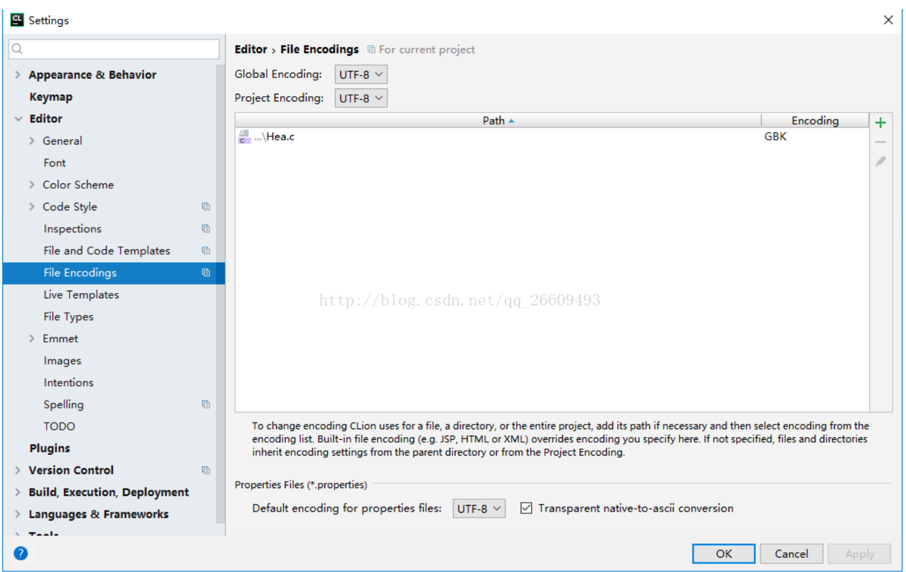
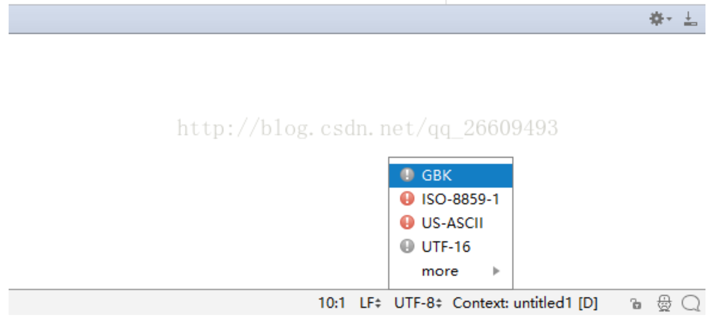
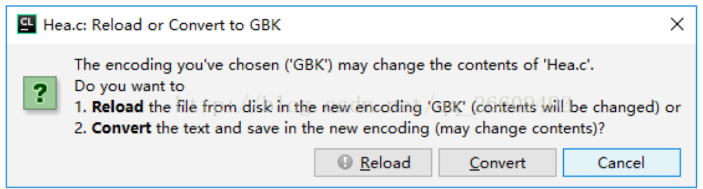

# [Error]20180324Clion控制台乱码问题(JetBrains CLion 2017.2.2)

   Clion使用很方便，但是刚开始学的时候也遇到了很多问题，第一天学习遇到了控制台乱码问题，解决后特此记录。

1点击File找到Settings点击后找到File Encodings 

如图设置

点击ok后来到编辑器

右下角的 File Encod

ng 默认是 UTF-8，点击切换成 GBK

弹出的菜单中选 Convert 

设置完成后运行项目会发现乱码问题解决了.