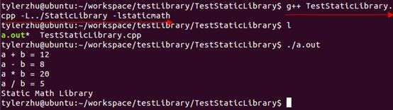
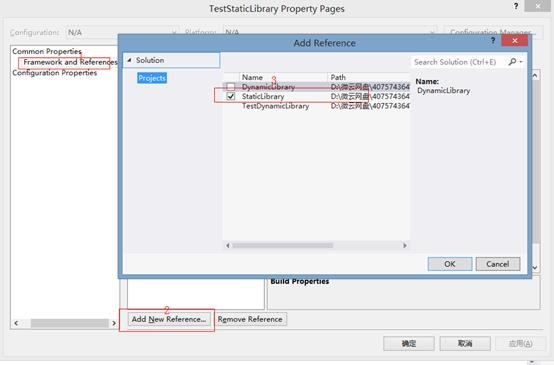

# 20180429 CPP静态库与动态库

二者的不同点在于**代码被载入的时刻不同**。

l  静态库在程序编译时会被连接到目标代码中，程序运行时将不再需要该静态库，**因此体积较大**。【特别是同一个函数被多次调用的时候】

l  动态库在程序编译时并不会被连接到目标代码中，而是在程序运行是才被载入，因此在程序运行时还需要动态库存在，**因此代码体积较小**。

动态库的好处是，不同的应用程序如果调用相同的库，那么在内存里只需要有一份该共享库的实例。带来好处的同时，也会有问题！如经典的DLL Hell问题，关于如何规避动态库管理问题，可以自行查找相关资料。

------

解决DLL Hell问题： 

链接： https://www.zhihu.com/question/24368174， 在LInux 下，已经不需要考虑这个问题，会加上相应的主版本号，次版本号等。

------

原文： https://www.cnblogs.com/skynet/p/3372855.html

这次分享的**宗旨**是——让大家学会创建与使用静态库、动态库，知道静态库与动态库的区别，知道使用的时候如何选择。这里不深入介绍静态库、动态库的底层格式，内存布局等，有兴趣的同学，推荐一本书《程序员的自我修养——链接、装载与库》。

# 什么是库

库是写好的现有的，成熟的，可以复用的代码。**现实中每个程序都要依赖很多基础的底层库，不可能每个人的代码都从零开始，因此库的存在意义非同寻常**。

本质上来说库是一种可执行代码的二进制形式，可以被操作系统载入内存执行。库有两种：静态库（.a、.lib）和动态库（.so、.dll）。

所谓静态、动态是指链接。回顾一下，将一个程序编译成可执行程序的步骤：


图：编译过程

# 静态库

之所以成为【静态库】，是因为在链接阶段，会将汇编生成的目标文件.o与引用到的库一起链接打包到可执行文件中。因此对应的链接方式称为静态链接。

试想一下，静态库与汇编生成的目标文件一起链接为可执行文件，那么静态库必定跟.o文件格式相似。其实一个静态库可以简单看成是**一组目标文件（****.o/.obj****文件）的集合**，即很多目标文件经过压缩打包后形成的一个文件。静态库特点总结：

l  静态库对函数库的链接是放在编译时期完成的。

l  程序在运行时与函数库再无瓜葛，移植方便。

l  浪费空间和资源，因为所有相关的目标文件与牵涉到的函数库被链接合成一个可执行文件。

下面编写一些简单的四则运算C++类，将其编译成静态库给他人用，头文件如下所示：

```cpp
///StaticMath.h头文件
#pragma once
class StaticMath
{
public:
    StaticMath(void);
    ~StaticMath(void);
    static double add(double a, double b);//加法
    static double sub(double a, double b);//减法
    static double mul(double a, double b);//乘法
    static double div(double a, double b);//除法
    void print();
};
```

 

Linux下使用**ar**工具、Windows下vs使用**lib.exe**，将目标文件压缩到一起，并且对其进行编号和索引，以便于查找和检索。一般创建静态库的步骤如图所示：


图：创建静态库过程

## Linux下创建与使用静态库

### Linux静态库命名规则

Linux静态库命名规范，必须是"lib[your_library_name].a"：lib为前缀，中间是静态库名，扩展名为.a。

### 创建静态库（.a）

通过上面的流程可以知道，Linux创建静态库过程如下：

```cpp
g++ -c StaticMath.cpp
```

l  首先，将代码文件编译成目标文件.o（StaticMath.o）

注意带参数-c，否则直接编译为可执行文件

l  然后，通过ar工具将目标文件打包成.a静态库文件

```cpp
ar -crv libstaticmath.a StaticMath.o
```

生成静态库**libstaticmath.a**。


大一点的项目会编写makefile文件（CMake等等工程管理工具）来生成静态库，输入多个命令太麻烦了。

### 使用静态库

编写使用上面创建的静态库的测试代码：

```cpp
#include "StaticMath.h"
#include <iostream>
using namespace std; 

int main(int argc, char* argv[]){
    double a = 10;
    double b = 2;
    cout << "a + b = " << StaticMath::add(a, b) << endl;
    cout << "a - b = " << StaticMath::sub(a, b) << endl;
    cout << "a * b = " << StaticMath::mul(a, b) << endl;
    cout << "a / b = " << StaticMath::div(a, b) << endl;

    StaticMath sm;
    sm.print();

    system("pause");

    return 0;
}
```

Linux下使用静态库，只需要在编译的时候，指定静态库的搜索路径（-L选项）、指定静态库名（不需要lib前缀和.a后缀，-l选项）。

\# g++ TestStaticLibrary.cpp -**L../StaticLibrary** **-lstaticmath**



l  -L：表示要连接的库所在目录

l  -l：指定链接时需要的动态库，编译器查找动态连接库时有隐含的命名规则，即在给出的名字前面加上lib，后面加上.a或.so来确定库的名称。

 

## Windows下创建与使用静态库

### 创建静态库（.lib）

如果是使用VS命令行生成静态库，也是分两个步骤来生成程序：

l  首先，通过使用带编译器选项 **/c** 的 **Cl.exe** 编译代码 (**cl /c** **StaticMath.cpp**)，创建名为“StaticMath.obj”的目标文件。

l  然后，使用库管理器 **Lib.exe** 链接代码 (**lib** **StaticMath.obj**)，创建静态库StaticMath.lib。

当然，我们一般不这么用，使用VS工程设置更方便。创建win32控制台程序时，勾选静态库类型；打开工程“属性面板”--”配置属性”---”常规”，配置类型选择静态库。


图：vs静态库项目属性设置

Build项目即可生成静态库。

### 使用静态库

测试代码Linux下面的一样。有3种使用方法：

#### *方法一：*

在VS中使用静态库方法：

l  工程“属性面板”è“通用属性”è “框架和引用”è”添加引用”，将显示“添加引用”对话框。“项目”选项卡列出了当前解决方案中的各个项目以及可以引用的所有库。 在“项目”选项卡中，选择 StaticLibrary。 单击“确定”。



l  添加StaticMath.h 头文件目录，必须修改包含目录路径。打开工程“属性面板”è”配置属性”è “C/C++”è” 常规”，在“附加包含目录”属性值中，键入StaticMath.h 头文件所在目录的路径或浏览至该目录。


编译运行OK。


图：静态库测试结果（vs）

如果引用的静态库不是在同一解决方案下的子工程，而是使用第三方提供的静态库lib和头文件，上面的方法设置不了。还有2中方法设置都可行。

#### *方法二：*

打开工程“属性面板”è”配置属性”è “链接器”è”命令行”，输入静态库的完整路径即可。


#### *方法三：*

l  “属性面板”è”配置属性”è “链接器”è”常规”，附加依赖库目录中输入，静态库所在目录；

l  “属性面板”è”配置属性”è “链接器”è”输入”，附加依赖库中输入静态库名StaticLibrary.lib。


# 动态库

通过上面的介绍发现静态库，容易使用和理解，也达到了代码复用的目的，那为什么还需要动态库呢？

## 为什么还需要动态库？

为什么需要动态库，其实也是静态库的特点导致。

l  空间浪费是静态库的一个问题。


l  另一个问题是静态库对程序的更新、部署和发布页会带来麻烦。如果静态库liba.lib更新了，所以使用它的应用程序都需要重新编译、发布给用户（对于玩家来说，可能是一个很小的改动，却导致整个程序重新下载，**全量更新**）。

动态库在程序编译时并不会被连接到目标代码中，而是在程序运行是才被载入。**不同的应用程序如果调用相同的库，那么在内存里只需要有一份该共享库的实例**，规避了空间浪费问题。动态库在程序运行是才被载入，也解决了静态库对程序的更新、部署和发布页会带来麻烦。用户只需要更新动态库即可，**增量更新**。


动态库特点总结：

l  动态库把对一些库函数的链接载入推迟到程序运行的时期。

l  可以实现进程之间的资源共享。（因此动态库也称为共享库）

l  将一些程序升级变得简单。

l  甚至可以真正做到链接载入完全由程序员在程序代码中控制（**显示调用**）。

Window与Linux执行文件格式不同，在创建动态库的时候有一些差异。

l  在Windows系统下的执行文件格式是PE格式，动态库需要一个**DllMain****函数做出初始化的入口，通常在导出函数的声明时需要有_declspec(dllexport)****关键字**。

l  Linux下gcc编译的执行文件默认是ELF格式，**不需要初始化入口，亦不需要函数做特别的声明，**编写比较方便。

与创建静态库不同的是，不需要打包工具（ar、lib.exe），直接使用编译器即可创建动态库。

## Linux下创建与使用动态库

 

### linux动态库的命名规则

动态链接库的名字形式为 libxxx.so，前缀是lib，后缀名为“.so”。

l  针对于实际库文件，每个共享库都有个特殊的名字“soname”。在程序启动后，程序通过这个名字来告诉动态加载器该载入哪个共享库。

l  在文件系统中，soname仅是一个链接到实际动态库的链接。对于动态库而言，每个库实际上都有另一个名字给编译器来用。它是一个指向实际库镜像文件的链接文件（lib+soname+.so）。

### 创建动态库（.so）

编写四则运算动态库代码：

```cpp
///DynamicMath.h头文件
#pragma once
class DynamicMath
{

public:

        DynamicMath(void);

        ~DynamicMath(void);

 

        static double add(double a, double b);//¼Ó·¨

        static double sub(double a, double b);//¼õ·¨

        static double mul(double a, double b);//³Ë·¨

        static double div(double a, double b);//³ý·¨

        void print();

};
```

 

l  首先，生成目标文件，此时要加编译器选项-fpic

```cpp
g++ -fPIC -c DynamicMath.cpp
```

-fPIC 创建与地址无关的编译程序（pic，position independent code），是为了能够在多个应用程序间共享。

l  然后，生成动态库，此时要加链接器选项-shared

-shared指定生成动态链接库。

```cpp
g++ -shared -o libdynmath.so DynamicMath.o
```


其实上面两个步骤可以合并为一个命令：

 ```cpp
g++ -fPIC -shared -o libdynmath.so DynamicMath.cpp
 ```


### 使用动态库

编写使用动态库的测试代码：

```cpp
#include "../DynamicLibrary/DynamicMath.h"

 

#include <iostream>

using namespace std;

 

int main(int argc, char* argv[])

{

    double a = 10;

    double b = 2;

 

    cout << "a + b = " << DynamicMath::add(a, b) << endl;

    cout << "a - b = " << DynamicMath::sub(a, b) << endl;

    cout << "a * b = " << DynamicMath::mul(a, b) << endl;

    cout << "a / b = " << DynamicMath::div(a, b) << endl;

 

    DynamicMath dyn;

    dyn.print();

    return 0;

}
```

引用动态库编译成可执行文件（跟静态库方式一样）：

```cpp
g++ TestDynamicLibrary.cpp -L../DynamicLibrary -ldynmath
```

然后运行：./a.out，发现竟然报错了！！！


可能大家会猜测，是因为动态库跟测试程序不是一个目录，那我们验证下是否如此：


发现还是报错！！！那么，在执行的时候是如何定位共享库文件的呢？

1)        当系统加载可执行代码时候，能够知道其所依赖的库的名字，但是还需要知道绝对路径。此时就需要系统动态载入器(dynamic linker/loader)。

2)        对于elf格式的可执行程序，是由ld-linux.so*来完成的，它先后搜索elf文件的 DT_RPATH段—环境变量LD_LIBRARY_PATH—/etc/ld.so.cache文件列表—/lib/,/usr/lib 目录找到库文件后将其载入内存。

如何让系统能够找到它：

l  如果安装在/lib或者/usr/lib下，那么ld默认能够找到，无需其他操作。

l  如果安装在其他目录，需要将其添加到/etc/ld.so.cache文件中，步骤如下：

n  编辑/etc/ld.so.conf文件，加入库文件所在目录的路径

n  运行ldconfig ，该命令会重建/etc/ld.so.cache文件

我们将创建的动态库复制到/usr/lib下面，然后运行测试程序。


## Windows下创建与使用动态库

### 创建动态库（.dll）

与Linux相比，在Windows系统下创建动态库要稍微麻烦一些。首先，需要一个DllMain函数做出初始化的入口（创建win32控制台程序时，勾选DLL类型会自动生成这个文件）:

```cpp
///dllmain.cpp入口文件

// dllmain.cpp : Defines the entry point for the DLL application.

#include "stdafx.h"

 

BOOL APIENTRY DllMain( HMODULE hModule,

                       DWORD  ul_reason_for_call,

                       LPVOID lpReserved

                     )

{

    switch (ul_reason_for_call)

    {

    case DLL_PROCESS_ATTACH:

    case DLL_THREAD_ATTACH:

    case DLL_THREAD_DETACH:

    case DLL_PROCESS_DETACH:

        break;

    }

    return TRUE;

}
```


通常在导出函数的声明时需要有_declspec(dllexport)关键字：

| **DynamicMath.h****头文件**                                  |
| ------------------------------------------------------------ |
| **#pragma** **once****class** **DynamicMath****{****public****:**    **__declspec****(****dllexport****) DynamicMath(****void****);**    **__declspec****(****dllexport****) ~DynamicMath(****void****);**     **static** **__declspec****(****dllexport****)** **double** **add(****double** **a,** **double** **b);****//****加法**    **static** **__declspec****(****dllexport****)** **double** **sub(****double** **a,** **double** **b);****//****减法**    **static** **__declspec****(****dllexport****)** **double** **mul(****double** **a,** **double** **b);****//****乘法**    **static** **__declspec****(****dllexport****)** **double** **div(****double** **a,** **double** **b);****//****除法**     **__declspec****(****dllexport****)** **void** **print();****};** |

生成动态库需要设置工程属性，打开工程“属性面板”è”配置属性”è”常规”，配置类型选择动态库。

[![clip_image033[4\]](https://images0.cnblogs.com/blog/92071/201310/16201622-f7d36399cee8475cab1d1e2e0e840686.jpg)](https://images0.cnblogs.com/blog/92071/201310/16201619-f190d6dd94ee48e0883bb5d5bbe4e66a.jpg)

图：v动态库项目属性设置

Build项目即可生成动态库。

### 使用动态库

创建win32控制台测试程序：

| **TestDynamicLibrary.cpp****测试程序**                       |
| ------------------------------------------------------------ |
| **#include** **"stdafx.h"****#include** **"DynamicMath.h"** **#include** **<iostream>****using** **namespace** **std;** **int** **_tmain****(****int** **argc****,** **_TCHAR******* **argv****[])****{**    **double** **a = 10;**    **double** **b = 2;**     **cout <<** **"a + b = "** **<<** **DynamicMath****::add(a, b) << endl;**    **cout <<** **"a - b = "** **<<** **DynamicMath****::sub(a, b) << endl;**    **cout <<** **"a \* b = "** **<<** **DynamicMath****::mul(a, b) << endl;**    **cout <<** **"a / b = "** **<<** **DynamicMath****::div(a, b) << endl;**     **DynamicMath** **dyn;**    **dyn.print();**     **system(****"pause"****);**    **return** **0;****}** |

#### *方法一：*

l  工程“属性面板”è“通用属性”è “框架和引用”è”添加引用”，将显示“添加引用”对话框。“项目”选项卡列出了当前解决方案中的各个项目以及可以引用的所有库。 在“项目”选项卡中，选择 DynamicLibrary。 单击“确定”。

[![clip_image035[4\]](https://images0.cnblogs.com/blog/92071/201310/16201623-5edd9d617fa14814954f5be9eef17e5c.jpg)](https://images0.cnblogs.com/blog/92071/201310/16201623-914ff83612a4470fa59c2bc729053c6b.jpg)

l  添加DynamicMath.h 头文件目录，必须修改包含目录路径。打开工程“属性面板”è”配置属性”è “C/C++”è” 常规”，在“附加包含目录”属性值中，键入DynamicMath.h 头文件所在目录的路径或浏览至该目录。

[![clip_image037[4\]](https://images0.cnblogs.com/blog/92071/201310/16201625-d7cb24cf20d740bcb3f88d59c62ebcef.jpg)](https://images0.cnblogs.com/blog/92071/201310/16201624-9cfecaf931ba4f4d96d6cf7cac3ac40e.jpg)

编译运行OK。

[![clip_image038[4\]](https://images0.cnblogs.com/blog/92071/201310/16201626-4ce0f7eda5614a2bbeee781caef72701.png)](https://images0.cnblogs.com/blog/92071/201310/16201626-29defaed72cf4a91b7c83f6bd0fecf53.png)

图：动态库测试结果（vs）

#### *方法二：*

l  “属性面板”è”配置属性”è “链接器”è”常规”，附加依赖库目录中输入，动态库所在目录；

[![clip_image040[4\]](https://images0.cnblogs.com/blog/92071/201310/16201627-8627d191364844c98f56424229ac3b7e.jpg)](https://images0.cnblogs.com/blog/92071/201310/16201626-98727f19e0d14d43942771bac7e24238.jpg)

l  “属性面板”è”配置属性”è “链接器”è”输入”，附加依赖库中输入动态库编译出来的DynamicLibrary.lib。

[![clip_image042[4\]](https://images0.cnblogs.com/blog/92071/201310/16201630-6f46fc88ea404623aa3c659a415059df.jpg)](https://images0.cnblogs.com/blog/92071/201310/16201628-425bd512f3bf4b51b121bdb59604bc5e.jpg)

这里可能大家有个疑问，动态库怎么还有一个DynamicLibrary.lib文件？即无论是静态链接库还是动态链接库，最后都有lib文件，那么两者区别是什么呢？其实，两个是完全不一样的东西。

[![clip_image044[4\]](https://images0.cnblogs.com/blog/92071/201310/16201632-92992f0dc61a407ea9946dfbda35ec7f.jpg)](https://images0.cnblogs.com/blog/92071/201310/16201631-f72543fd66ba4593996f864a7fb6f92a.jpg)

StaticLibrary.lib的大小为190KB，DynamicLibrary.lib的大小为3KB，静态库对应的lib文件叫**静态库**，动态库对应的lib文件叫【**导入库】**。实际上静态库本身就包含了实际执行代码、符号表等等，而**对于导入库而言，其实际的执行代码位于动态库中，导入库只包含了地址符号表等，确保程序找到对应函数的一些基本地址信息**。

# 动态库的显式调用

上面介绍的动态库使用方法和静态库类似属于隐式调用，编译的时候指定相应的库和查找路径。其实，动态库还可以显式调用。**【在****C****语言中】**，显示调用一个动态库轻而易举！

## 在Linux下显式调用动态库

\#include <dlfcn.h>，提供了下面几个接口：

l  void * **dlopen**( const char * pathname, int mode )：函数以指定模式打开指定的动态连接库文件，并返回一个句柄给调用进程。

l  void* **dlsym**(void* handle,const char* symbol)：dlsym根据动态链接库操作句柄(pHandle)与符号(symbol)，返回符号对应的地址。使用这个函数不但可以获取函数地址，也可以获取变量地址。

l  int **dlclose** (void *handle)：dlclose用于关闭指定句柄的动态链接库，只有当此动态链接库的使用计数为0时,才会真正被系统卸载。

l  const char *dlerror(void)：当动态链接库操作函数执行失败时，dlerror可以返回出错信息，返回值为NULL时表示操作函数执行成功。

## 在Windows下显式调用动态库

应用程序必须进行函数调用以在运行时显式加载 DLL。为显式链接到 DLL，应用程序必须：

l  调用 **LoadLibrary**（或相似的函数）以加载 DLL 和获取模块句柄。

l  调用 **GetProcAddress**，以获取指向应用程序要调用的每个导出函数的函数指针。由于应用程序是通过指针调用 DLL 的函数，编译器不生成外部引用，故无需与导入库链接。

l  使用完 DLL 后调用 **FreeLibrary**。

## 显式调用C++动态库注意点

对C++来说，情况稍微复杂。显式加载一个C++动态库的困难**一部分是因为****C++****的name mangling**；**另一部分是因为没有提供一个合适的****API****来装载类**，在C++中，您可能要用到库中的一个类，而这需要创建该类的一个实例，这不容易做到。

**name mangling**可以通过extern "C"解决。C++有个特定的关键字用来声明采用C binding的函数：extern "C" 。用 extern "C"声明的函数将使用函数名作符号名，就像C函数一样。因此，只有非成员函数才能被声明为extern "C"，并且不能被重载。尽管限制多多，extern "C"函数还是非常有用，因为它们可以象C函数一样被dlopen动态加载。冠以extern "C"限定符后，并不意味着函数中无法使用C++代码了，相反，它仍然是一个完全的C++函数，可以使用任何C++特性和各种类型的参数。

另外如何从C++动态库中获取类，附上几篇相关文章，但我并不建议这么做：

l  《LoadLibrary调用DLL中的Class》：<http://www.cppblog.com/codejie/archive/2009/09/24/97141.html>

l  《C++ dlopen mini HOWTO》：<http://blog.csdn.net/denny_233/article/details/7255673>

**“显式”使用C++****动态库中的Class****是非常繁琐和危险的事情，因此能用“隐式”就不要用“显式”，能静态就不要用动态。**

# 附件：Linux下库相关命令

## g++(gcc)编译选项

l  -shared ：指定生成动态链接库。

l  -static ：指定生成静态链接库。

l  -fPIC ：表示编译为位置独立的代码，用于编译共享库。目标文件需要创建成位置无关码， 念上就是在可执行程序装载它们的时候，它们可以放在可执行程序的内存里的任何地方。

l  -L. ：表示要连接的库所在的目录。

l  -l：指定链接时需要的动态库。编译器查找动态连接库时有隐含的命名规则，即在给出的名字前面加上lib，后面加上.a/.so来确定库的名称。

l  -Wall ：生成所有警告信息。

l  -ggdb ：此选项将尽可能的生成gdb 的可以使用的调试信息。

l  -g ：编译器在编译的时候产生调试信息。

l  -c ：只激活预处理、编译和汇编,也就是把程序做成目标文件(.o文件) 。

l  -Wl,options ：把参数(options)传递给链接器ld 。如果options 中间有逗号,就将options分成多个选项,然后传递给链接程序。

## nm命令

有时候可能需要查看一个库中到底有哪些函数，**nm****命令**可以打印出库中的涉及到的所有符号。库既可以是静态的也可以是动态的。nm列出的符号有很多，常见的有三种：

l  一种是在库中被调用，但并没有在库中定义(表明需要其他库支持)，用U表示；

l  一种是库中定义的函数，用T表示，这是最常见的；

l  一种是所谓的弱态”符号，它们虽然在库中被定义，但是可能被其他库中的同名符号覆盖，用W表示。

$nm libhello.h

## ldd命令

**ldd****命令可以查看一个可执行程序依赖的共享库**，例如我们编写的四则运算动态库依赖下面这些库：

[![clip_image046[4\]](https://images0.cnblogs.com/blog/92071/201310/16201633-192ac5e40541413dadf5d8f88ad8cbc8.jpg)](https://images0.cnblogs.com/blog/92071/201310/16201633-aebe0e8017354a9b93644043b9d013c6.jpg)

# 总结

二者的不同点在于**代码被载入的时刻不同**。

l  静态库在程序编译时会被连接到目标代码中，程序运行时将不再需要该静态库，**因此体积较大**。

l  动态库在程序编译时并不会被连接到目标代码中，而是在程序运行是才被载入，因此在程序运行时还需要动态库存在，**因此代码体积较小**。

动态库的好处是，不同的应用程序如果调用相同的库，那么在内存里只需要有一份该共享库的实例。带来好处的同时，也会有问题！如经典的DLL Hell问题，关于如何规避动态库管理问题，可以自行查找相关资料。