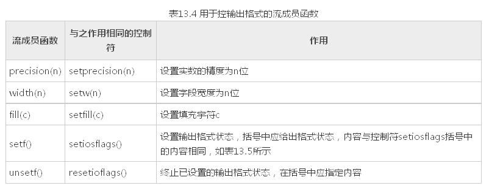

# 20180605 格式化输出


----

原文： https://blog.csdn.net/zyq522376829/article/details/46788725

在输出数据时，为简便起见，往往不指定输出的格式，由系统根据数据的类型采取默认的格式，但有时希望数据按指定的格式输出，如要求以十六进制或八进制形式 输出一个 整数，对输出的小数只保留两位小数等。有两种方法可以达到此目的。

1）使用控制符的方法；

2）使用流对象的有关成员函数。分别叙述如下。

使用控制符的方法

```cpp
#include <iostream>  
#include <cstdio>  
#include <iomanip>  
using namespace std;  
  
int main()  
{  
    int a;  
    cout << "input a:";  
    cin >> a;  
    cout << "dec:" << dec << a << endl; 		//以十进制形式输出整数  
    cout << "hex:" << hex << a << endl; 		//以十六进制形式输出整数a  
    cout << "oct:" << setbase(8) << a << endl;	//以八进制形式输出整数a  
    char *pt = "China"; 						//pt指向字符串"China"  
    
    // 默认是右对齐
    cout << setw(10) << pt << endl; 			//指定域宽为,输出字符串  
    cout << setfill('*') << setw(10) 
        << pt << endl; 							//指定域宽,输出字符串,空白处以'*'填充  
    double pi = 22.0 / 7.0; 					//计算pi值  
    
    //按指数形式输出,8位小数  
    cout << setiosflags(ios::scientific) << setprecision(8);  
    cout << "pi=" << pi << endl; 				//输出pi值  
    cout << "pi=" << setprecision(4) << pi << endl; 			//改为位小数  
    cout << "pi=" << setiosflags(ios::fixed) << pi << endl; 	//改为小数形式输出  
    system("pause");  
    return 0;  
}  
```


运行结果如下：

```shell
input a:34↙(输入a的值)
dec:34 (十进制形式)
hex:22 (十六进制形式)
oct:42 (八进制形式)
China (域宽为)
*China (域宽为,空白处以'*'填充)
pi=3.14285714e+00 (指数形式输出,8位小数)
pi=3.1429e+00 (指数形式输出,4位小数)
pi=3.143 (小数形式输出,精度仍为)

```

人们在输入输出时有一些特殊的要求，如在输出实数时规定字段宽度，只保留两位小数，数据向左或向右对齐等。C++提供了在输入输出流中使用的控制符(有的书中称为操纵符)


举例， 输出双精度数：

```cpp
double a=123.456789012345; // 对a赋初值
1) cout<<a; 输出： 123.456
2) cout<<setprecision(9)<<a; 输出： 123.456789
3) cout<<setprecision(6); 恢复默认格式(精度为6)
4) cout<< setiosflags(ios∷fixed); 输出： 123.456789
5) cout<<setiosflags(ios∷fixed)<<setprecision(8)<<a; 输出： 123.45678901
6) cout<<setiosflags(ios∷scientific)<<a; 输出： 1.234568e+02
7) cout<<setiosflags(ios∷scientific)<<setprecision(4)<<a; 输出： 1.2346e02
```

<br>

下面是整数输出的例子：

```cpp
int b=123456; // 对b赋初值

1) cout<<b; 输出： 123456

2) cout<<hex<<b; 输出： 1e240

3) cout<<setiosflags(ios∷uppercase)<<b; 输出： 1E240

4) cout<<setw(10)<<b<<'，'<<b; 输出： 123456，123456

5) cout<<setfill('*')<<setw(10)<<b; 输出：  123456

6) cout<<setiosflags(ios∷showpos)<<b; 输出： +123456

```


如果在多个cout语句中使用相同的setw(n)，并使用setiosflags(ios::right)，可以实现各行数据右对齐，如果指定相同的精度，可以实现上下小数点对齐。

例如：各行小数点对齐。

```cpp
int main( )  
{  
    double a=123.456,b=3.14159,c=-3214.67;  
    cout<<setiosflags(ios::fixed)<<setiosflags(ios::right)<<setprecision(2);  
    cout<<setw(10)<<a<<endl;  
    cout<<setw(10)<<b<<endl;  
    cout<<setw(10)<<c<<endl;  
    system("pause");  
    return 0;  
}  

```

输出如下：

```cpp
  123.46 (字段宽度为10，右对齐，取两位小数)
    3.14
-3214.67

```

先统一设置定点形式输出、取两位小数、右对齐。这些设置对其后的输出均有效(除非重新设置)，而setw只对其后一个输出项有效，因此必须在输出a，b，c之前都要写setw(10)。

用流对象的成员函数控制输出格式

除了可以用控制符来控制输出格式外，还可以通过调用流对象cout中用于控制输出格式的成员函数来控制输出格式。用于控制输出格式的常用的成员函数如下：



流成员函数setf和控制符setiosflags括号中的参数表示格式状态，它是通过格式标志来指定的。格式标志在类ios中被定义为枚举值。因此在引用这些格式标志时要在前面加上类名ios和域运算符“::”。格式标志见表13.5。


例：用流控制成员函数输出数据。

```cpp
int main()  
{  
    int a = 21;  
    cout.setf(ios::showbase);	 //显示基数符号(0x或)  
    cout << "dec:" << a << endl; //默认以十进制形式输出a  
    cout.unsetf(ios::dec); 		 //终止十进制的格式设置  
    cout.setf(ios::hex);         //设置以十六进制输出的状态  
    cout << "hex:" << a << endl; //以十六进制形式输出a  
    cout.unsetf(ios::hex);       //终止十六进制的格式设置  
    cout.setf(ios::oct);         //设置以八进制输出的状态  
    cout << "oct:" << a << endl; //以八进制形式输出a  
    cout.unsetf(ios::oct);  
    char *pt = "China";          //pt指向字符串"China"  
    cout.width(10);              //指定域宽为  
    cout << pt << endl;          //输出字符串  
    cout.width(10);              //指定域宽为  
    cout.fill('*');              //指定空白处以'*'填充  
    cout << pt << endl;          //输出字符串  
    double pi = 22.0 / 7.0;      //输出pi值  
    cout.setf(ios::scientific);  //指定用科学记数法输出  
    cout << "pi=";               //输出"pi="  
    cout.width(14);              //指定域宽为  
    cout << pi << endl;          //输出pi值  
    cout.unsetf(ios::scientific); //终止科学记数法状态  
    cout.setf(ios::fixed);       //指定用定点形式输出  
    cout.width(12);              //指定域宽为  
    cout.setf(ios::showpos);     //正数输出“+”号  
    cout.setf(ios::internal);    //数符出现在左侧  
    cout.precision(6);           //保留位小数  
    cout << pi << endl;          //输出pi,注意数符“+”的位置  
    system("pause");  
    return 0;  
}  
```


运行情况如下：

```shell
dec:21(十进制形式)
hex:0x15 (十六进制形式,以x开头)
oct:025 (八进制形式,以开头)
China (域宽为)
*China (域宽为,空白处以'*'填充)
pi=**3.142857e+00 (指数形式输出,域宽,默认位小数)
+***3.142857 (小数形式输出,精度为,最左侧输出数符“+”)
```

对程序的几点说明：

1) 成员函数width(n)和控制符setw(n)只对其后的==第一个输出项==有效。如：

```cpp
cout.width(6);
cout <<20 <<3.14<<endl;
输出结果为 203.14
```

在输出第一个输出项20时，域宽为6，因此在20前面有4个空格，在输出3.14时，width (6)已不起作用，此时按系统默认的域宽输出（按数据实际长度输出）。如果要求在输出数据时都按指定的同一域宽n输出，不能只调用一次width(n)， 而必须在输出每一项前都调用一次width(n)，上面的程序中就是这样做的。

2) 在表13.5中的输出格式状态分为5组，每一组中同时只能选用一种（例如dec、hex和oct中只能选一，它们是互相排斥的）。

在用成员函数setf和 控制符setiosflags设置输出格式状态后，如果想改设置为同组的另一状态，应当调用成员函数unsetf（对应于成员函数self）或 resetiosflags（对应于控制符setiosflags），先终止原来设置的状态。然后再设置其他状态，大家可以从本程序中看到这点。

程序在开 始虽然没有用成员函数self和控制符setiosflags设置用dec输出格式状态，但系统默认指定为dec，因此要改变为hex或oct，也应当先 用unsetf 函数终止原来设置。

如果删去程序中的第7行和第10行，虽然在第8行和第11行中用成员函数setf设置了hex和oct格式，由于未终止dec格式，因 此hex和oct的设置均不起作用，系统依然以十进制形式输出。

同理，程序倒数第8行的unsetf 函数的调用也是不可缺少的。

3) 用setf 函数设置格式状态时，可以包含两个或多个格式标志，由于这些格式标志在ios类中被定义为枚举值，每一个格式标志以一个二进位代表，因此可以用位或运算符“|”组合多个格式标志。如倒数第5、第6行可以用下面一行代替：

```cpp
cout.setf(ios::internal I ios::showpos); //包含两个状态标志，用"|"组合
```

<br>

4) 可以看到：对输出格式的控制，既可以用控制符(如例13.2)，也可以用cout流的有关成员函数(如例13.3)，二者的作用是相同的。控制符是在头文件iomanip中定义的，因此用控制符时，必须包含iomanip头文件。cout流的成员函数是在头文件iostream 中定义的，因此只需包含头文件iostream，不必包含iomanip。许多程序人员感到使用控制符方便简单，可以在一个cout输出语句中连续使用多种控制符。