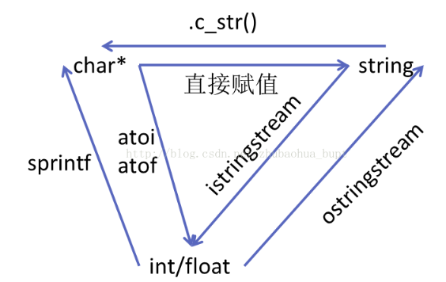
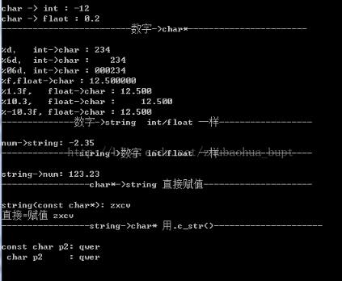

# 20180729int string 和char数组之间的转换




```cpp
#include<iostream>
#include<string>
#include<sstream>
#pragma warning(disable:4996)
using namespace std;
int main()
{
 
	cout << "-------------------------char*->数字------------------------"<<endl << endl;
	char a[] = {'-','1','2',',','3'};
	int num1 = atoi(a);
	cout << "char -> int : " << num1 << endl;
 
	char a1[] = { '.','2' };
	float num2 =atof(a1);
	cout << "char -> flaot : " << num2 << endl;
 
 
	cout << "-------------------------数字->char*-----------------------" << endl << endl;
	int num3 = +234;
	char c1[40];
	sprintf(c1,"%d",num3);//按正常位数转换
	cout << "%d，  int->char : " <<c1<< endl;
 
	sprintf(c1, "%6d", num3);//指定6位，不足左边补空格
	cout << "%6d， int->char : " << c1<< endl;
 
	sprintf(c1, "%06d", num3);//指定6位，不足左边补0
	cout << "%06d，int->char : " << c1 << endl;
	
	float num4 = 12.5;
	char c2[40];
	sprintf(c2, "%f", num4);//按num4实际情况转换
	cout << "%f,float->char : " << c2<< endl;
	//%m.nf  m代表c2打印总宽度，n代表保留的小数位 
	// if(m<=c2保留指定小数位后的总长度)，m不起作用，
	//else  输出m位，默认右对齐，不足位补空格
	sprintf(c2, "%1.3f", num4);
	cout << "%1.3f,   float->char : " << c2 << endl;
 
	sprintf(c2, "%10.3f", num4);
	cout << "%10.3,   float->char : " << c2 << endl;
 
	sprintf(c2, "%-10.3f", num4);//加‘-’表示右对齐
	cout << "%-10.3f, float->char : " << c2 << endl;
 
 
 
	cout << "--------------数字->string  int/float 一样------------------" << endl << endl;
	float num5 = -2.35;
	ostringstream ss;
	ss << num5;
	string s1 = ss.str();
	cout << "num->string: " << s1 << endl;
 
	cout << "---------------string->数字 int/float 一样------------------" << endl << endl;
	
	istringstream iss("123.23");
	float num6;
	iss>>num6 ;
	cout << "string->num: " << num6 << endl;
	
	cout << "-----------------char*->string 直接赋值---------------------" << endl << endl;
	char *p1 = "zxcv"; 
	string s2(p1);
	cout << "string(const char*): " << s2 << endl;
	string s3;
	s3 = p1;
	cout << "直接=赋值 " << s3 << endl;
 
	cout << "-----------------string->char* 用.c_str()---------------------" << endl << endl;
	string s4 = "qwer";
	const char *p2 = s4.c_str();
	cout << "const char p2: " << p2 << endl;
	char *p3 = (char*)s4.c_str();
	cout << " char p2     : " << p3 << endl;
	system("pause");
} 

```


