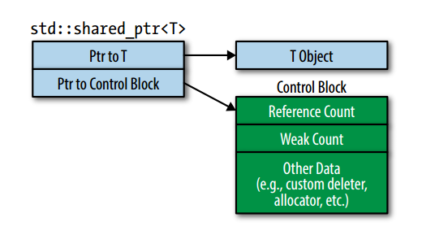

#20180406_C++常见面试问题总结

此次整理来自QQ群186588041，所有资料来自谭校长、张教主、H神、Robort、fight for dream、刀刀、二货（也就是我）
主要是总结了一些经常被问道的面试题
经验不足，水平有限，希望读者能提出宝贵的意见~~~~
这个和CSDN上我的blog是同步的：<http://blog.csdn.net/charles_r_chiu/article/details/47858885>

------

## 1、什么是虚函数？什么是纯虚函数？

答：虚函数声明如下： virtual ReturnType FunctionName(Parameter)；引入虚函数是为了动态绑定。
纯虚函数声明如下：virtual ReturnType FunctionName()= 0；引入纯虚函数是为了派生接口。

------

## 2、基类为什么需要虚析构函数？

答：标准规定：当derived class经由一个base class指针被删除而该base class的析构函数为non-virtual时，将发生未定义行为。通常将发生资源泄漏。
解决方法即为：为多态基类声明一个virtual 析构函数。

------

## 3.、当i是一个整数的时候++i和i++那个更快一点？i++和++i的区别是什么？

答：理论上++i更快，实际与编译器优化有关，通常几乎无差别。
i++实现的代码为：

```
//i++实现代码为：                                    
int operator++(int)                                  
{
    int temp = *this;                                     
    ++*this;                                             
    return temp;                                    
}//返回一个int型的对象本身
```

++i的实现代码：

```
// ++i实现代码为：
int& operator++()
{
    *this += 1;
    return *this;
}//返回一个int型的对象引用
```

i++和++i的考点比较多，简单来说，就是i++返回的是i的值，而++i返回的是i+1的值。也就是++i是一个确定的值，是一个可修改的左值，如下使用：

```
    cout << ++(++(++i)) << endl;
    cout << ++ ++i << endl;
```

可以不停的嵌套++i。
这里有很多的经典笔试题，一起来观摩下：

```
int main()
{
    
    int i = 1;
    printf("%d,%d\n", ++i, ++i);    //3,3
    printf("%d,%d\n", ++i, i++);    //5,3
    printf("%d,%d\n", i++, i++);    //6,5
    printf("%d,%d\n", i++, ++i);    //8,9
    system("pause");
    return 0;
}
```

首先是函数的入栈顺序从右向左入栈的，计算顺序也是从右往左计算的，不过都是计算完以后在进行的压栈操作：
对于第5行代码，首先执行++i，返回值是i，这时i的值是2，再次执行++i，返回值是i，得到i=3，将i压入栈中，此时i为3，也就是压入3，3；
对于第6行代码，首先执行i++，返回值是原来的i，也就是3，再执行++i，返回值是i，依次将3，5压入栈中得到输出结果
对于第7行代码，首先执行i++，返回值是5，再执行i++返回值是6，依次将5，6压入栈中得到输出结果
对于第8行代码，首先执行++i，返回i，此时i为8，再执行i++，返回值是8，此时i为9，依次将i，8也就是9，8压入栈中，得到输出结果。
上面的分析也是基于vs搞的，不过准确来说**函数多个参数的计算顺序是未定义的(the order of evaluation of function arguments are undefined)。笔试题目的运行结果随不同的编译器而异。**
参考：<http://www.stroustrup.com/bs_faq2.html#evaluation-order>
下面是使用其他编译器输出的结果：

```
//------ C++ version ------
#include <cstdio>
int main()
{
    int i = 1;
    printf("%d %d\n", ++i, ++i);
    printf("%d %d\n", ++i, i++);
    printf("%d %d\n", i++, i++);
    printf("%d %d\n", i++, ++i);
    return 0;
}
 
//------ C version ------
#include <stdio.h>
int main()
{
    int i = 1;
    printf("%d %d\n", ++i, ++i);
    printf("%d %d\n", ++i, i++);
    printf("%d %d\n", i++, i++);
    printf("%d %d\n", i++, ++i);
    return 0;
}
```

上面是参考的执行代码。
gcc-5.1(C++) gcc-5.1(C++14) gcc-5.1(C) 的执行结果：

```
3 3
5 3
6 5
8 9
```

gcc-4.3.2(C++) clang-3.7(C++) clang-3.7(C) 的执行结果

```
2 3
4 4
5 6
7 9
```

gcc-5.1(C99 strict) 的编译结果：编译不通过。

```
C99 strict prog.c: In function 'main':
prog.c:6:28: error: operation on 'i' may be undefined [-Werror=sequence-point]
     printf("%d %d\n", ++i, ++i);
                            ^
prog.c:7:29: error: operation on 'i' may be undefined [-Werror=sequence-point]
     printf("%d %d\n", ++i, i++);
                             ^
prog.c:8:29: error: operation on 'i' may be undefined [-Werror=sequence-point]
     printf("%d %d\n", i++, i++);
                             ^
prog.c:9:28: error: operation on 'i' may be undefined [-Werror=sequence-point]
     printf("%d %d\n", i++, ++i);
                            ^
cc1: all warnings being treated as errors
```

由上可见，这种比较毫无意义。

------

## 4.、vector的reserve和capacity的区别?

答：reserve()用于让容器预留空间，避免再次内存分配；capacity() 返回在重新进行内存分配以前所能容纳的元素数量。

------

## 5、在模板中，如何声明嵌套从属类型(即模板嵌套类型)？

答：template内出现的类型如果依赖于某个template参数，则称之为从属类型；如果从属类型在class内呈嵌套状，则称之为嵌套从属类型。

```
template<typename C>
void doSomething(const C& container)
{
    if(container.size() > 0)
        C::iterator iter(container.begin());
}
```

此时，根据C++的规则，编译器先假设C::iterator不是一个类型。然而iter的声明只有在C::iterator是一个类型时才合理。因此需要我们自己告诉编译器。
那么，就需要再C::iterator之前加上typename，告诉编译器C::iterator是一个类型。

```
template<typename C>
void doSomething(const C& container)
{
    if(container.size() > 0)
        typename C::iterator iter(container.begin());
}
```

如上就是。

------

## 6、 auto_ptr能作为vector的元素吗？为什么？

答：不可以。
当复制一个auto_ptr时，它所指向的对象的所有权被交到复制的auto_ptr上面，而它自身将被设置为null。复制一个auto_ptr意味着改变它的值。

------

## 7、如何初始化const和static数据成员？

答：通常在类外初始化static数据成员，但是 static const 的整型(bool，char，int，long)可以再类声明中初始化，static const的其他类型也必须在类外初始化(包括整型的数组)。

------

## 8、如何确保对象在抛出异常时也能被删除？什么是RAII？

答：总的思想是RAII：设计一个class，令他的构造函数和析构函数分别获取和释放资源。
有两个方法：

1. 利用“函数的局部对象无论函数以何种方式(包括因异常)结束都会被析构”这一特性，将“一定要释放的资源”放进局部对象的析构函数；
2. 使用智能指针。

------

## 9、 为什么需要private继承？

答：在这里把各种继承都说一下：
补充：不同继承描述符下，基类的各种修饰符下的成员转换为子类成员的修饰符示意：
参考：《TC++PL》 p363

| 继承描述符     | 父public成员    | 父protected成员 | 父private成员 |
| --------- | ------------ | ------------ | ---------- |
| public    | 子public成员    | 子protected成员 | -          |
| protected | 子protected成员 | 子protected成员 | -          |
| private   | 子private成员   | 子private成员   | -          |

------

## 10、如何实现单例模式？如何避免发生对象的用户复制行为？如何实现线程安全的单例模式？DCLP是什么，有什么问题？

答：
(1)、将构造函数、析构函数、复制构造函数、赋值操作符声明为私有，即可实现单例模式
单例模式实现代码通常为：

```
class Singleton
{
public:
    static Singleton* Instance();
protected:
    Singleton();
private:
    static Singleton* _instance;
};
Singleton::Singleton(){}
Singleton* Singleton::_instance = nullptr;
Singleton* Singleton::Instance()
{
    if(_instance == nullptr)
        _instance = new Singleton;
    return _instance;
}
```

(2)、避免用户的复制行为，可以将复制构造函数声明为private或者使用C++11中的delete语法。
(3)、实现线程安全的单例模式：上面实现中的GetInstance()不是线程安全的，因为在单例的静态初始化中存在竞争条件。如果碰巧有多个线程在同时调用该方法，那么就有可能被构造多次。
比较简单的做法是在存在竞争条件的地方加上互斥锁。这样做的代价是开销比较高。因为每次方法调用时都需要加锁。
比较常用的做法是使用双重检查锁定模式(DCLP)。但是DCLP并不能保证在所有编译器和处理器内存模型下都能正常工作。如，共享内存的对称多处理器通常突发式提交内存写操作，这会造成不同线程的写操作重新排序。这种情况通常可以采用volatile解决，他能将读写操作同步到易变数据中，但这样在多线程环境下仍旧存在问题。

------

## 11、相等和等价的区别？哪些类型的容器使用相等或等价？

答： 相等(equality)是以```operator==```为基础，如果```x==y```为真，则判定x和y相等。
等价(equavalence)是``以operator<``为基础，如果``!(x < y) && !(y < x)``为真，则判定x和y等价。
通常，关联容器采用“等价”，而顺序容器采用“相等”。

------

## 12、如何实现仿函数？为什么需要通过继承自unary_function 或者 binary_function来实现仿函数？

答：function object就是重载了函数调用操作符 `operator()`的一个struct或者class
所有内置一元仿函数均继承自unary_function，所有内置二元仿函数均继承自binary_function
继承自unary_function和binary_function的仿函数可以成为“可配接“的仿函数。可配接的仿函数，能够与其他STL组件更”和谐“地协同工作。

------

## 13、如果在构造函数和析构函数中抛出异常会发生什么？什么是栈展开？

答： (1)、构造函数抛异常：不会发生资源泄漏。假设在``operator new()``时抛出异常，那么将会因异常而结束此次调用，内存分配失败，不可能存在内存泄露。假设在别处(operator new() )执行之后抛出异常，此时析构函数调用，已构造的对象将得以正确释放，且自动调用operator delete()释放内存

<br>

析构函数抛异常：
可以抛出异常，但该异常必须留在析构函数；若析构函数因异常退出，情况会很糟糕(all kinds of bad things are likely to happen)
a、可能使得已分配的对象未能正常析构，造成内存泄露；
b、例如在对像数组的析构时，如果对象的析构函数抛出异常，释放代码将引发未定义行为。考虑一个对象数组的中间部分在析构时抛出异常，它无法传播，因为传播的话将使得后续部分不能正常释放；它也无法吸收，因为这违反了”异常中立“原则(异常中立，就是指任何底层的异常都会抛出到上层，也就相当于是异常透明的)。
(2)、抛出异常时，将暂停当前函数的执行，开始查找匹配的catch子句。首先检查throw本身是否在try块内部如果是，检查与该try相关的catch子句，看是否可以处理该异常。如果不能处理，就退出当前函数，并且释放当前函数的内存并销毁局部对象，继续到上层的调用函数中查找，直到找到一个可以处理该异常的catch。

------

## 14、如何在const成员函数中赋值？

答：使用mutable去掉const的成员函数的const性质
const_cast和mutable的比较
**const_cast:**
1) 强制去掉对象的const属性。
2) 缺点：对const对象，调用包含const_cast的const成员函数，属于未定义行为。
**mutable:**
1) 使用场景：对可能要发生变化的成员前，加上存储描述符mutable。
2) 实质：对加了mutable的成员，无视所有const声明。
为什么要有这种去除常量标志的需求？
答：两个概念：物理常量性和逻辑常量性
物理常量性：实际上就是常量。
逻辑常量性：对用户而言是常量，但在用户不能访问的细节上不是常量。
参考：《TC++PL》 p206

------

## 15、两种常用的实现隐式类类型转换的方式是什么？如何避免隐式类型转换？

答：(1)、
a、使用单参数的构造函数或N个参数中有N-1个是默认参数的构造函数，如：

```cpp
class A
{
public：
      A(stirng s);
      A(string s,int a = 0);
};
```

b、使用operator what_you_want_to_convert_type() const

```cpp
class A
{
public:
        operator char*() const
        {
            return data;	//当从其他类型转换到char*时自动调用
        }
private:
        char* data;
};
```

(2)、在单参数的构造函数或N个参数中有N-1个是默认参数的构造函数声明之前**加上explicit**。

------

## 16、STL中的vector：增减元素对迭代器的影响

解答：这个问题主要是针对连续内存容器和非连续内存容器。
a、对于连续内存容器，如vector、deque等，增减元素均会**使得当前之后的**所有迭代器失效。因此，以删除元素为例：由于erase()总是指向被删除元素的下一个元素的有效迭代器，因此，可以利用该连续内存容器的成员erase()函数的返回值。常见的编程写法为：

```cpp
for(auto iter = myvec.begin(); iter != myvec.end())  //另外注意这里用 "!=" 而非 "<"
{
    if(delete iter)
        iter = myvec.erase(iter);
    else ++iter;
}
```

还有两种极端的情况是：
(1)、vector插入元素时位置过于靠前，导致需要后移的元素太多，因此vector增加元素建议使用push_back而非insert；
(2)、当增加元素后整个vector的大小超过了预设，这时会导致vector重新分分配内存，效率极低。因此习惯的编程方法为：**在声明了一个vector后，立即调用reserve函数，令vector可以动态扩容**。通常vector是按照之前大小的2倍来增长的。
b、对于非连续内存容器，如set、map等。**增减元素只会使得当前迭代器无效**。仍以删除元素为例，由于删除元素后，``erase()``返回的迭代器将是无效的迭代器。因此，需要**在调用erase()之前，就使得迭代器指向删除元素的下一个元素**。常见的编程写法为：

```cpp
for(auto iter = myset.begin(); iter != myset.end())  //另外注意这里用 "!=" 而非 "<"
{
    if(delete iter)
        myset.erase(iter++);  //使用一个后置自增就OK了
    else ++iter;
}
```

其实在C++11中**erase的返回值就是下一个节点，也可以利用函数的返回值**。

------

## 17、new和malloc的区别

解答：这个问题答案过于复杂，建议直接百度这个问题，网上的说法已经足够完善。
不过针对网上的一些说法补充并且纠正一下。网上在回答这个问题的时候没有对new操作符进行深入的解释，在这里大致说一下。
new可分为operator new(new 操作)、new operator(new 操作符)和placement new(定位 new)。其中operator new执行和malloc相同的任务，即分配内存，但对构造函数一无所知；而 new operator则调用operator new，分配内存后再调用对象构造函数进行对象的构造。
其中operator new是可以重载的。placement new，就是operator new的一个重载版本，允许你在一个已经分配好的内存中构造一个新的对象。而网上对new说法，大多针对operator new而言，因此说new是带有类型的(以为调用了类的构造函数)，不过如果直接就说new是带有类型的话，明显是不合适的，比如原生的operator new。可以参考我的一个程序，这个程序是用代理模式实现一个自定义二维数组，在第二个维度拷贝构造的时候， 拷贝构造需要深拷贝(当然第一个维度也需要)，执行深拷贝时代码大致如下：

```cpp
class Array2D    //二维数组模板
{
private:
        size_t length2,length1; //数组各个维的大小
        Array1D<T>* data;
}
void* raw  =::operator new[](length2*sizeof(Array1D<T>));
data = static_cast<Array1D<T>*>(raw);
```

可见执行operator new的时候申请的原生内存是可以不带有类型的。
1) malloc()分配指定字节数的未经初始化的内存空间，返回的是void指针；new操作符为一个指定类型的对象分配空能，并调用其构造函数初始化，返回的是该对象的指针。
2) malloc()必须要做初始化，以及将void指针转换成合适类型的指针。同时要考虑到分配的内存大小正好是你所需要的大小。当new操作符使用"(value)" notation，即可得到值为value的初始化。如果考虑上初始化的开销，malloc()和new没有性能上的差别。

------

## 18、C++如何避免内存泄漏

解答：这其实可以看做是一个编程风格的问题。
a、使用RAII(Resource Acquisition Is Initialization,资源获取即初始化)技法，以构造函数获取资源(内存),析构函数释放。
b、相比于使用原生指针，更建议使用智能指针，尤其是C++11标准化后的智能指针。
c、注意delete和``delete[]``的使用方法。
d、这是很复杂的一种情况，是关于类的copy constructor的。首先先介绍一些概念。
同default constructor一样，标准保证，如果类作者没有为class声明一个copy constructor，那么编译器会在**需要的时候**产生出来(这也是一个常考点：问道"如果类作者未定义出default/copy constructor，编译器会自动产生一个吗？"答案是否定的)
不过请注意！！这里编译器即使产生出来，也是为**满足它的需求，而非类作者的需求**！！
而什么时候是编译器"需要"的时候呢？是在当这个class 【不表现出】bitwise copy semantics(位逐次拷贝，即浅拷贝)的时候。
在4中情况下class【不表现出】bitwise copy semantics
(1)、当class内含一个member object且该member object声明了一个copy constructor(无论该copy ctor是类作者自己生明的还是编译器合成的)；
(2)、当class继承自一个base class且该base class有一个copy constructor(无论该copy ctor是类作者自己生明的还是编译器合成的)；
(3)、当class声明了virtual function；
(4)、当class派生自一个继承链，且该链中存在virtual base class时。
言归正传，如果class中仅仅是一些普通资源，那么default memberwise copy是完全够用的；然而，挡在该class中存在了一块动态分配的内存，并且在之后执行了bitwise copy semantics后，将会有一个按位拷贝的对象和原来class中的某个成员指向同一块heap空间，当执行它们的析构函数后，该内存将被释放两次，这是未定义的行为。因此，在必要的时候需要使用user-defined explicit copy constructor，来避免内存泄露。

------

## 19、STL中排序算法的实现是什么

解答：STL中的sort()，在数据量大时，采用quicksort，分段递归排序；一旦分段后的数量小于某个门限值，改用Insertion sort，避免quicksort深度递归带来的过大的额外负担，如果递归层次过深，还会改用heapsort。

------

## 20、指针和引用的区别

本质：指针是一个变量，存储内容是一个地址，指向内存的一个存储单元。而引用是原变量的一个别名，实质上和原变量是一个东西，是某块内存的别名。
指针的值可以为空，且非const指针可以被重新赋值以指向另一个不同的对象。而引用的值不能为空，并且引用在定义的时候必须初始化，一旦初始化，就和原变量“绑定”，不能更改这个绑定关系。
不过如下的写法也是同的过编译器的：

```cpp
int *iptr = NULL;
int& iref = *iptr;
```

但是，上面的写法是非人类的。
对指针执行sizeof()操作得到的是指针本身的大小（32位系统为4,64位系统为8）。而对引用执行sizeof()操作，由于引用本身只是一个被引用的别名，所以得到的是所绑定的对象的所占内存大小。
指针的自增(++)运算表示对地址的自增，自增大小要看所指向单元的类型。而引用的自增(++)运算表示对值的自增。
在作为函数参数进行传递时的区别：指针作为函数传输作为传递时，函数内部的指针形参是指针实参的一个副本，改变指针形参并不能改变指针实参的值，通过解引用*运算符来更改指针所指向的内存单元里的数据。而引用在作为函数参数进行传递时，实质上传递的是实参本身，即传递进来的不是实参的一个拷贝，因此对形参的修改其实是对实参的修改，所以在用引用进行参数传递时，不仅节约时间，而且可以节约空间。
上面是引用和指针的区别，总的来说，如果你需要一个可能会为空，或者还会指向别的值的时候，就使用指针，如果是要一开始就要指向一个object，并不会改变的时候就可以只用引用。

------

## 21、指针数组和数组指针的区别

顾名思义，数组指针应该是指向数组的指针，而指针数组则是指该数组的元素均为指针。
数组指针，是指向数组的指针，其本质为指针，形如int (*p)[10]，p即为指向数组的指针；数组指针是指向数组首元素的地址的指针，其本质为指针，可以看成是二级指针

指针数组，在C语言和C++中，数组元素全为指针的数组称为指针数组，其中一维指针数组的定义形式为：
类型名 *数组标识符[数组长度]
指针数组中每一个元素均为指针，其本质为数组，例如我们经常使用的动态数组的就是基于此的使用，如下示例：

```cpp
size_t row,col;
//输入row和col的数值
int **MathTable = new int*[row];
for( int i = 0 ; i < row ; i++ )
    MathTable[i] = new int[col];
//code
for( int i = 0 ; i < row ; i++ )
    delete [] MathTable[i];
delete []MathTable;
```

也就是形如``int *p[10]``这样的声明，就是我们这里的指针数组，从声明形态上来讲，是由于``[]``的优先级高于``*``，又有诸如下面的指针：

```cpp
*ptr_arry[i]
```

指针数组中的元素可以表示为：

```cpp
*(*(ptr_arry+i))
```

()的优先级较高，又由于又结合的原因，可以化简为：

```cpp
**(ptr_arry+i)
```

由于数组元素均为指针，因此prt_array[i]是指第i+1个元素的指针。

------

## 22、指针函数和函数指针

此处还有两个需要区分的概念，就是函数指针和指针函数。
函数指针
函数指针：指向函数的指针变量，在C编译时，每一个函数都有一个入口地址，那么指向这个函数的函数指针便是指向这个地址。函数指针主要有两个作用：用作调用函数和做函数的参数。
int (*func)(int x);
诸如上面的代码这是申明了一个函数指针，代码(*func)中括号是必须的，这会告诉编译器这是一个函数指针而不是声明一个具有返回类型为指针的函数，后面的形参要是这个函数所指向的函数形参而定。使用如下面的代码：

```
#include <iostream>
 
using namespace std;
 
int(*func)(int a, int b);
int bar(int a, int b)
{
    return a + b;
}
 
 
 
int foo(int a, int b)
{
    return a;
}
int _tmain(int argc, _TCHAR* argv[])
{
    func = bar;
    cout << func(12, 34) << endl;
    system("pause");
    func = foo;
    cout << func(12, 34) << endl;
    system("pause");
    return 0;
}
```

这样的声明有些繁琐，其实可以使用typedef来进行简化：

```
#include <iostream>
 
using namespace std;
 
typedef int(*PF)(int, int);
//int(*func)(int a, int b);
int bar(int a, int b)
{
    return a + b;
}
 
 
 
int foo(int a, int b)
{
    return a;
}
int _tmain(int argc, _TCHAR* argv[])
{
    PF func;
    func = bar;
    cout << func(12, 34) << endl;
    system("pause");
    func = foo;
    cout << func(12, 34) << endl;
    system("pause");
    return 0;
}
```

函数指针的另一个作用就是作为函数的参数，可以在一个函数的形参列表中传入函数指针，然后边可以在这个函数中使用这个函数指针所指向的函数，这样边可以使程序变得更加清晰和简洁。

```
#include <iostream>
 
using namespace std;
 
typedef int(*PF)(int, int);
//int(*func)(int a, int b);
int bar(int a, int b)
{
    return a + b;
}
 
 
 
int foo(int a, int b)
{
    return a;
}
 
 
void func(int a, int b, PF ptr)
{
    cout << ptr(a, b) << endl;
    return;
}
int _tmain(int argc, _TCHAR* argv[])
{
    PF ptr;
    ptr = bar;
    func(12, 34, ptr);
    system("pause");
    ptr = foo;
    func(12, 34, ptr);
    system("pause");
    return 0;
}
```

一旦知道函数指针是如何工作的，我们就可以构建一些复杂的定义，例如：

```
void *(*(*fp1)(int))[10];
```

fp1是一个指向函数的指针，该函数接受一个整型参数，并且返回类型是一个指向包含了10个void指针数组的指针。是不是很绕？

```
float (*((*fp2)(int,int,float)))(int);
```

fp2是一个指向函数的指针，该函数接受三个参数(int,int,float)，返回值是一个指向函数的指针，该函数接受一个整型参数并返回一个float。

```
typedef doubele (*(*(*fp3)())[10])();
```

fp3是一个函数指针，该函数无参数，且返回一个指向含有10个指向函数指针指针数组的指针，这些函数不接收参数，且返回值是double值

```
int (*(*fp4())[10])();
```

fp4是一个返回指针的函数，该指针指向含有10个函数指针的数组，这些函数的返回值是整型。

指针函数
与函数指针相区别的定义应该就是指针函数，指针函数本质上是一个函数，是指函数的返回值为指针的函数，一般是形如下的函数：
int* func(int x,int y);
如上就是一个返回值是指针的函数，很常见。
函数对象
上面谈到了函数指针以及应用，这里涉猎下函数对象。从一般函数回调意义上来说，函数对象和函数指针是相同的，但是函数对象却具有许多函数指针不具有的优点，函数对象使程序设计更加灵活，而且能够实现函数的内联（inline）调用，使整个程序实现性能加速。

------

## 23、二维动态数组的申请和删除

首先是如何申请二维的数组，这里我们先申请一个指针数组，然后令指针数组中的每一个元素都指向一个数组，这样二维数组就成了：

```
    size_t row, col;
    //输入row和col的数值
    int **MathTable = new int*[row];
    for (int i = 0; i < row; i++)
        MathTable[i] = new int[col];
```

然后是释放空间的过程：

```
    //code
    for (int i = 0; i < row; i++)
        delete[] MathTable[i];
    delete[]MathTable;
```

符合new和delete配对的原则，怎么new出来就怎么delete掉。

------

## 24、关于shared_ptr使用需要记住什么？

总结下来需要注意的大概有下面几点：
1）、尽量避免使用raw pointer构建shared_ptr，至于原因此处不便于多讲，后续还有讲解
2）、shared_ptr使得依据共享生命周期而经行地资源管理进行垃圾回收更为方便
3）、shared_ptr对象的大小通常是unique_ptr的两倍，这个差异是由于Control Block导致的，并且shared_ptr的引用计数的操作是原子的，这里的分析也会在后续看到
4）、默认的资源销毁是采用delete，但是shared_ptr也支持用户提供deleter，与unique_ptr不同，不同类型的deleter对shared_ptr的类型没有影响。

------

## 25、C和C++的区别

1. 标准：分别隶属于两个不同的标准委员会。C以C99标准为主流，C11已经发布；C++以C++98/03为主流，C++11/14也日趋流行。
2. 语言本身：
   1. C++是面向对象语言，C是面向过程语言。
   2. 结构：C以结构体struct为核心结构；C++以类class为核心结构。
   3. 多态：C可以以宏定义的方式“自定义”部分地支持多态；C++自身提供多态，并以模板templates支持编译期多态，以虚函数virtual function支持运行期多态。
   4. 头文件的调用：C++用< >代替" "代表系统头文件；且复用C的头文件时，去掉".h"在开头加上"C"。
   5. 输入输出：鉴于C++中以对象作为核心，输入和输出都是在流对象上的操作。
   6. 封装：C中的封装由于struct的特性全部为公有封装，C++中的封装由于class的特性更加完善、安全。
   7. 常见风格：C中常用宏定义来进行文本替换，不具有类型安全性；C++中常建议采用常量定义，具有类型安全性。
   8. 效率：常见的说法是同等目的C通常比C++更富有效率(这其实有一定的误解，主要在于C++代码更难于优化且少有人使用编译期求值的特性)。
   9. 常用语言/库特性：
      1. 数组：C中采用内建数组，C++中建议采用vector。相比之下vector的大小可以动态增长，且使用一些技巧后增长并不低效，且成员函数丰富。
      2. 字符串 C中采用C风格的string(实则为字符串数组)，C++中建议采用string，对比与上一条类似。
      3. 内存分配：C中使用malloc与free，它们是是C标准库函数，C++中建议使用new/delete代替前者，他们说是C++的运算符(这是笔试面试常考点)以C++中的new为例，new可分为operator new(new 操作)、new operator(new 操作符)和placement new(定位 new)。其中operator new执行和malloc相同的任务，即分配内存，但对构造函数一无所知；而 new operator则调用operator new，分配内存后再调用对象构造函数进行对象的构造。其中operator new是可以重载的。placement new，就是operator new的一个重载版本，允许你在一个已经分配好的内存中构造一个新的对象。
      4. 指针：C中通常使用的是原生指针(raw pointer)，由于常出现程序员在申请后忘记释放造成资源泄漏的问题，在C++98中加入了“第一代”基于引用计数的智能指针auto_ptr，由于初代的各种问题(主要是无法解决循环指针)，在03标准也就是TR1中引入了shared_ptr,weak_ptr和unique_ptr这三个功能各异的智能指针，并与11标准中正式确定，较好的解决了上述问题。
3. 仅有C++才有的常用特性：
   1. 语言(范式)特性：
      1. 面向对象编程：C++中以关键字class和多态特性支持的一种编程范式；
      2. 泛型编程：C++中以关键字template支持的一种编程范式；
      3. 模板元编程 ：C++中以模板特化和模板递归调用机制支持的一种编程范式。
      4. C++中以对象和类型作为整个程序的核心，在对象方面，时刻注意对象创建和析构的成本，例如有一个很常用的(具名)返回值优化((N)RVO);
         在类型方面，有运行时类型信息(RTTI)等技术作为C++类型技术的支撑。
      5. 函数重载：C++允许拥有不同变量但具有相同函数名的函数(函数重载的编译器实现方式、函数重载和(主)模板特化的区别都曾考过)。
      6. 异常：以catch、throw、try等关键字支持的一种机制。
      7. 名字空间：namespace，可以避免和减少命名冲突且让代码具有更强的可读性。
      8. 谓词用法：通常以bool函数或仿函数(functor)或lambda函数的形式，出现在STL的大多数算法的第三个元素。
   2. 常见关键字(操作符)特性：
      1. auto：在C中，auto代表自动类型通常都可省略；而在C++11新标准中，则起到一种“动态类型”的作用——通常在自动类型推导和decltype搭配使用。
      2. 空指针：在C中常以NULL代表空指针，在C++中根据新标准用nullptr来代表空指针。
      3. &: 在C中仅代表取某个左值(lvalue)的地址，在C++中还可以表示引用(别名)。
      4. &&：在C中仅能表示逻辑与，在C++中还可以表示右值引用。
      5. []：在C中仅能表示下标操作符，在C++中还可以表示lambda函数的捕捉列表。
      6. {}：在C中仅能用于数组的初始化，在C++中由于引入了初始化列表(initializer_list)，可用于任何类型、容器等的初始化。
      7. 常量定义：C中常以define来定义常量，C++中用const来定义运行期常量，用constexpr来定义编译器常量。
   3. 常用新特性：
      1. 右值引用和move语义(太多内容，建议自查)。
      2. 基于范围的for循环(与python中的写法类似，常用于容器)。
      3. 基于auto——decltype的自动类型推导。
      4. lambda函数(一种局部、匿名函数，高效方便地出现在需要局部、匿名语义的地方)。
      5. 标准规范后的多线程库。

------

## 26、C++的内存对齐

为什么要内存对齐？这个网上讲得更全面，就不再多说了。简而言之，为了速度和正确性。详见网页：<http://blog.csdn.net/lgouc/article/details/8235471>，英文原版：（<http://www.ibm.com/developerworks/library/pa-dalign/>）

1. C/C++中的内存对齐之基础篇
   这里主要以【不带有】虚继承链和虚函数的struct/class为例,【注意：所有的空间均需要为最大类型大小的整数倍】
   1. 这里有一个C和C++不同的情况：在C中，空struct/class不占有内存，在C++中，空struct/class通常占有1byte的空间，原因是编译器强行在里面放入了一个char，这样可以使得这个class的不同实例化在内存中分配到独一无二的地址。
   2. 最基本的内存对齐情况(其中注释代表该类型实际大小)

```
        struct A
        {
                char   c; //1byte
                double d; //8byte
                int i;       //4byte
        };
```

在64位g++和vs2013下运行sizeof(A)结果均为24。这种情况下的计算都比较简单，首先确定最大类型的大小，这里是double，因此Max = 8，因此占据的空间就应该是8的倍数(相应的，若struct内最大的类型为int，那么占据的空间就应该是4的倍数)。补齐的大小就根据最大类型的长度来确定。通常在内存中按照变量声明的顺序来分配空间，先为char分配，占据1byte， 8 - 1 = 7，剩余空间小于下一个变量double的需要空间，因此另外开辟一个8byte用于安放double，紧接着安放int，它占据另一个8byte空间的4个byte。而char后面的7byte、int后面的4byte都用于内存对齐。
因此总大小为8+8+8 = 24(可以看成1+7 + 8 + 4+4)。

```
        struct A
        {
                double d; //8byte
                char   c; //1byte
                int i; //4byte
        };
```

在64位g++和vs2013下运行sizeof(A)结果均为16。根据上述说明，很容易得到 8 + 1+4+3 = 16，其中3为char、int之后的补齐。

1. 稍复杂一点的内存对其情况

```
        class A
        {
        public:
                static double dd;
                char   c; //1byte
                double d; //8byte
                static A a;
                int i; //4byte
        };
```

在64位g++和vs2013下运行sizeof(A)结果均为24。这里只需要注意一下，static data member会被放在class object之外。因此sizeof(A)时，不会计算他们的大小在内。其余计算同 2 中的第一个例子相同。

1. 只有一种类型时的情况：如一个struct中仅有一个char或int等，由于“所有的空间均需要为最大类型大小的整数倍”这个原则，struct的空间大小就是这些类型各自的大小，而不用再进行补齐。
   C/C++中的内存对齐之深入篇——虚继承和虚函数

```
        class A
        {
        public:
                virtual ~A();
                char   c; //1byte
                double d; //8byte
                int i; //4byte
        };
```

在32位g++下运行sizeof(A)结果为24，在64位g++下运行sizeof(A)结果为32，在vs2013下运行sizeof(A)结果为32。
32位g++下：通常将vptr放在object的最前面，可以确定该内存空间与data member的内存空间不需要独立。也就是说，该例中，无论虚析构函数被声明在哪里，都会在分配空间时最先给一个vptr分配4byte的空间，且该空间后是可以紧接着分配char的1byte的空间。以此类推，结合上面的例子，可以得出4(vptr)+1(char)+3(补齐) + 8 + 4+4 = 24
64位g++下：通常将vptr放在object的最前面，无法确定该内存空间与data member的内存空间是否需要独立。也就是说，该例中，无论虚析构函数被声明在哪里，都会在分配空间时最先给一个vptr分配8byte的空间，且不清楚该空间后是否可以紧接着分配char的1byte的空间(由于该vptr占据8byte，无论是否需要间隔，效果都一样)，以此类推，结合上面的例子，可以得出

```
8(vptr)+ 1(char)+7(补齐) + 8 + 4+4 = 32
```

在vs2013下：通常将vptr放在object的最前面，vptr的大小与实际最大类型的大小相关。也就说说，该例中，无论虚析构函数被声明
在哪里，都会在分配空间时最先给一个vptr分配4byte的空间，由于后面存在double类型，需要将vptr补齐。结合上面的例子，可以得出

```
4(vptr)+4(补齐) + 1+7 + 8 +4+4 = 32
```

2、带有普通继承的class的内存对齐情况

```
        class A
        {
                int i;    //4byte
                char c1;//1byte
        };
        class B :  public A
        {
                char c2;//1byte
        };
        class C :  public B
        {
             char c3;//1byte
        };
```

在64位g++下，调用sizeof(A)、sizeof(B)、sizeof(C)后的结果均为8；在vs2013下分别为8,12,16

```
g++下：普通继承时，派生类和基类的内存空间没有间隔。
    A：4+1+3(补齐) = 8
    B：4+1+1(c2)+2(补齐) = 8
    C：4+1+1(c2)+1(c3)+1(补齐) = 8
注意这里所有成员均为私有成员，如果改成public或protected则大小会有变化
vs2013下：普通继承时，派生类和基类的内存空间需要独立，即先补齐基类，再分配派生类。
    A：4+1+3(补齐) = 8
    B：4+1+3(补齐) + 1(c2)+3(补齐) = 12
    C：4+1+3(补齐) + 1(c2)+3(补齐) + 1(c3)+3(补齐) = 16
```

3、带有虚拟继承链的class的内存对齐情况

```
        class A
        {
                int i;    //4byte
                char c1;//1byte
        };
        class B : virtual public A
        {
                char c2;//1byte
        };
        class C : virtual public B
        {
             char c3;//1byte
        };
```

调用sizeof(A)、sizeof(B)、sizeof(C)后，32位g++下，分别为8,16,24；64位g++下，分别为：8,24,40；vs2013下分别为8,16,24

```
32位g++下：
    A：仍然是4+1+3(补齐) = 8
    B：4+1+3 + 4(vptr)+1(c2)+3(补齐) = 16
    C；4+1+3 + 4(vptr)+1(c2)+3(补齐) + 4(vptr)+1(c3)+3(补齐) = 24
64位g++下：
    A：仍然是4+1+3(补齐) = 8
    B：4+1+3 + 8(vptr)+1(c2)+7(补齐) = 24
    C；4+1+3 + 8(vptr)+1(c2)+7(补齐) + 8(vptr)+1(c3)+7(补齐) = 40
vs2013下：
    A：仍然是4+1+3(补齐) = 8
    B：4+1+3 + 4(vptr)+1(c2)+3(补齐) = 16
    C；4+1+3 + 4(vptr)+1(c2)+3(补齐) + 4(vptr)+1(c3)+3(补齐) = 24
注意这里vs2013的情况表面看上去和32位g++相同，实则不然。例如去掉class B对于A的虚拟继承性
```

```
        class A
        {
                int i;    //4byte
                char c1;//1byte
        };
        class B :  public A    /*注意这里跟上面相比不是虚拟继承了*/
        {
                char c2;//1byte
        };
        class C : virtual public B
        {
             char c3;//1byte
        };
```

调用sizeof(A)、sizeof(B)、sizeof(C)后，32位g++下：分别为8,8,16；vs2013下分别为8,12,20

```
32位g++下：
    A：仍然是4+1+3(补齐) = 8
    B：B：4+1+1(c2)+2(补齐) = 8(因为不是虚拟继承)
    C；4+1+1(c2)+2(补齐) + 4(vptr)+1(c3)+3(补齐) = 16
vs2013下：
    A：仍然是4+1+3(补齐) = 8
    B：4+1+3(补齐) + 1(c2)+3(补齐) = 12
    C；4+1+3(补齐) + 1(c2)+3(补齐) + 4(vptr)+1(c3)+3(补齐) = 20
```

虚基类的继承是C++中为了多重继承而产生的，但是虚基类的继承有带来了新的问题，如何能够实现这种动态绑定呢？

**<u>*不是虚继承，内存都是在一块的。*</u>**

------

## 27、为什么函数参数的入栈的顺序是从右往左

因为好多函数是不定参数个数的，比如最常用的printf，所以需要参数的入栈顺序是从右往左。

------

## 28、C++的多态机制

inside C++ object

------

## 29、C++中的转化机制？各适用于什么环境？dynamic_cast转换失败时，会出现什么情况？

对指针，返回NULL.对引用，抛出bad_cast异常more Effective C++

C++引入了4种类型转化操作符（cast operator）：static_cast，const_cast，dynamic_cast和reinterpret_cast，使用方法与C语言中略有不同：

```
(type)expression; //这是C语言的
```

然后引入C++的：

```
static_cast<type>(expression);//这是C++的
```

然后看一下各自的适用范围：

static_cast：static_cast基本上拥有与C旧式转型相同的威力和意义，以及相同的限制。但是，该类型转换操作符不能移除常量性，因为有一个专门的操作符用来移除常量性。
const_cast：用来改变表达式中的常量性（constness）或者易变形（volatileness），只能用于此功能。**【用mutable??】**
dynamic_cast：将指向基类basic class object的pointer或者reference转型为指向派生类derived（或这sibling base）class object的pointer或者reference中，并且可以获知是否转型成功：如果转型失败，当转型对象是指针的时候会返回一个null指针；当转型对象是reference会抛出一个异常exception。dynamic_cast无法应用在缺乏虚函数的类型上，也不能改变类型的常量性。
此外，dynamic_cast还有一个用途就是找出被对象占用的内存的起始点。
reinterpret_cast：这个操作符的转换结果几乎总是和编译器平台相关，所以不具有移植性。reinterpret_cast的最常用用途是转换“函数指针”类型，如下：

```
typedef void(*FuncPtr)();
int doSomething();
int main()
{
    FuncPtr funcPtrArray[10];
    funcPtrArray[0] = reinterpret_cast<FuncPtr>(&doSomething);
    return 0;
}
```

通过reinterpret_cast强迫编译器了，并成功的将不同的类型的函数&doSomething转换为需要的类型。不过这个操作符进行的转换动作不具有移植性（C++不保证所有的函数指针都能以此方式重新呈现），某些情况下这样的转型可能会导致不正确的结果，所以这种操作不到万不得已不要使用。

------

## 30、 拷贝构造函数作用及用途？什么时候需要自定义拷贝构造函数？

答：

1. 在C++中，有下面三种对象需要拷贝的情况：
   1. 一个对象以值传递的方式传入函数体
   2. 一个对象以值传递的方式从函数返回
   3. 一个对象需要通过另外一个对象进行初始化
      以上的情况就需要拷贝构造函数的调用。

   ```
   函数的输入输出
   一个对象用另一个对象进行初始化
   ```

   ​

2. 当类中的数据成员需要动态分配存储空间时，不可以依赖default copy constructor。当default copy constructor被因编译器需要而合成时，将执行default memberwise copy语义。此时如果类中有动态分配的存储空间时，将会发生惨重的灾情。在需要时（包括这种对象要赋值、这种对象作为函数参数要传递、函数返回值为这种对象等情况），要考虑到自定义拷贝构造函数。

```
有指针，需要深复制。
```


## 31、构造函数可以调用虚函数吗？语法上通过吗？语义上可以通过吗？

不能，语法上通过，语义上有问题。
derived class对象内的base class成分会在derived class自身构造之前构造完毕。因此，在base class的构造函数中执行的virtual函数将会是base class的版本，决不会是derived class的版本。
即使目前确实正在构造derived class。

```
所以基函数调用的虚函数还是 基类的 版本。
```


------

## 32、深拷贝和浅拷贝的区别

答：浅拷贝：如果在类中没有显式地声明一个拷贝构造函数，那么，编译器将会根据需要生成一个默认的拷贝构造函数，完成对象之间的位拷贝。default memberwise copy即称为浅拷贝。
此处需要注意，并非像大多数人认为的“如果class未定义出copy constructor，那么编译器就会为之合成一个执行default memberwise copy语义的copy constructor”。
通常情况下，只有在default copy constructor被视为trivial时，才会发生上述情况。一个class，如果既没有任何base/member class含有copy constructor，也没有任何virtual base class或 virtual functions，
它就会被视为trivial。
通常情况下，浅拷贝是够用的。

```
浅拷贝：默认的构造函数
默认的拷贝构造在以下视为trivial 时：
- 基类未定义拷贝构造
- 无任何虚基类或者虚函数
```


深拷贝：然而在某些状况下，类内成员变量需要动态开辟堆内存，如果实行位拷贝，也就是把对象里的值完全复制给另一个对象，如A=B。
这时，如果B中有一个成员变量指针已经申请了内存，那A中的那个成员变量也指向同一块内存。如果此时B中执行析构函数释放掉指向那一块堆的指针，这时A内的指针就将成为悬挂指针。
因此，这种情况下不能简单地复制指针，而应该复制“资源”，也就是再重新开辟一块同样大小的内存空间。

```
深拷贝： 涉及动态分配内存时。
```


------

## 33、动态绑定和静态绑定的区别

1. 对象的静态类型：对象在声明时采用的类型。是在编译期确定的。

2. 对象的动态类型：目前所指对象的类型。是在运行期决定的。对象的动态类型可以更改，但是静态类型无法更改。

3. 静态绑定：绑定的是对象的静态类型，某特性(比如函数)依赖于对象的静态类型，发生在编译期。

4. 动态绑定：绑定的是对象的动态类型，某特性(比如函数)依赖于对象的动态类型，发生在运行期。

   ```
   静态和动态，一个在编译期，一个在运行期。
   ```

   ​

------

## 34、函数模板特化与重载决议中的陷阱

这个题目的答案来自张教主的整理
1：

```
template<typename T> void f(T);/* a */          
template<typename T> void f(T*);/* b */         
template< > void f<int>(int*);/* c */           
int* p;                                         
f(p);   
```

2：

```
template<typename T> void f(T);/* a */
template< > void f<int*>(int*);/* b */
template<typename T> void f(T*);/* c */
int* p;
f(p);
```

现在请问1和2中的f(p)分别会调用a、b、c中的哪一个？
解答：
如果你认为1中的f(p)调用的是c的话，恭喜答对了。然而如果按绝大部分人的想法再来回答2中的调用情况时，他会回答调用b(也就是和1中一样的模板，这里
顺序交换了一下编号也换了，请注意)，那么狠抱歉，错了。
分析前先回顾一下模板特化的东西。

1. 非特化的模板也被称为主模板；
2. 类模板能全特化和偏特化；
3. 函数模板只能全特化，不过由于函数重载的原因，能达到偏特化的效果。

现在分析如下：
对于第1个：

```
    /// 1- 重载决议发生在以下两个主模板之间（先忽略全特化）
    template<typename T> void f(T);/* a */     主模板      
    template<typename T> void f(T*);/* b */    函数不存在偏特化，是第一个的重载
    
    /// 2- 从上面主模板决议中选出b，然后选择下面的全特化版本。
    template< > void f<int>(int*);/* c */      是重载模板的显示特化（全特化）    
    int* p;                                        
    f(p);  
```

这里，a是第一个主模板，b是第二个主模板，且b是第一个主模板a的**重载而非偏特化**(函数模板没有偏特化)。c是第二个主模板b的显式特化(全特化)。
在f(p)调用时，发生重载决议，会无视特化存在(标准规定：**重载决议无视模板特化，重载决议只会发生在主模板之间**)。在主模板a和b中决议出b，即第二个主模板被决议选中，然后再调用其全特化版本c。
对于第2个：

```
    template<typename T> void f(T);/* a */       主模板    
    template< > void f<int*>(int*);/* b */       全特化
    template<typename T> void f(T*);/* c */      第二个主模板（重载的函数模板）
    
    /// 1- 先忽略全特化，在主模板和重载的版本选择c， 而c无全特化版本，所以直接选择c                                              
    int* p;                                        
    f(p);
```

这里a是第一个主模板，b是第一个主模板a的全特化，c是第二个主模板。在f(p)调用时，发生重载决议，同样会无视特化存在，在主模板a和c中决议出c，而c并 无全特化版本，因此直接调用c。

```
1- 先忽略全特化版本，重载决议中选择一个重载的主模板
2- 查看1中选择的重载版本，是否有全特化版本，若有，则选择，若无，则不选择。
```


------

## 35、virtual函数能声明为内联吗？为什么？

答：通常情况下是不能的
原因：inline是编译期决定，他意味着在执行前就将调用动作替换为被调用函数的本体；
virtual是运行期决定，他意味着直道运行期才决定调用哪个函数。
这两者之间通常是冲突的。
然而也**有特例，就是当编译阶段就已经知道调用虚函数的指针为多态指针**。这里就不再敖述了。

```
一个是编译器决定的，一个是运行期决定的。
```


------

## 36、哪些类型的对象不可以作为union的成员？为什么有这种限制？

答： 标准规定，凡是具有non-trivial constructor、non-trivial destructor、non-trivial copy constructor、non-trivial assignment operator的class对象都不能作为union的成员。
即是说，这个class的以上四种成员必须均经由编译器合成且该class无虚函数和虚基类。
有这种限制是为了兼容C。

```cpp
triavial通常是指没有意义，在构造类对象的时候，有时候编译器会自动生成构造函数（拷贝构造以及＝号运算符号），有时候这些函数对于用户来说是没有意义的（尤其是在类里边有动态分配的指针时）。但在以下4种情况下，缺省的构造函数是有意义的：
1.类里边有其他类变量（该类有缺省构造函数）
2.类是从另外一个类继承而来（基类有缺省构造函数）
3.类里边有虚函数。
4.虚继承的情况。
```

像这种，析构就没有实际的意义

```cpp
class A{
public:
    A();
    ~A()
    int a;
    char b;
}
```


------

## 37、C++11有哪些进步？有哪些新的东西？

lambda
线程库
智能指针
auto

------

## 38、如何实现一个不能在堆分配的类，如何实现一个不能被继承的类

如何实现一个不能在堆上分配的类，如果要在堆上分配就是会使用new，所以可以重载new 操作符，并将其重载于class A的private内：

```
class A 
{
public:
    A(int a):_x(a){}
    int Display() {
        return _x;
    }
    void setVal(int x) {
        _x = x;
        return;
    }
private:
    //
    int _x;
    void* operator new(size_t t){
    }
};
```

如何实现一个**不能被继承的类**，这里有一个比较简单的方法，利用C++11的新**关键字final**：

```
class B final {
public:
    B(int a) {
    }
};
```

现在就不能继承该类。

------

下面是第二期的地址：<http://blog.csdn.net/charles_r_chiu/article/details/48227281>
该期正在撰写~~~~最近找工作好累啊

- [2015年09月14日发布](https://segmentfault.com/a/1190000003745529)

------

上一次已经谢了一些东西了，感觉总结的差不多了，这一期主要是上一期的查漏补缺。主要是侧重回答一些比较重一些的问题，比如智能指针、RAII机制还有最长被问到的C++的多态。 
首先是智能指针。

# 1.智能指针

上一期介绍一下智能指针在用法的上要注意的部分，这次主要介绍一下为什么。 
这里要提及的首先有三点：

- shared_ptr是原始指针大小的两倍。
- 引用计数的内存必须被动态分配
- 引用计数的改变（increments and decrements）必须是原子的

使用如下代码：

```cpp
#include <memory>
#include <iostream>
using namespace std;
int main()
{
    int *rpw = new int(12);
    {
        shared_ptr<int> isptr1(rpw);
        cout << sizeof(rpw) << endl;
        cout << sizeof(isptr1) << endl;
    }
    system("pause");
    return 0;
}
```

在32bit的电脑上可以得到结果： 

```cpp
4
8
```

明显看到验证了第一条。为什么会是两倍具体原因后面会分析

与unique_ptr类似，shared_ptr使用delete作为默认的资源析构函数，但是也可以使用用户自己提供的删除函数(deleter)。不过与unique_ptr不同的是，（unique_ptr的deleter是unique_ptr的类型的一部分）shared_ptr的deleter的类型不再是shared_ptr的类型的一部分。如下示例：

```cpp
    auto del1 = [](int *p) {
        cout << "del1" << endl;
        delete p;
    };
    auto del2 = [](int *p) {
        cout << "del2" << endl;
        delete p;
    };
    shared_ptr<int> isptr1(new int(12), del1);
    shared_ptr<int> isptr2(new int(10), del2);
    vector<shared_ptr<int>> vsptr{ isptr1,isptr2 };
```

明显看到验证了第一条。为什么会是两倍具体原因后面会分析

与unique_ptr类似，shared_ptr使用delete作为默认的资源析构函数，但是也可以使用用户自己提供的删除函数(deleter)。不过与unique_ptr不同的是，（unique_ptr的deleter是unique_ptr的类型的一部分）shared_ptr的deleter的类型不再是shared_ptr的类型的一部分。如下示例：

```cpp
    auto del1 = [](int *p) {
        cout << "del1" << endl;
        delete p;
    };
    auto del2 = [](int *p) {
        cout << "del2" << endl;
        delete p;
    };
    shared_ptr<int> isptr1(new int(12), del1);
    shared_ptr<int> isptr2(new int(10), del2);
    vector<shared_ptr<int>> vsptr{ isptr1,isptr2 };
```

这里的isptr1和isptr2的类型是一样的，而对于unique_ptr则不同：

```cpp
    auto del1 = [](int *p) {
        cout << "del1" << endl;
        delete p;
    };
    auto del2 = [](int *p) {
        cout << "del2" << endl;
        delete p;
    };
    unique_ptr<int, decltype(del1)> iuptr1(new int(12), del1);
    unique_ptr<int, decltype(del2)> iuptr2(new int(10), del2);
```

这里的iuptr1和iuptr2是两种不同的类型。 
回到上面的分析中，为什么shared_ptr的大小是raw pointer的两倍的呢？原因主要是在shared_ptr的内部不只有一个类似原始指针的指向object的指针，还有一个指向Control Block的指针： 
 


如上所示，清晰的看到shared_ptr的sizeof返回值应该是2个指针的大小，其中一个指针指向需要指向的object，另外一个指针指向Control Block。Control Block中包含了对这个shared_ptr控制所必需的一些信息，包括引用计数Reference Count、Weak Count、以及在Other Data中会存放用户指定的deleter函数，分配器（allocator）等。所以从shared_ptr的开销角度来说，接下主要是讨论Control Block的创建已经创建带来的问题和Control Block的开销。 
一般来说在三种情况下会创建Control Block

- 通过raw pointer创建shared_ptr的时候
- 通过make_shared创建shared_ptr的时候
- 通过unique_ptr转化创建shared_ptr的时候

上面三种情况都会创建Control Block，但是问题就出在这个Control Block上，稍后讨论该部分的开销。如果使用同一个raw pointer创建shared_ptr就会出现两个不同的shared_ptr指向同一个raw pointer指向的资源，但是有两个不同的Control Block，当一个的引用计数为0的时候，就会调用deleter释放该资源，那么当另一个shared_ptr也要释放该资源的时候就会发生释放已经被释放的资源的错误，如下所示：

```cpp
  int *rpw = new int(12);
    {
        shared_ptr<int> isptr1(rpw);
        shared_ptr<int> isptr2(rpw);
    }
```

显然这种错误是致命的，因为有可能是发生在析构函数中，接下来还会导致资源泄漏，原本我们是为了防止资源泄漏的。所以，这里建议尽我们在使用shared_ptr的时候应当避免使用raw pointer创建shared_ptr，也就是尽量避免。

------

# 2.详解RAII：RAII是什么？有什么用？怎么用？

RAII是Resource Acquisition Is Initialization的缩写，也有人称其为“资源获取就是初始化”，是C++语言的一种管理资源、避免泄漏的惯用法。C++标准保证任何情况下，已构造的对象最终会销毁，即它的析构函数最终会被调用。简单的说，RAII 的做法是使用一个对象，在其构造时获取资源，在对象生命期控制对资源的访问使之始终保持有效，最后在对象析构的时候释放资源。 
（稍后补全）