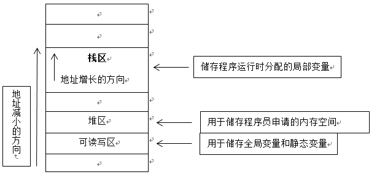
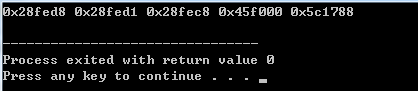

# 20180427 C++中的栈内存和堆内存的区别


-----------

原文： https://blog.csdn.net/ybhjx/article/details/70662482

- 数据结构中的堆与栈：

栈：是一种连续储存的数据结构，具有先进后出的性质。通常的操作有入栈（圧栈）、出栈和栈顶元素。想要读取栈中的某个元素，就要将其之前的所有元素出栈才能完成。类比现实中的箱子一样。

堆：是一种非连续的树形储存数据结构，每个节点有一个值，整棵树是经过排序的。特点是根结点的值最小（或最大），且根结点的两个子树也是一个堆。常用来实现优先队列，存取随意。

- 内存中的栈区与堆区：

一般说到内存，指的是计算机的随机储存器（RAM），程序都在这里面运行。计算机内存的大致划分如下图所示：



栈内存：由程序自动向操作系统申请分配以及回收，速度快，使用方便，但程序员无法控制。若分配失败，则提示栈溢出错误。注意，const局部变量也储存在栈区内，栈区向地址减小的方向增长。

```cpp
//测试栈内存
#include <iostream>
int main()
{
    int i = 10; //变量i储存在栈区中
    const int i2 = 20;
    int i3 = 30;
    std::cout << &i << " " << &i2 << " " << &i3 << std::endl;
    return 0;
}
```

测试输出为：


&i3 < &i2 < &i，证明地址是减小的。

堆内存：程序员向操作系统申请一块内存，当系统收到程序的申请时，会遍历一个记录空闲内存地址的链表，寻找第一个空间大于所申请空间的堆结点，然后将该结点从空闲结点链表中删除，并将该结点的空间分配给程序。分配的速度较慢，地址不连续，容易碎片化。此外，由程序员申请，同时也必须由程序员负责销毁，否则则导致内存泄露。

```cpp
//测试堆内存和栈内存的区别
#include <iostream>
int main()
{
    int i = 10; //变量i储存在栈区中
    char pc[] = "hello!"; //储存在栈区
    const double cd = 99.2; //储存在栈区
    static long si = 99; //si储存在可读写区，专门用来储存全局变量和静态变量的内存
    int* pi = new int(100); //指针pi指向的内存是在 堆区，专门储存程序运行时分配的内存
    std::cout << &i << " " << &pc << " " << &cd << " " << &si << " " << pi << std::endl;
    delete pi; //需程序员自己释放
    return 0;
}
```

测试输出为：



运行多次后会发现pi所指向的地址并不连续，是跳跃式的；而&si是一致的，储存在可读写区；前三个变量都储存在栈区，由程序自动分配和销毁。

 

- 关于堆和栈区别的比喻：

堆和栈的区别可以引用一位前辈的比喻来看出：

使用栈就象我们去饭馆里吃饭，只管点菜（发出申请）、付钱、和吃（使用），吃饱了就走，不必理会切菜、洗菜等准备工作和洗碗、刷锅等扫尾工作，他的好处是快捷，但是自由度小。

使用堆就象是自己动手做喜欢吃的菜肴，比较麻烦，但是比较符合自己的口味，而且自由度大。