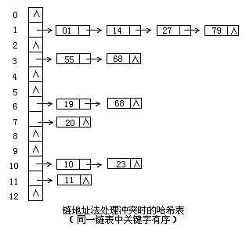

# 20180427 hash表解决冲突的方法

**一、冲突是如何产生的？**
哈希函数是指如何对关键字进行编址的规则，这里的关键字的范围很广，可视为无限集，如何保证无限集的原数据在编址的时候不会出现重复呢？规则本身无法实现这个目的。举一个例子，仍然用班级同学做比喻，现有如下同学数据
张三，李四，王五，赵刚，吴露.....
假如我们编址规则为取姓氏中姓的开头字母在字母表的相对位置作为地址，则会产生如下的哈希表

| 位置   | 字母   | 姓名   |      |
| ---- | ---- | ---- | ---- |
| 0    | a    |      |      |
| 1    | b    |      |      |
| 2    | c    |      |      |

...

| 10   | L    | 李四   |      |
| ---- | ---- | ---- | ---- |
|      |      |      |      |

...

| 22   | W    | 王五，吴露 |      |
| ---- | ---- | ----- | ---- |
|      |      |       |      |

..

| 25   | Z    | 张三，赵刚 |      |
| ---- | ---- | ----- | ---- |
|      |      |       |      |

我们注意到，灰色背景标示的两行里面，关键字王五，吴露被编到了同一个位置，关键字张三，赵刚也被编到了同一个位置。老师再拿号来找张三，座位上有两个人，"你们俩谁是张三？"

**二、如何解决冲突问题**

既然不能避免冲突，那么如何解决冲突呢，显然需要附加的步骤。通过这些步骤，以制定更多的规则来管理关键字集合，通常的办法有:

**a)开放地址法**

开放地执法有一个公式:$Hi=(H(key)+d_i) MOD m i=1,2,...,k(k<=m-1)$

其中，m为哈希表的表长。$d_i$是产生冲突的时候的增量序列。如果$d_i$值可能为`1,2,3,...m-1`，称线性探测再散列。

如果$d_i$取1，则每次冲突之后，向后移动1个位置.如果di取值可能为`1,-1,2,-2,4,-4,9,-9,16,-16,...k*k,-k*k(k<=m/2) `

称二次探测再散列。如果di取值可能为伪随机数列。称伪随机探测再散列。仍然以学生排号作为例子，

现有两名同学，李四，吴用。李四与吴用事先已排好序，现新来一名同学，名字叫王五，对它进行编制

| 10.. | .... | 22   | ..   | ..   | 25   |
| ---- | ---- | ---- | ---- | ---- | ---- |
| 李四.. | .... | 吴用   | ..   | ..   | 25   |

   王五未来之前

| 10.. | ..   | 22   | 23   | 25   |
| ---- | ---- | ---- | ---- | ---- |
| 李四.. |      | 吴用   | 王五   |      |

   (a)线性探测再散列对赵刚进行编址，且di=1

| 10... | 20   | 22   | ..   | 25   |
| ----- | ---- | ---- | ---- | ---- |
| 李四..  | 王五   | 吴用   |      |      |

   (b)二次探测再散列，且di=-2 

| 1... | 10... | 22   | ..   | 25   |
| ---- | ----- | ---- | ---- | ---- |
| 王五.. | 李四..  | 吴用   |      |      |

(c)伪随机探测再散列,伪随机序列为:5,3,2 
b)再哈希法 
当发生冲突时，使用第二个、第三个、哈希函数计算地址，直到无冲突时。缺点：计算时间增加。
比如上面第一次按照姓首字母进行哈希，如果产生冲突可以按照姓字母首字母第二位进行哈希，再冲突，第三位，直到不冲突为止
**c)链地址法**
将所有关键字为同义词的记录存储在同一线性链表中。如下：

因此这种方法，可以近似的认为是筒子里面套筒子
**d)建立一个公共溢出区**
假设哈希函数的值域为[0,m-1],则设向量HashTable[0..m-1]为基本表，另外设立存储空间向量OverTable[0..v]用以存储发生冲突的记录。
经过以上方法，基本可以解决掉hash算法冲突的问题