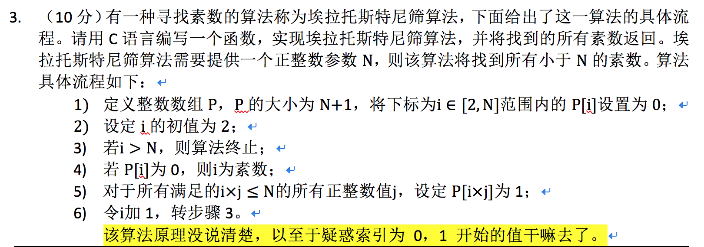
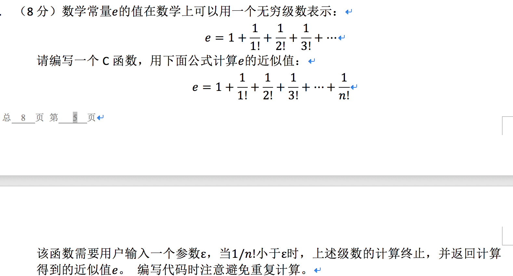
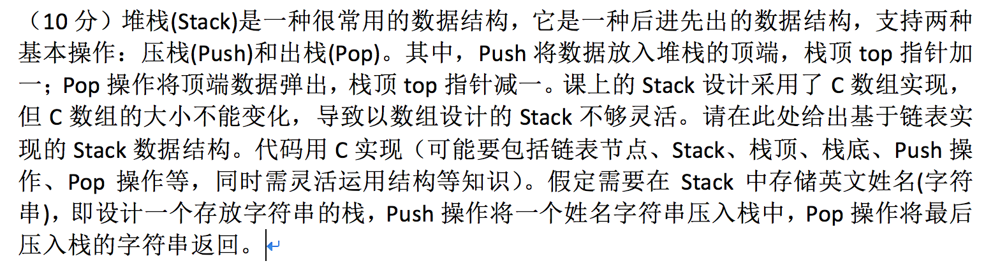
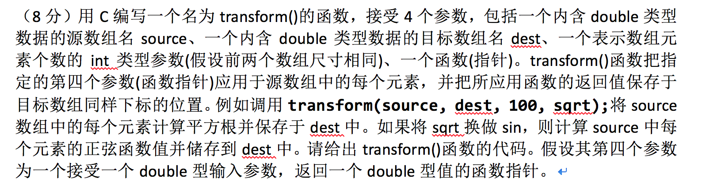
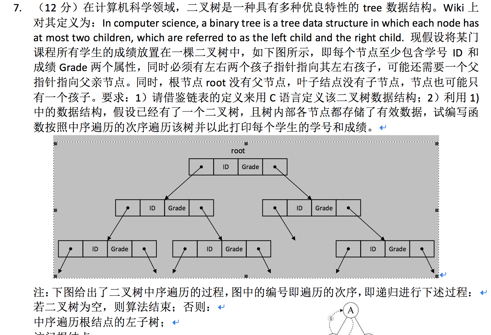
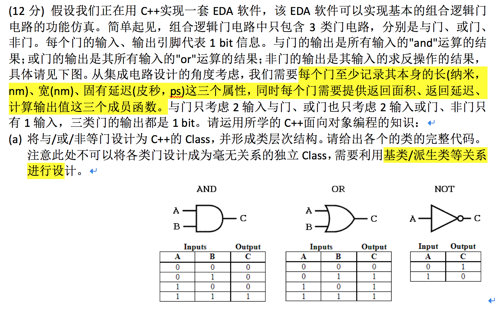
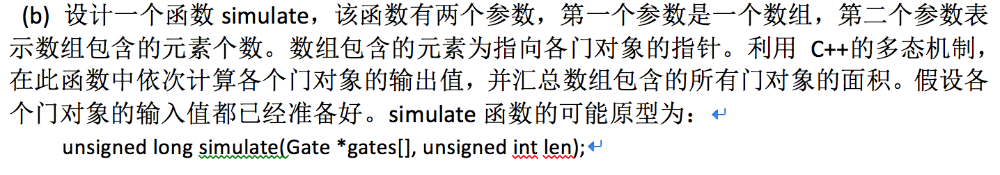

# 20180529C 语言试卷相关题目


## 返回Long型数的最大数

1.      （10分）用C编写一个函数，该函数的参数为一个长整数，返回值亦为长整数。该函数要求的功能为：将输入参数的各个数位拆出，然后重新排列组合为一个更大的长整数并返回该长整数。例如输入参数2314，拆出2、3、1、4，然后重新组合为最大的4321返回。编写该函数时无需考虑是否超出长整数的表示范围；只需考虑十进制形式。 

```c
//#include <iostream>
#include <stdio.h>
#include <strings.h>
#include <stdlib.h>

int a[100] = {-1};

int cmp(const void *a,const void *b)
{
    return(*(int *)b-*(int *)a);  //实现的是降序排序
}

long moreBigger(long in){
    int index = 0;
    do{
        a[index] = in %10;
        index++;
    }while(in /= 10);

    qsort(a,100,sizeof(a[0]),cmp);	///  <stdlib.h>
    long res = 0;
    for(int j =0; j < index; j++){
        res = res*10 + a[j];
    }

    return res;
}

int main() {

    printf("%d",moreBigger(15374));
    return 0;
}
```

<br>

## 区分回文

（10分）用C编写一个函数，用于进行回文(Palindrome，即从左往右和从右往左看是相同的句子)测试。该函数的输入为一条消息，输出是表示该消息是否为回文的标志。为简单起见，只考虑英文消息，而且忽略掉消息中所有不是字母的字符。运行时场景如下：

Enter a message: He lived as a devil, eh?

Palindrome

 

Enter a message: Madam, I am Adam

Not a palindrome

​            没有考虑是否忽略大小写，答案是区分大小写的

```c
//#include <iostream>
#include <stdio.h>
#include <strings.h>
#include <stdlib.h>
#include <string.h>


bool Judge(){
    char str[100];
    printf("Enter a message:");
//    gets(str);  ///  不能用 scanf
    fgets(str, (sizeof str / sizeof str[0]), stdin);
    char * p = strrchr(str, '\0');

    printf("%d",p - str);
    char newStr[100];
    int p_newStr = 0;
    for(int i=0; i < p - str; i++){
        if( (str[i] >='a' && str[i] <= 'z' || str[i] >= 'A' && str[i] <= 'Z' )){
               newStr[p_newStr] = str[i];
               p_newStr++;
        }
    }
    newStr[p_newStr] = '\0';
    printf("%s", newStr);

    char * pp = strrchr(newStr, '\0');
    char * end = pp-1;
    char * begin = newStr;
    bool  flag = true;
    while (begin < end){
        if( *begin != *end ){
            flag = false;
            break;
        }else{
            begin++;
            end--;
        }

    }
    return  flag;

}

int main() {
    printf("%d", Judge() );
    return 0;
}
//He lived as a devil, eh?
```

<br>

## 找一个数里面的所有素数



```c
//#include <iostream>
#include <stdio.h>
#include <strings.h>
#include <stdlib.h>
#include <string.h>


int main() {
    int *array;
    int N;
    printf("请输入所要创建的一维动态数组的长度：");
    scanf("%d",&N);
    array=(int*)calloc(N+1,sizeof(int));

    for(int i=2; i <=N; i++){
        array[i] = 0;
    }

    for(int i=2; i<=N; i++){
        if(!array[i]){
            for(int j = i; i*j <=N; j++)
                array[i*j] = 1;
        }
    }

    int j=0;
    for(int i=2;i<=N;i++)
    {
        if(!array[i])
        {
            printf("%d ",i);
            j++;
            if(j%10 == 0)
                printf("\n");
        }
    }
    printf("\n");
    free(array);
    return 0;
}
//He lived as a devil, eh?
```

<br>

## 计算级数



```c
//#include <iostream>
#include <stdio.h>
#include <strings.h>
#include <stdlib.h>
#include <string.h>

int main() {
    double precise;
    scanf("%lf", &precise);
    double res = 0;
    int index = 1;
    long long prod = 1;
    if(precise > 0){
        while(1){
            prod = prod * index;
            double current = 1.0 / prod;
            if( current < precise ){
                break;
            }
            res = res + current;
            index++;
        }
        res = res + 1;
        printf("%lf", res);
    }else{
        printf("Precision must be positive float");
    }

    return 0;
}

```

<br>

## 用单链表实现栈



```c
#include <stdio.h>
#include <stdlib.h>

typedef struct NODE
{
    int val;
    struct NODE *next;
}node;//define node

node * head=NULL;//init head_node of stack
int length_stack(node *link); /// 函数声明

//create node
node *create_node(int val)
{
    node *p=(node *)malloc(sizeof(node));
    p->val=val;
    p->next=NULL;
    return p;
}

//push 头插法
node *push(int val)
{
    node *p=create_node(val);
    p->next=head;
    head=p;
    return head;
}

//peek
int peek(node *link)
{
    if(length_stack(link)==0)
    {
        printf("此栈为空");
        return 0;
    }
    return head->val;
}

//calculate length_length
int length_stack(node *link)
{
    int count=0;
    while(link)
    {
        count++;
        link=link->next;
    }
    return count;
}


//pop
int pop(node *link)
{
    node *p;
    p=head;
    head=head->next;
    free(p);
    return p->val;
}
//printf_stack
void print_stack()
{
    while(head)
    {
        printf("%d   ",head->val);
        head=head->next;
    }
}


int main()
{
    push(1);
    push(2);
    push(3);
    push(4);
    push(5);
    peek(head);
    int size=length_stack(head);
    printf("栈长度为：%d\n",size);

    print_stack();

}
```

存储为字符串的实现

```c
#include <stdio.h>
#include <stdlib.h>

typedef struct NODE
{
    char* val;
    struct NODE *next;
}node;//define node

node * head=NULL;//init head_node of stack
int length_stack(node *link);

//create node
node *create_node(char* val)
{
    node *p=(node *)malloc(sizeof(node));
    p->val=val;
    p->next=NULL;
    return p;
}

//push 头插法
node *push(char* val)
{
    node *p=create_node(val);
    p->next=head;
    head=p;
    return head;
}

//peek
char* peek(node *link)
{
    if(length_stack(link)==0)
    {
        printf("此栈为空");
        return 0;
    }
    return head->val;
}

//calculate length_length
int length_stack(node *link)
{
    int count=0;
    while(link)
    {
        count++;
        link=link->next;
    }
    return count;
}


//pop
char* pop(node *link)
{
    node *p;
    p=head;
    head=head->next;
    free(p);
    return p->val;
}
//printf_stack
void print_stack()
{
    while(head)
    {
        printf("%s   ",head->val);
        head=head->next;
    }
}


int main()
{
    push("Jim");
    push("god");
    push("hello");
    push("world");
    push("me");
    peek(head);
    int size=length_stack(head);
    printf("栈长度为：%d\n",size);

    print_stack();

}
```


## 函数指针作为参数



```c
#include <stdio.h>
#include <algorithm>
#include <vector>
#include <iostream>

// or
//typedef void(*FunType)(int);

void transform(double* source, double* dest, size_t n, double (*func)(double) ){
    for( int i=0; i< n; i++ ){
        dest[i] = func(source[i]);
    }
}

double sqrt(double x)
{
    return x*x;
}
int main(){
    double source[2] = {1,2};
    double dest[2];
    transform(source,dest,2,sqrt);
    for(int i=0; i < 2; i++){
        printf("%lf", dest[i]);
    }
    return 0;
}
```

<br>

## 二叉树的中序遍历



```c
#include <stdio.h>
#include <algorithm>
#include <vector>
#include <iostream>


typedef int datatype;
typedef struct node{
    datatype id;
    datatype grade;
    node* lchild = nullptr;
    node* rchild = nullptr;
    node* parent = nullptr;
    node(datatype id, datatype grade,node* lchild, node* rchild, node* parent):
            id(id),grade(grade),lchild(lchild),rchild(rchild),parent(parent){}

    node(datatype id, datatype grade): id(id),grade(grade){}
}Node;


void inorder(Node* in){
    if(in == nullptr)
        return;
    inorder(in->lchild);
    printf("id: %d \t grade: %d \n", in->id, in -> grade);
    inorder(in->rchild);
}

int main(){
   Node* top =new Node(0,1);
   Node* l = new Node(1,2);
    Node* r = new Node(2,3);
    top->lchild = l;
    top->rchild = r;
    inorder(top);

    return 0;
}
```

<br>

## 虚函数和虚继承






```cpp
class BaseGate{
public:
    BaseGate(){}
    BaseGate(double length, double width, double delay):length(length),width(width),delay(delay){}
protected:
    double length;
    double width;
    double delay;
public:
    virtual double getArea() =0;
    virtual double getDelay() = 0;
    virtual bool output() = 0;

};

class And: public BaseGate{
private:
    bool in1,in2;
public:
    Add(double length, double width, double delay, bool in1, bool in2):
            BaseGate(length,width,delay), in1(in1), in2(in2){}

    double  getArea(){
        return length * width;
    }

    double getDelay(){
        return delay;
    }

    bool output(){
        return in1 & in2;
    }

    /// 实现一个静态重载版本
    static bool  output(bool in1, bool in2){
        return in1 & in2;
    }
};

class Or: public BaseGate{
private:
    bool in1,in2;
public:
    Or(double length, double width, double delay, bool in1, bool in2):
            BaseGate(length,width,delay), in1(in1), in2(in2){}

    double  getArea(){
        return length * width;
    }

    double getDelay(){
        return delay;
    }

    bool output(){
        return in1 | in2;
    }

    /// 实现一个静态重载版本
    static bool  output(bool in1, bool in2){
        return in1 | in2;
    }
};


class Not: public BaseGate{
private:
    bool in1;
public:
    Not(double length, double width, double delay, bool in1, bool in2):
            BaseGate(length,width,delay), in1(in1){}

    double  getArea(){
        return length * width;
    }

    double getDelay(){
        return delay;
    }

    bool output(){
        return ~in1;
    }

    /// 实现一个静态重载版本
    static bool  output(bool in1){
        return ~in1;
    }
};


unsigned long simulate(BaseGate *gates[], unsigned int len){
    unsigned  long  res = 0;
    for(int i = 0; i < len ; i ++){
        gates[i] -> output();
        res += gates[i] -> getArea();
    }
    return res;

}
```


