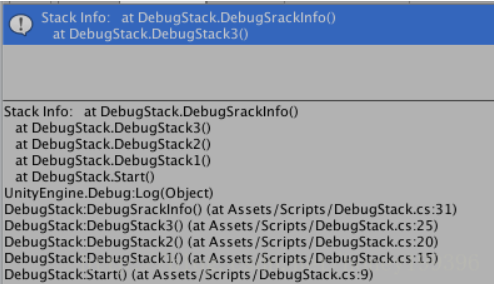
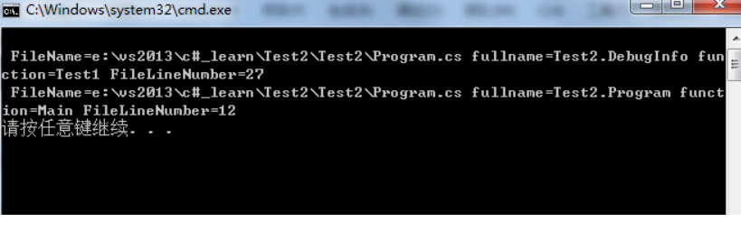

# 20180717 打印当前堆栈信息

简单示例1：们可以通过断点调试查看堆栈信息，也可以直接输出调用的堆栈信息，

```csharp
using System.Collections;
using System.Collections.Generic;
using UnityEngine;

public class DebugStack : MonoBehaviour {
    // Use this for initialization
    void Start () {
        DebugStack1 ();
    }
    void DebugStack1()
    {
        DebugStack2 ();
    }
    void DebugStack2()
    {
        DebugStack3 ();
    }
    void DebugStack3()
    {
        DebugSrackInfo ();
    }
    void DebugSrackInfo()
    {
        string trackStr = new System.Diagnostics.StackTrace().ToString();
        Debug.Log ("Stack Info:" + trackStr);
    }
}
```

但是这种不能打印行号，还是不太好。如下： 



---------------------------

为了显示行号， 可写一个简单的类：

```csharp
using System;
using System.Diagnostics;
namespace Test2
{
    class Program
    {
        static void Main(string[] args)
        {
            DebugInfo db = new DebugInfo();
            Console.WriteLine(db.Test1());
        }
 
     
 
    }
 
    class DebugInfo
    {
      public String Test1()
        {
            string info = null;
            //设置为true，这样才能捕获到文件路径名和当前行数，当前行数为GetFrames代码的函数，也可以设置其他参数
            StackTrace st = new StackTrace(true);
            //得到当前的所以堆栈
            StackFrame[] sf = st.GetFrames();
            for (int i = 0; i < sf.Length; ++i)
            {
                info = info + "\r\n" + " FileName=" + sf[i].GetFileName() + " fullname=" + sf[i].GetMethod().DeclaringType.FullName + " function=" + sf[i].GetMethod().Name + " FileLineNumber=" + sf[i].GetFileLineNumber();         
           }
          return info;
        }
 
    }
 

```

显示的效果如下：



   需要注意的是，无论是Debug还是Release模式，new StackTrace(true)的时候设置为true，并且exe路径下存在==pdb编译信息文件，这才可以显示当前路径文件名和行数==。

 

实例如下：

写一个静态函数：

最底层的堆栈信息是该函数。

```csharp
    /// created by : xixie
    /// 打印堆栈信息，可以打印行号
    /// </summary>
    public static string PrintStackInfo() {
        string info = null;
        //设置为true，这样才能捕获到文件路径名和当前行数，当前行数为GetFrames代码的函数，也可以设置其他参数
        StackTrace st = new StackTrace(true);
        //得到当前的所以堆栈
        StackFrame[] sf = st.GetFrames();
        for (int i = 0; i < sf.Length; ++i)
        {
            info = info + "\r\n" + " FileName=" + sf[i].GetFileName() + " fullname=" + sf[i].GetMethod().DeclaringType.Name/*FullName*/ + " function=" + sf[i].GetMethod().Name + " FileLineNumber=" + sf[i].GetFileLineNumber();
        }
        return info;
    }
```

调用如下：

```csharp
 Debug.Log("UIChatVoiceButton OnPress()  " + CommonFun.PrintStackInfo());
```

结果：

```shell
UIChatVoiceButton OnPress()  
 FileName=C:\Users\xixie\workshop_tmp\Client\UnityProj_clone\Assets\ShareWithDS\Scripts\Utility\CommonFun.cs fullname=CommonFun function=PrintStackInfo FileLineNumber=10218
 FileName=C:\Users\xixie\workshop_tmp\Client\UnityProj_clone\Assets\Scripts\UI\UIChat\UIChatVoiceButton.cs fullname=UIChatVoiceButton function=OnPress FileLineNumber=43
 FileName= fullname=GameObject function=SendMessage FileLineNumber=0
 FileName=C:\Users\xixie\workshop_tmp\Client\UnityProj_clone\Assets\Plugins\NGUI\Scripts\UI\UICamera.cs fullname=UICamera function=Notify FileLineNumber=1593
 FileName=C:\Users\xixie\workshop_tmp\Client\UnityProj_clone\Assets\Plugins\NGUI\Scripts\UI\UICamera.cs fullname=UICamera function=ProcessRelease FileLineNumber=2524
 FileName=C:\Users\xixie\workshop_tmp\Client\UnityProj_clone\Assets\Plugins\NGUI\Scripts\UI\UICamera.cs fullname=UICamera function=ProcessTouch FileLineNumber=2642
 FileName=C:\Users\xixie\workshop_tmp\Client\UnityProj_clone\Assets\Plugins\NGUI\Scripts\UI\UICamera.cs fullname=UICamera function=ProcessMouse FileLineNumber=2012
 FileName=C:\Users\xixie\workshop_tmp\Client\UnityProj_clone\Assets\Plugins\NGUI\Scripts\UI\UICamera.cs fullname=UICamera function=ProcessTouches FileLineNumber=2152
 FileName=C:\Users\xixie\workshop_tmp\Client\UnityProj_clone\Assets\Plugins\NGUI\Scripts\UI\UICamera.cs fullname=UICamera function=Update FileLineNumber=1794
```


但是在手机等应用中会显示无`st.GetFrames();` 方法。在 C#5.0 中使用如下新方法。

```csharp
    public static void WriteError(object message,
       [CallerMemberName] string memberName = "",
       [CallerFilePath] string sourceFilePath = "",
       [CallerLineNumber] int sourceLineNumber = 0)
    {
        //_log4Net.ErrorFormat("文件:{0} 行号:{1} 方法名:{2},消息:{3}", sourceFilePath, sourceLineNumber, memberName, message);
        Logger.Log(string.Format("Fine:{0} LineNumber:{1} Method:{2}, Message:{3}", sourceFilePath, sourceLineNumber, memberName, message));
    }
```


------------------

通用版本：

```csharp
    public static void DebugStackInfor(string message) {
        string trackStr = new System.Diagnostics.StackTrace().ToString();
        Logger.LogWarning("message: "+ message + "StackInfo: " + trackStr);
    }
```

使用：

```csharp
 CommonFun.DebugStackInfor("UIChatVoiceButton OnPress()");
```


