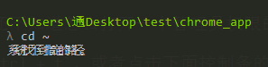

# 20180703 cmder cwgyin 和 fish

官网：

```shell
http://cmder.net/
```


## 下载

[参考](https://blog.csdn.net/oncealong/article/details/50459136)

只有方便的快速切换到当前目录,才能提高生产力.要不然先Win+X调用命令提示符,然后再CD %指定Path%,黄花菜都凉了.

接下来说下如何结合魔方和Cmder,使其快速切换到当前目录. 
1.下载Cmder.exe,有迷你版和完全版.完全版有更多的命令,包括git和vim,可以给你贴近原生的*nix感受. 
[完全版下载地址](https://github.com/bliker/cmder/releases/download/v1.2.9/cmder.zip) （夕下载的是这个）
[迷你版下载地址](https://github.com/bliker/cmder/releases/download/v1.2.9/cmder_mini.zip) 

**mini版功能简单，很小巧，只有4M多，主要是cmd和powershell**  


**full版功能强大，包含了git、powershell、bash、chocolatey、Cygwin、SDK等功能**  


## 全安装版本介绍

### 全安装版 cmder 自带的程序

全安装版 cmder 自带了 msysgit, 压缩包 23M, 除了 git 本身这个命令之外, 里面可以使用大量的 linux 命令


比如我最喜欢的 grep, curl(没有 wget), 说实话我并不知道怎么在 windows 下搜索某个目录下的文本, cmder 拯救了我, 像 vim, ssh, ls, bash, perl 更是每个都是痛点需求

 

左右上下分屏, 多 tab 终端, 都不在话下


linux 下 bash 的快捷键大多都可以使用, 比如 清屏 `ctrl + l`, `ctrl + u`, 甚至是历史搜索 `ctrl + r` 都可以用


不多说了, 还等什么, 赶快使用 cmder 吧!

你可能还需要一些小小的设置来让自己用的更


## 配置

### 基本配置

1- 下载完后，解压缩就能用；

2- 添加到环境变量（用户环境变量的==path==），这样可以不用在 Cmder 目录下运行 `Cmder.exe` 了。


3- 运行如下命令，可以将Cmder 添加到右键：

添加至右键菜单：进入cmder根目录，以管理员身份运行 cmd

```shell
Cmder.exe /REGISTER ALL 
```


4- 打开Cmder 进行配置


加载完后默认的tasks后（==点击Add default tasks==）

-----

==下面这个刚开始好像不管用，后面又管用了。==

下载后打开,右下角Show System Menu->setting->Tasks->选中{cmd},做如下修改: 
将 `cmd /k "%ConEmuDir%\..\init.bat" -new_console:d:%USERPROFILE%` 
改为 `cmd /k "%ConEmuDir%\..\init.bat" -new_console:d:%CD%` 
如下图所示: 


至此设置完毕。  在任何文件夹下右键打开即可自动切换到当前路径下。  


### 背景

当然这个完全是图好看的。 
可以选择自己喜欢的图片，暗化之后效果不错，在 Features-Transparency 下也能弄出透明效果


### 主题

内置了几款不错的主题，总有一款适合你，当然也支持自己设定


### 快捷键

可以自己设置全局快捷键


### 设置字体

cmder 默认的 console 字体已经比 windows 自带的好看 n 倍, 但还有一些小小的瑕疵, 比如下图所示, 需要一些小小的设置



输入 `win + alt + p` 或者 在顶部右击点击 `settings`, 进入设置页面, 去掉 monospace 选项, 看是不是中文字体正常了? 我自己还会勾选 bold 加粗, 并且把字体改大, 点击 save settings 即可, 如果你发现保存按钮是灰色, 那依然需要进入管理员权限的 cmder 来保存设置

 

字体大小的设置

- 字体放大缩小： 按住`ctrl` + 鼠标滚轮上下 即可

<br>

### 设置默认打开的终端

- 设置默认使用cmd、PowerShell还是bash：

  

  


### 设置中文编码

设置中文编码：右击cmd窗口，点击setting。在Start-up下的environment中加入: `set LANG=zh_CN.UTF8`


### 设置管理员权限和打开新的终端

新开窗口打开管理员权限：新的tab页面使用快捷键： `ctrl+t`来打开， 然后会弹出如下的配置窗口。还可以设置分屏位置、启动目录以及启动的环境。


### 防止字体重叠

防止字体重叠（据说..反正我没遇到过）： 


### 基础功能及扩展

 

1. tab分页 可以执行不同的任务，使用快捷键： `ctrl+t`来打开
2. 在视窗内搜索画面上出现过的关键字
3. 新增tab页按钮
4. 切换tab页按钮
5. 锁定窗口，无法输入新内容
6. 切换视窗是否提供卷轴功能，启动时可查询之前显示过的内容。
7. 左击可开启系统菜单，右击可直接开启设置 （ `Win+Alt+P`：开启设置）

### 设置aliases及分屏打开vscode

用文本编辑器打开安装路径下 -> config -> user-aliases.cmd
 添加相应的命令， 使得可以自定义一些短命令来替代某些长命令：

```
gc = git commit -am $1
sublilme = "E:\Microsoft VS Code\Code.exe" $1 -new_console:s50H 
```

其中`$1`代表`gc`命令后面添加的参数， 并且`=`后的命令可以使用`&`连接，使得gc可以一次完成多条命令任务。
 这样子设置以后，使用`gc "first commit"`就会替代 `git commit -am"first commit"`时。
 键入命令 `sublime` 就可直接在窗口右边50%横向打开vscode，若是想纵向打开则更改参数(new_console:s50V)，当中的数字作为百分比。（注意cmder窗口要足够大小才能分栏显示）

 


ps: 这仅仅是设置了cmd下的aliases， 如果想更改powershell下的，需要打开vendor/profile.ps1

```
Set-Alias sublime "C:\Program Files\Sublime Text 3\sublime_text.exe"
```

pss: 如果想打开sublime， 可能配置会麻烦一些， 可以参考该文章： [再见2015 再见cmd](https://link.jianshu.com?t=http://imweb.io/topic/56b072d05c49f9d377ed8ee2)

## 5. 个性化配置

- 分屏设置
   打开 setting -> key -> search : split ， 即可调节左右分屏以及上下分屏了  

  这个很有用，我的设置如下：

  ==F5: 上下分屏==

  ==F6: 左右分屏==

  

- 主题设置： setting -> Features -> Colors 选择不同的Schemes 即可， 下面可以设置一些比较细节的颜色显示

- 调节背景透明度： 个人喜好问题。在 setting -> Features -> Transparency 。 第一个进度条的是在活跃（焦点在cmder时）的窗口透明度，第二个则是在非活跃时的窗口透明度。

## 6. 常用快捷键及设置

对于tab操作与浏览器页的tab操作一致：

| tab操作         | 快捷键                |
| --------------- | --------------------- |
| 新建tab         | ==Ctrl + t==          |
| 关闭tab         | Ctrl + w              |
| 切换Tab         | Ctrl+Tab或Ctrl+1,2... |
| 新建CMD         | Shift + Alt + 1       |
| 新建 PowerShell | Shift + Alt + 2       |
| 全屏操作        | Alt + Enter           |

 

## cmder 的设置

添加 ll 等命令在cmder->config->aliases，打开aliases。并将:

l=ls --show-control-chars

la=ls -aF --show-control-chars

ll=ls -alF --show-control-chars

ls=ls --show-control-chars -F

添加至文件末尾，用于增强命令并添加颜色区分。


## 参考文献

1- https://blog.csdn.net/csdn_moming/article/details/50968258

2- http://bg.biedalian.com/2014/09/11/cmder.html

3- https://www.jianshu.com/p/979db1a96f6d (划重点)

4-https://lfire.github.io/2017/03/08/cmder-cygwin-chinese/

5- 附上最后一个更详细的介绍： https://jeffjade.com/2016/01/13/2016-01-13-windows-software-cmder/

这个并未总结进来。

