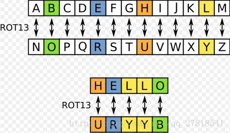
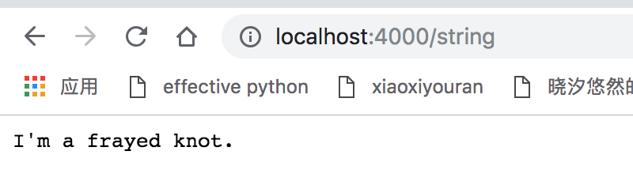
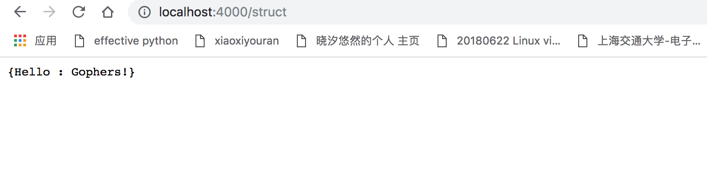

# 方法和接口

Go ==没有类==。然而，仍然可以==在结构体类型上定义方法==。

*方法接收者*出现在 `func` 关键字和方法名之间的参数中。

```go
package main

import (
	"fmt"
	"math"
)

type Vertex struct {
	X, Y float64
}

func (v *Vertex) Abs() float64 {		// 结构体类型上定义方法
	return math.Sqrt(v.X*v.X + v.Y*v.Y)
}

func main() {
	v := &Vertex{3, 4}
	fmt.Println(v.Abs())
}
//5
```

你可以对包中的 **任意 类型定义任意方法**，而不仅仅是针对结构体。

但是，**不能对来自其他包的类型或基础类型定义方法**。

```go
package main

import (
	"fmt"
	"math"
)

type MyFloat float64

func (f MyFloat) Abs() float64 {
	if f < 0 {
		return float64(-f)
	}
	return float64(f)
}

func main() {
	f := MyFloat(-math.Sqrt2)
	fmt.Println(f.Abs())
}

//1.4142135623730951
```

<br>

## 接受者为指针的方法

方法可以与命名类型或命名类型的指针关联。

刚刚看到的两个 `Abs` 方法。一个是在 `*Vertex` 指针类型上，而另一个在 `MyFloat`值类型上。 有两个原因需要**使用指针接收者**。首先避免在每个方法调用中拷贝值（如果值类型是大的结构体的话会更有效率）。其次，**方法可以修改接收者指向的值**。

尝试修改 `Abs` 的定义，同时 `Scale` 方法使用 `Vertex` 代替 `*Vertex` 作为接收者。

当 `v` 是 `Vertex` 的时候 `Scale` 方法没有任何作用。`Scale` 修改 `v`。当 `v` 是一个值（非指针），方法看到的是 `Vertex` 的副本，并且无法修改原始值。

`Abs` 的工作方式是一样的。只不过，仅仅读取 `v`。所以读取的是原始值（通过指针）还是那个值的副本并没有关系。

```go
package main

import (
	"fmt"
	"math"
)

type Vertex struct {
	X, Y float64
}

func (v *Vertex) Scale(f float64) {  // fun 后面是结构体的类型声明
	v.X = v.X * f
	v.Y = v.Y * f
}

func (v *Vertex) Abs() float64 {
	return math.Sqrt(v.X*v.X + v.Y*v.Y)
}

func main() {
	v := &Vertex{3, 4}
	v.Scale(5)
	fmt.Println(v, v.Abs())
}

//&{15 20} 25
```

<br>

## 接口

接口类型是由**一组方法定义的集合**。

接口类型的值**可以存放实现这些方法的任何值**。

**注意：** 列子代码的 22 行存在一个错误。 由于 `Abs` 只定义在 `*Vertex（指针类型）` 上， 所以 `Vertex（值类型）` 不满足 `Abser`。

```go
package main

import (
	"fmt"
	"math"
)

type Abser interface {	// 接口
	Abs() float64
}

func main() {
	var a Abser			// 先定义一个接口
	f := MyFloat(-math.Sqrt2)
	v := Vertex{3, 4}

	a = f  // a MyFloat 实现了 Abser
	a = &v // a *Vertex 实现了 Abser

	// 下面一行，v 是一个 Vertex（而不是 *Vertex）
	// 所以没有实现 Abser。
//	a = v
//
	fmt.Println(a.Abs())
}

type MyFloat float64

// 下面这几个函数都是接口
func (f MyFloat) Abs() float64 {
	if f < 0 {
		return float64(-f)
	}
	return float64(f)
}

type Vertex struct {
	X, Y float64
}

func (v *Vertex) Abs() float64 {	// (v *Vertex) 定义的是针对什么类型实现的接口
	return math.Sqrt(v.X*v.X + v.Y*v.Y)
}

//5
```

<br>

## 隐式接口

类型通过==实现那些方法来实现接口==。 没有显式声明的必要；所以也就没有关键字“implements“。

隐式接口==解藕了实现接口的包和定义接口的包==：互不依赖。

因此，也就无需在每一个实现上增加新的接口名称，这样同时也鼓励了明确的接口定义。

[包 io](http://golang.org/pkg/io/) 定义了 `Reader` 和 `Writer`；其实不一定要这么做。

```go
package main

import (
	"fmt"
	"os"
)

type Reader interface {
	Read(b []byte) (n int, err error)
}

type Writer interface {
	Write(b []byte) (n int, err error)
}

type ReadWriter interface {
	Reader
	Writer
}

func main() {
	var w Writer

	// os.Stdout 实现了 Writer
	w = os.Stdout		// 接口 绑定了对象， 而这个对象实现了 Read() 和 Write() 方法；

	fmt.Fprintf(w, "hello, writer\n")	// 这个函数里面肯定调用了 w.write() 函数，经确认，确实如此
}
//hello, writer
```

<br>

## Stringers

一个普遍存在的接口是 [`fmt`](https://golang.org/pkg/fmt/) 包中定义的 [`Stringer`](https://golang.org/pkg/fmt/#Stringer)。

```go
type Stringer interface {
    String() string
}
```

`Stringer` 是一个可以用字符串描述自己的类型。`fmt`包 （还有许多其他包）使用这个来进行输出。

```go
package main

import "fmt"

type Person struct {
	Name string
	Age  int
}

func (p Person/*结构体实现--> String() 方法*/) String() string {
	return fmt.Sprintf("%v (%v years)\n", p.Name, p.Age)
}

func main() {
	a := Person{"Arthur Dent", 42}
	z := Person{"Zaphod Beeblebrox", 9001}
	fmt.Println(a, z)
}

//Arthur Dent (42 years)
//Zaphod Beeblebrox (9001 years)
```

<br>

## 练习：Stringers

让 `IPAddr` 类型实现 `fmt.Stringer` 以便用点分格式输出地址。

例如，`IPAddr{1,2,3,4}` 应当输出 `"1.2.3.4"`。

```go
package main

import "fmt"

type IPAddr [4]byte

// TODO: Add a "String() string" method to IPAddr.

func (obj IPAddr) String() string{
	return fmt.Sprintf("%v.%v.%v.%v", obj[0], obj[1], obj[2], obj[3])
}

func main() {
	addrs := map[string]IPAddr{
		"loopback":  {127, 0, 0, 1},
		"googleDNS": {8, 8, 8, 8},
	}
	for n, a := range addrs {
		fmt.Printf("%v: %v\n", n, a)
	}
}

//loopback: 127.0.0.1
//googleDNS: 8.8.8.8
```

<br>

## 错误

Go 程序使用 `error` 值来表示错误状态。

与 `fmt.Stringer` 类似，`error` 类型是一个==内建接口==：

```go
type error interface {
    Error() string
}
```

（与 `fmt.Stringer` 类似，`fmt` 包在输出时也会试图匹配 `error` 接口。）

通常==函数会返回一个 `error` 值==，调用的它的代码应当判断这个错误是否等于 `nil`， 来进行错误处理。

```go
i, err := strconv.Atoi("42")
if err != nil {
    fmt.Printf("couldn't convert number: %v\n", err)
}
fmt.Println("Converted integer:", i)
```

`error` 为 nil 时表示成功；非 nil 的 `error` 表示错误。

```go
package main

import (
	"fmt"
	"time"
)

type MyError struct {
	When time.Time
	What string
}

func (e *MyError) Error() string {		// MyError 结构体实现了内建的 error 接口
	return fmt.Sprintf("at %v, %s",
		e.When, e.What)
}

func run() error {			// 直接用 接口接受结构体，然后调用 接口函数
	return &MyError{
		time.Now(),
		"it didn't work",
	}
}

func main() {
	if err := run(); err != nil {			// if 可以执行多条语句
		fmt.Println(err)
	}
}

//at 2018-11-09 10:27:12.762202 +0800 CST m=+0.000689689, it didn't work
```

<br>

## 练习：错误

从之前的练习中复制 `Sqrt` 函数，并修改使其返回 `error` 值。

`Sqrt`  **接收到一个负数时，应当返回一个非 nil 的错误值**。复数同样也不被支持。

创建一个新类型

```go
type ErrNegativeSqrt float64
```

为其实现

```go
func (e ErrNegativeSqrt) Error() string
```

使其成为一个 `error`， 该方法就可以让 `ErrNegativeSqrt(-2).Error()` 返回 `"cannot Sqrt negative number: -2"`。

**注意：** 在 `Error` 方法内调用 `fmt.Sprint(e)` 将会让程序陷入死循环。可以通过先转换 `e` 来避免这个问题：`fmt.Sprint(float64(e))`。请思考这是为什么呢？

修改 `Sqrt` 函数，使其**接受一个负数时，返回 `ErrNegativeSqrt` 值**。

```go
package main

import (
	"fmt"
	"math"
)

type ErrNegativeSqrt float64


func (e ErrNegativeSqrt) Error() string {
	return fmt.Sprintf("cannot Sqrt negative number: %v", float64(e))	// 必须用强转，否则自己一直调用自己
}

func Sqrt(x float64) (float64, error) {
	if x <=0 {
		return 0, ErrNegativeSqrt(x)	// 这里要用类型转换，否则会出错
	}


	return math.Sqrt(x), nil
}

func main() {
	fmt.Println(Sqrt(2))
	fmt.Println(Sqrt(-2))
}

//1.4142135623730951 <nil>
//0 cannot Sqrt negative number: -2
```

<br>

## Readers

`io` 包指定了 `io.Reader` 接口， 它表示==从数据流结尾==读取。

Go 标准库包含了这个接口的[许多实现](http://golang.org/search?q=Read#Global)， 包括==文件、网络连接、压缩、加密==等等。

`io.Reader` 接口有一个 `Read` 方法：

```
func (T) Read(b []byte) (n int, err error)
```

`Read` 用数据填充指定的字节 slice，并且==返回填充的字节数和错误信息==。 在遇到数据流结尾时，返回 `io.EOF` 错误。

例子代码创建了一个 [`strings.Reader`](https://golang.org/pkg/strings/#Reader)。 并且==以每次 8 字节的速度读取它的输出==。

```go
package main

import (
	"fmt"
	"io"
	"strings"
)

func main() {
	r := strings.NewReader("Hello, Reader!")

	b := make([]byte, 8)  // 8 个字节也相当于8个字符；
	for {
		n, err := r.Read(b)
		fmt.Printf("n = %v err = %v b = %v\n", n, err, b)
		fmt.Printf("b[:n] = %q\n", b[:n])
		if err == io.EOF {
			break
		}
	}
}

//n = 8 err = <nil> b = [72 101 108 108 111 44 32 82]
//b[:n] = "Hello, R"
//n = 6 err = <nil> b = [101 97 100 101 114 33 32 82]
//b[:n] = "eader!"
//n = 0 err = EOF b = [101 97 100 101 114 33 32 82]
//b[:n] = ""
```

## 练习：Reader

实现一个 `Reader` 类型，它不断生成 ASCII 字符 `'A'` 的流。

```go
package main

import (
	//"code.google.com/p/go-tour/reader"
	"fmt"
	"io"
)

type MyReader struct{}

// TODO: Add a Read([]byte) (int, error) method to MyReader.

func (r MyReader)Read(b []byte) (int, error){
	b[0] = 'A'
	return 1, nil	// 填充1个字符 'A'，error 始终
}

func main() {
	//reader.Validate(MyReader{})
	var r MyReader
	b := make([]byte, 1)  // 8 个字节也相当于8个字符；
	for {
		n, err := r.Read(b)
		fmt.Printf("n = %v err = %v b = %v\n", n, err, b)
		fmt.Printf("b[:n] = %q\n", b[:n])
		if err == io.EOF {
			break
		}
	}
}
```

<br>

## 练习：rot13Reader

一个常见模式是 [io.Reader](http://golang.org/pkg/io/#Reader) 包裹另一个 `io.Reader`，然后通过某种形式修改数据流。

例如，[gzip.NewReader](http://golang.org/pkg/compress/gzip/#NewReader) 函数接受 `io.Reader`（压缩的数据流）并且返回同样实现了 `io.Reader` 的 `gzip.Reader`（解压缩后的数据流）。

编写一个实现了 `io.Reader` 的 `rot13Reader`， 并从一个 `io.Reader` 读取， 利用 [rot13](http://en.wikipedia.org/wiki/ROT13) 代换密码对数据流进行修改。

已经帮你构造了 `rot13Reader` 类型。 通过实现 `Read` 方法使其匹配 `io.Reader`。

解答：

ROT13  是过去在古罗马开发的**凯撒加密**的一种变体。

套用ROT13到一段文字上仅仅只需要检查字元字母顺序并取代它在13位之后的对应字母 ，有需要超过时则重新绕回26英文字母开头即可[2]。A换成N、B换成O、依此类推到M换成Z，然后序列反转：N换成A、O换成B、最后Z换成M。只有这些出现在英文字母里头的字元受影响；数字、符号、空白字元以及所有其他字元都不变。 因为只有在英文字母表里头只有26个，并且26=2×13，ROT13函数是它自己的逆反： 



```go
package main

import (
	"io"
	"os"
	"strings"
)

type rot13Reader struct {
	r io.Reader
}

// 转换byte  前进13位/后退13位
func rot13(b byte) byte {
	switch {
	case 'A' <= b && b <= 'M':
		b = b + 13
	case 'M' < b && b <= 'Z':
		b = b - 13
	case 'a' <= b && b <= 'm':
		b = b + 13
	case 'm' < b && b <= 'z':
		b = b - 13
	}
	return b
}

// 重写Read方法
func (mr rot13Reader) Read(b []byte) (int, error) {
	n, e := mr.r.Read(b)
	for i := 0; i < n; i++ {
		b[i] = rot13(b[i])
	}
	return n, e
}
func main() {
	s := strings.NewReader("Lbh penpxrq gur pbqr!")
	r := rot13Reader{s}
	io.Copy(os.Stdout, &r)
}

//You cracked the code!
```

<br>

## Web 服务器

[包 http](http://golang.org/pkg/net/http/) 通过任何实现了 `http.Handler` 的值来响应 HTTP 请求：

```go
package http

type Handler interface {
    ServeHTTP(w ResponseWriter, r *Request)
}
```

在这个例子中，类型 `Hello` 实现了 `http.Handler`。

访问 <http://localhost:4000/> 会看到来自程序的问候。

**注意：** 这个例子无法在基于 web 的指南用户界面运行。为了尝试编写 web 服务器，可能需要[安装 Go](http://golang.org/doc/install/)。

```go
package main

import (
	"fmt"
	"log"
	"net/http"
)

type Hello struct{}

func (h Hello) ServeHTTP (w http.ResponseWriter, r *http.Request) {	// 只要实现了 ServeHTTP 函数即可
	fmt.Fprint(w, "Hello!")
}

func main() {
	var h Hello
	err := http.ListenAndServe("localhost:4000", h)
	if err != nil {
		log.Fatal(err)
	}
}
```

<br>

## 练习：HTTP 处理

实现下面的类型，并在其上定义 ServeHTTP 方法。在 web 服务器中注册它们来==处理指定的路径==。

```go
type String string

type Struct struct {
    Greeting string
    Punct    string
    Who      string
}
```

例如，可以使用如下方式==注册处理方法==：

```go
http.Handle("/string", String("I'm a frayed knot."))
http.Handle("/struct", &Struct{"Hello", ":", "Gophers!"})
```

**注意：** 这个例子无法在基于 web 的用户界面下运行。 为了尝试编写 web 服务，你可能需要 [安装 Go](http://golang.org/doc/install/)。

```go
package main

import (
	"fmt"
	"log"
	"net/http"
)
// 1 定义类型
type String string
type Struct struct {
	Greeting string
	Punct    string
	Who      string
}
// 2 实现http.Handler的方法
func (s String) ServeHTTP(w http.ResponseWriter, r *http.Request) {
	fmt.Fprint(w, string(s))
}
func (s *Struct) ServeHTTP(w http.ResponseWriter, r *http.Request) {
	fmt.Fprint(w, fmt.Sprintf("%v", *s))
}
func main() {
	// 3  设置需要处理的对应的url
	http.Handle("/string", String("I'm a frayed knot."))
	http.Handle("/struct", &Struct{"Hello", ":", "Gophers!"})

	//   这里就是默认的 nil
	e := http.ListenAndServe("localhost:4000", nil)
	if e != nil {
		log.Fatal(e)
	}
}
```

注意，这里的url 不是 `localhost:4000`, 这个路径根本就找不到。 应该用 `localhost:4000/string` 或者 `localhost:4000/struct` 查看指定内容：



另一个url是，



<br>

## 图片

[Package image](http://golang.org/pkg/image/#Image) 定义了 `Image` 接口：

```go
package image

type Image interface {
    ColorModel() color.Model
    Bounds() Rectangle
    At(x, y int) color.Color
}
```

*注意*：`Bounds` 方法的 `Rectangle` 返回值实际上是一个 [`image.Rectangle`](http://golang.org/pkg/image/#Rectangle)， 其定义在 `image` 包中。

（参阅[文档](http://golang.org/pkg/image/#Image)了解全部信息。）

`color.Color` 和 `color.Model` 也是接口，但是通常因为直接使用==预定义的实现 `image.RGBA` 和 `image.RGBAModel` 而被忽视了==。这些接口和类型由[image/color 包](http://golang.org/pkg/image/color/)定义。

```go
package main

import (
	"fmt"
	"image"
)

func main() {
	m := image.NewRGBA(image.Rect(0, 0, 100, 100))	// 打印一个矩形框？
	fmt.Println(m.Bounds())		// 返回的是一个 Rectangle
	fmt.Println(m.At(0, 0).RGBA())
}

//(0,0)-(100,100)
//0 0 0 0		// 分别是 R,G,B,alpha 值
```

<br>

## 练习：图片

还记得之前编写的图片生成器吗？现在来另外编写一个，不过这次将会返回 `image.Image` 来代替 slice 的数据。

自定义的 `Image` 类型，要实现[必要的方法](http://golang.org/pkg/image/#Image)，并且调用 `pic.ShowImage`。

`Bounds` 应当返回一个 `image.Rectangle`，例如 `image.Rect(0, 0, w, h)`。

`ColorModel` 应当返回 `color.RGBAModel`。

`At` 应当返回一个颜色；在这个例子里，在最后一个图片生成器的值 `v` 匹配 `color.RGBA{v, v, 255, 255}`。

```go
package main

import (
	"image"
	"image/color"
	"golang.org/x/tour/pic"	// 现在这个包导不进来了， 有点问题..
)

// 1  新建构造体

type Image struct{}

// 2 实现官方image的三个方法

func (i Image) ColorModel() color.Model {
	return color.RGBAModel
}

func (i Image) Bounds() image.Rectangle {
	// 这里的200（宽 高）我写死了 仅仅是展示作用  正确做法是从 i 中获取
	return image.Rect(0, 0, 200, 200)
}

func (i Image) At(x, y int) color.Color {

	return color.RGBA{uint8(x), uint8(y), uint8(255), uint8(255)}
}

func main() {
	// 可以自己设置宽高,传递进去
	m := Image{}
	// 3 调用
	tour.ShowImage(m)
}

```

<br>

