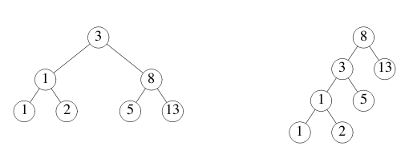

# 并发

## goroutine

*goroutine* 是由 Go 运行时环境管理的轻量级线程。

```go
go f(x, y, z)
```

开启一个新的 goroutine 执行

```go
f(x, y, z)
```

`f ， x ， y` 和 `z` 是当前 goroutine 中定义的，但是在新的 goroutine 中运行 `f`。

goroutine 在==相同的地址空间中运行==，因此访问**共享内存必须进行同步**。[`sync`](http://golang.org/pkg/sync/) 提供了这种可能，不过在 Go 中并不经常用到，因为有其他的办法。（在接下来的内容中会涉及到。）

```go
package main

import (
	"fmt"
	"time"
)

func say(s string) {
	for i := 0; i < 5; i++ {
		time.Sleep(100 * time.Millisecond)
		fmt.Println(s)
	}
}

func main() {
	go say("world1")
	say("hello1")
}

//hello1
//world1
//hello1
//world1
//world1
//hello1
//hello1
//world1
//hello1
//world1
```

<br>

## channel

channel 是==有类型的管道==，可以用 channel 操作符 `<-` 对其发送或者接收值。

```go
ch <- v    // 将 v 送入 channel ch。
v := <-ch  // 从 ch 接收，并且赋值给 v。
```

（“箭头”就是数据流的方向。）

和 map 与 slice 一样，channel 使用前必须创建：

```go
ch := make(chan int)
```

默认情况下，在另一端准备好之前，发送和接收都会阻塞。这使得 goroutine 可以在没有明确的锁或竞态变量的情况下进行同步。

```go
package main

import "fmt"

func sum(a []int, c chan int) {
	sum := 0
	for _, v := range a {
		sum += v
	}
	c <- sum // 将和送入 c
}

func main() {
	a := []int{7, 2, 8, -9, 4, 0}

	c := make(chan int)
	go sum(a[:len(a)/2], c)	 // 取数组的前半部分
	go sum(a[len(a)/2:], c)	 // 取数组的后半部分
	x, y := <-c, <-c 		 // 从 c 中获取

	fmt.Println(x, y, x+y)
}
//-5 17 12
```

<br>

## 缓冲 channel

channel 可以是 _带缓冲的_。为 `make` 提供==第二个参数作为缓冲长度==来初始化一个缓冲 channel：

```go
ch := make(chan int, 100)
```

向缓冲 channel 发送数据的时候，==只有在缓冲区满的时候才会阻塞==。当缓冲区清空的时候接受阻塞。

修改例子使得缓冲区被填满，然后看看会发生什么。

```go
package main

import "fmt"

func main() {
	c := make(chan int, 2)
	c <- 1
	c <- 2
	fmt.Println(<-c)
	fmt.Println(<-c)
}

//1
//2
```

<br>

## range 和 close

发送者可以 ==`close` 一个 channel 来表示再没有值会被发送==了。接收者可以通过赋值语句的==第二参数来测试 channel 是否被关闭==：当没有值可以接收并且 channel 已经被关闭，那么经过

```go
v, ok := <-ch
```

之后 `ok` 会被设置为 `false`。

循环 `for i := range c` 会==不断从 channel 接收值，直到它被关闭==。

**注意：** ==只有发送者才能关闭 channel，而不是接收者==。向一个已经关闭的 channel 发送数据会引起 panic。

 **还要注意：** channel 与文件不同；==通常情况下无需关闭它们==。只有在需要告诉接收者没有更多的数据的时候才有必要进行关闭，例如中断一个 `range`。

```go
package main

import (
	"fmt"
)

func fibonacci(n int, c chan int) {
	x, y := 0, 1
	for i := 0; i < n; i++ {
		c <- x
		x, y = y, x+y
	}
	close(c)
}

func main() {
	c := make(chan int, 10)
	go fibonacci(cap(c), c) 		// 会把通道传进函数
	for i := range c {
		fmt.Println(i)
	}
}

//0
//1
//1
//2
//3
//5
//8
//13
//21
//34
```

<br>

## select

`select` 语句使得一个 goroutine 在多个通讯操作上等待。

`select` 会阻塞，直到条件分支中的某个可以继续执行，这时就会执行那个条件分支。当多个都准备好的时候，会随机选择一个。

```cpp
package main

import "fmt"

func fibonacci(c, quit chan int) {
	x, y := 0, 1
	for {
		select {
		case c <- x:		// 选择一个执行， 往里面放数据
			x, y = y, x+y
		case <-quit:
			fmt.Println("quit")
			return
		}
	}
}

func main() {
	c := make(chan int)
	quit := make(chan int)
	go func() {
		for i := 0; i < 10; i++ {
			fmt.Println(<-c)   // 管道中有数据就输出
		}
		quit <- 0
	}()
	fibonacci(c, quit)
}

//0
//1
//1
//2
//3
//5
//8
//13
//21
//34
//quit
```

<br>

## 默认选择

当 `select` 中的其他条件分支==都没有准备好的时候，`default` 分支会被执行。==

为了非阻塞的发送或者接收，可使用 `default` 分支：

```go
select {
case i := <-c:
    // 使用 i
default:
    // 从 c 读取会阻塞
}
```

实例如下：

```go
package main

import (
	"fmt"
	"time"
)

func main() {
	tick := time.Tick(100 * time.Millisecond)
	boom := time.After(500 * time.Millisecond)
	for {
		select {
		case <-tick:
			fmt.Println("tick.")
		case <-boom:
			fmt.Println("BOOM!")
			return
		default:
			fmt.Println("    .")
			time.Sleep(50 * time.Millisecond)
		}
	}
}

//.
//.
//tick.
//.
//.
//tick.
//.
//.
//tick.
//.
//.
//tick.
//.
//.
//tick.
//BOOM!
```

<br>

## 练习：等价二叉树

可以用多种不同的二叉树的叶子节点存储相同的数列值。例如，这里有两个二叉树保存了序列 1，1，2，3，5，8，13。




用于检查两个二叉树是否存储了相同的序列的函数在多数语言中都是相当复杂的。这里将使用 Go 的并发和 channel 来编写一个简单的解法。

这个例子使用了 `tree` 包，定义了类型：

```
type Tree struct {
    Left  *Tree
    Value int
    Right *Tree
}
```

答案如下：

```go
package main

import (
	"golang.org/x/tour/tree"
	"fmt"
)
//  发送value，结束后关闭channel
func Walk(t *tree.Tree, ch chan int){
	sendValue(t,ch)
	close(ch)
}
//  递归向channel传值
func sendValue(t *tree.Tree, ch chan int){
	if t != nil {
		sendValue(t.Left, ch)
		ch <- t.Value
		sendValue(t.Right, ch)
	}
}

// 使用写好的Walk函数来确定两个tree对象  是否一样 原理还是判断value值
func Same(t1, t2 *tree.Tree) bool {
	ch1 := make(chan int)
	ch2 := make(chan int)
	go Walk(t1,ch1)
	go Walk(t2,ch2)
	for i := range ch1 {   // ch1 关闭后   for循环自动跳出
		if i != <- ch2 {
			return false
		}
	}
	return true
}

func main() {

	// 打印 tree.New(1)的值
	var ch = make(chan int)
	go Walk(tree.New(1),ch)
	for v := range ch {
		fmt.Println(v)
	}

	//  比较两个tree的value值是否相等
	fmt.Println(Same(tree.New(1), tree.New(1)))
	fmt.Println(Same(tree.New(1), tree.New(2)))
}

```

