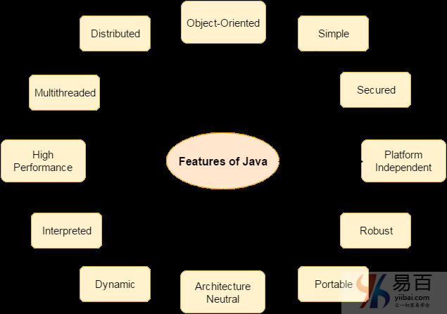
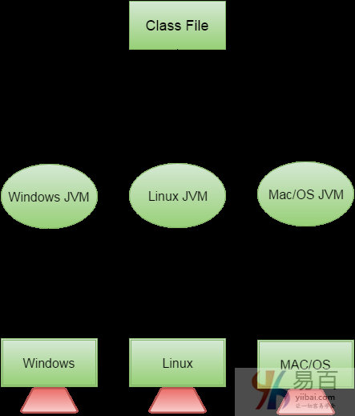

# 01 Java 语言特点

下面列出许多java的功能的特点。它们也被称为java流行语。下面给出的Java特性简单易懂。

1. 简单(Simple)
2. 面向对象(Object-Oriented)
3. 方便，可移植(Portable)
4. 平台独立(Platform independent)
5. 安全(Secured)
6. 强大,健壮(Robust)
7. 体系结构中立(Architecture neutral)
8. 动态(Dynamic)
9. 解释执行(Interpreted)
10. 高性能(High Performance)
11. 多线程(Multithreaded)
12. 分布式(Distributed)

如下图所示 -

接下来我们一个个地解释说明。

## 简单(Simple)

根据Sun的说法，Java语言很简单，这是因为：

- Java的语法是基于C++(程序员在学习C++之后更容易学习它)。
- 移除许多令人困惑和/或很少使用的特征，例如，显式指针，操作符重载等。
- 不需要删除未引用的对象，因为在Java中有自动垃圾收集。

## 面向对象(Object-Oriented)

面向对象意味着将软件组织成不同类型的对象，对象中结合了数据和行为。面向对象编程(OOP)是一种通过提供一些规则来简化软件开发和维护的方法。
**面向对象编程(OOP)的基本概念是：**

- 对象
- 类
- 继承
- 多态性
- 抽象
- 封装

## 平台独立(Platform independent)

平台是程序运行的硬件或软件环境。有两种类型的平台：基于软件和基于硬件。Java提供基于软件的平台。
Java平台与大多数其他平台的不同之处在于它是一个基于软件的平台，运行在其他基于硬件的平台之上。它有两个组件：

1. 运行时环境
2. API(应用程序编程接口)

Java代码可以在多个平台上运行，例如：Windows，Linux，Sun Solaris，Mac/OS等。Java代码由编译器编译并转换为字节码。这个字节码是一个独立于平台的代码，因为它可以在多个平台上运行，即一次写入和到处运行(WORA)。

## 安全(Secured)

Java是安全的，这是因为：

- **没有显式指针**
- **Java程序在虚拟机沙箱中运行**
  
- **类装载器**：通过**将本地文件系统与那些从网络资源导入的类分开包装**，以增加安全性。
- **字节码校验器**：检查代码片段中**是否存在违反对象访问权限的非法代码**。
- **安全管理器**：确定类可以访问什么资源，例如读取和写入本地磁盘。

这些安全方法是由java语言提供的。 一些安全性还可以由应用开发商通过SSL，JAAS，加密等提供。

## 强大,健壮(Robust)

健壮意味着强大。Java使用强大的内存管理，从而避免有安全问题的指针。在java中有自动垃圾收集。 在java中有异常处理和类型检查机制。所有这些点是使java强大的理由。

## 架构中立(Architecture neutral)

Java中并没有实现相关的特征。原始类型的大小是固定的。

在C语言编程中，对于`32`位架构，`int`数据类型占用`2`字节的存储器，对于`64`位架构，`int`数据类型占用`4`字节的存储器。 但在java中，它为`32`位和`64`位体系结构占用`4`字节的内存。

## 可移植

可以将java**字节码携带到任何平台**。

## 高性能

Java比传统的解释更快，因为字节代码与本地代码“接近”，但仍然比编译语言(例如C++)慢一些。

## 分布式(Distributed)

可以在java中**创建分布式应用程序。RMI和EJB用于创建分布式应用程序。我们可以通过从互联网上的任何机器调用方法来访问文件。**

## 多线程

线程就像一个单独的程序，并发执行。 我们可以编写Java程序，通过定**义多个线程一次处理多个任务**。多线程的主要优点是每个线程它不占用内存。它共享一个公共内存区域 线程对于多媒体，Web应用程序等非常重要。