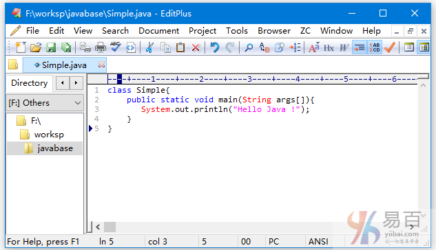
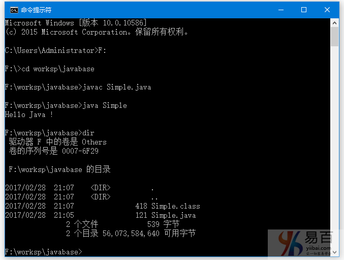
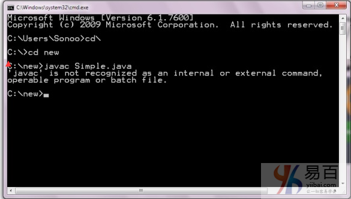

# 03 Hello World

## Hello Java示例的要求

要执行任何java程序，您首先需要：

- 安装JDK，如果你没有安装它，[下载JDK](http://www.oracle.com/technetwork/java/javase/downloads/index.html)并安装它。
- 设置`jdk/bin`目录的路径，参考：
- 创建或编写java程序
- 编译并运行java程序

### 创建hello java示例

现在让我们创建`hello java`程序，即创建一个 `Simple` 类，代码如下：

```Java
class Simple{  
    public static void main(String args[]){  
       System.out.println("Hello Java !");  
    }  
}

```

将上面代码保存在一个文件：`Simple.java` 中。

编译 `Simple.java`文件中的代码：

```Shell
javac Simple.java
```

执行编译后生成的二进制代码(Simple.class)：

```Java
java Simple
```

输出结果：

```  Shell
Hello Java
```

## 理解第一个java程序

让我们看看`class`，`public`，`static`，`void`，`main`，`String []`，`System.out.println()`的含义。

- `class`关键字用于在java中声明一个类。
- `public`关键字是一个表示可见性的访问修饰符，它表示对所有人可见。
- `static`是一个关键字，如果将某个方法声明为`static`，它被称为静态方法。 静态方法的核心优势是不用创建对象就可以直接调用。 `main`方法由JVM执行，因此它不需要创建对象来调用`main`方法。所以它节省了内存。
- `void`是方法的返回类型，它意味着它不返回任何值。
- `main`表示程序开始(执行的入口)。
- `String [] args`用于命令行参数，在以后会学习。
- `System.out.println()`是打印输出语句。在稍后我们会来了解`System.out.println`语句的内部工作原理。

下面我们来演示编写简单程序完整过程，通过**开始菜单** -> **所有程序** -> **附件** -> **打开记事本**(或者您常用的文本编辑器)，并写如下所示的简单程序：



如上图所示，在编辑器(记事本)中编写java的简单程序并将其保存为`Simple.java`文件。 要编译和运行这个程序，可通过**开始菜单** ->**所有程序** ->**附件** -> **打开命令提示符**。

要编译和运行上述程序，首先转到保存`Simple.java`文件所在的目录; 本示例中的目录是 `F:\worksp\javabase` 。命令提示符下进入这个目录并按步输入：

编译 `Simple.java`文件中的代码：

```Shell
javac Simple.java
```

执行编译后生成的二进制代码(Simple.class)：

```java
java Simple
```

输出结果：

```Java
Hello Java
```

整个过程如下图所示 -



## 编写Java程序的方式有多少种？

有很多方法可用来编写一个java程序。 可以在java程序中进行的修改如下：

**1)通过改变修饰符的顺序，方法原型不改变。**

让我们再来看看`main`方法的简单代码。

```java
static public void main(String args[])
```

**2)java数组可以使用后类型，前变量或后变量。**

让我们看看编写`main`方法的不同方式的代码。

```Java
public static void main(String[] args)  
public static void main(String []args)  
public static void main(String args[])
```

**3)通过传递3个点为main方法提供var-args支持**

让我们来看看在`main`方法中使用`var-args`的简单代码，在Java新特性一章中我们将学习`var-args`的用法。

```
public static void main(String... args)
```

**4)在java中的类的末尾的分号是可选的。**

让我们来看看下面简单的代码。

```java
class A{  
static public void main(String... args){  
System.out.println("hello java4");  
}  
};// ";"- 这里加不加分号没有影响
```

### 有效的java main方法签名

```java
public static void main(String[] args)  
public static void main(String []args)  
public static void main(String args[])  
public static void main(String... args)  
static public void main(String[] args)  
public static final void main(String[] args)  
final public static void main(String[] args)   /// can add final
final strictfp public static void main(String[] args) /// strictfp?
```

### 无效的java main方法签名

`public static` 必须在void 声明的前面。 且 不能用 `abstract`。

```java
public void main(String[] args)  
static void main(String[] args)  
public void static main(String[] args)  
abstract public static void main(String[] args)
```

### 解决错误: “javac不能识别为内部或外部命令”

**说的应该是环境变量的设置？？？**

如果发生如下图所示的问题，则需要设置路径。由于DOS不知道`javac`或`java`命令，所以我们需要设置`path`。 在这种情况下，如果将程序保存在 `jdk/bin` 文件夹中，则不需要路径。但最好设置路径，设置路径之后任何地方都可以使用 `javac`或`java`命令了 。
