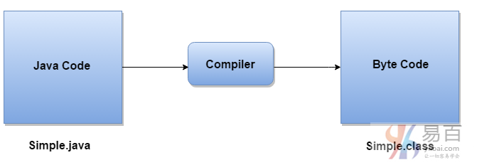
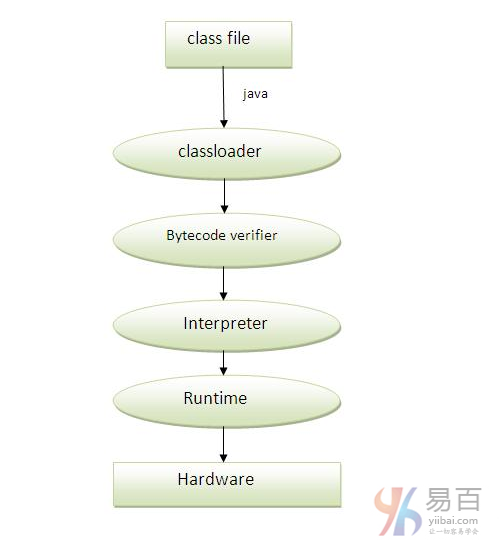
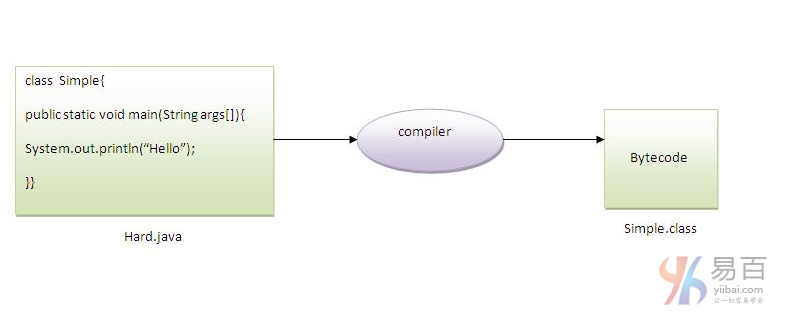
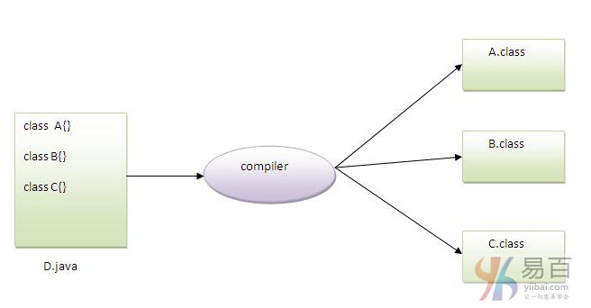

# 04 Hello Java 的内部细节

在前面的教程中，我们已经了解了第一个程序，如何编译以及如何运行第一个java程序。 这里，我们将了解和学习在编译和运行java程序时编译器和解释器发生什么。此外，我们将看到一些第一个程序中的一些问题。

## 编译时会发生什么？

在编译时，java文件由Java Compiler编译(它不与操作系统交互)，并将java代码转换为字节码，如下图中所示 -




## 运行时会发生什么？

在运行时，执行以下步骤：



**类加载器(Classloader)**：是用于加载类文件的JVM的子系统。
**字节码校验器(Bytecode Verifier)**：检查代码片段中是否存在违反对象访问权限的非法代码。
**解释器(Interpreter)**：读取字节码流然后执行指令。

**Q)可以使用其他名称而不是类名来保存java源文件？**

如果类不是使用`public`修辞符，这是可以的。 在下图中解释：



编译：

```java
javac Hard.java  /// 还是编译文件名
```

执行：

```java
java Simple		/// 直接调用编译生成的字节码
```

> 提示：如果使用 `public class Simple{}` 这样来定义类是不可以的。
>
> 默认是：private 权限

**Q)能在一个java源文件中有多个类吗？**

这是可以的，如下图所示：

