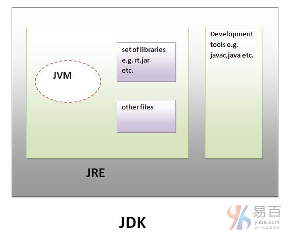

# 05 JVM JRE  和 JDK 的区别

好多开发者学习 Java 编程有若干个年头了，但真正了解JDK，JRE和JVM之间的区别应该不多，别不服，大概是因为平时都是在`Coding <=> Bug`，没有时间去阅读相关资料吧。
了解JDK，JRE和JVM之间的区别在Java中很重要，在这里简要概述了JVM。

如果要了解Java虚拟机的详细知识，请转到下一页。 首先，让我们来看看JDK，JRE和JVM之间的基本区别。

## JVM

JVM(Java虚拟机)是一个抽象机器。它是一个提供可以执行Java字节码的运行时环境的规范。
JVM可用于许多硬件和软件平台。JVM，JRE和JDK是平台相关的，因为每个OS的配置不同。 但是，Java是平台无关的。

**JVM执行以下主要任务：**

- 加载代码
- 验证代码
- 执行代码
- 提供运行时环境

## JRE

JRE是`Java Runtime Environment`的缩写。它用于提供运行时环境。它是JVM的实现。它是实际存在的。它包含一组库和JVM在运行时使用的其他文件。
Sun Micro Systems以外的其他公司也积极发布JVM的实施(实现)。

## JDK

JDK是`Java Development Kit`的缩写，它是实际上存在的。它包含JRE+开发工具。如下图所示 -

