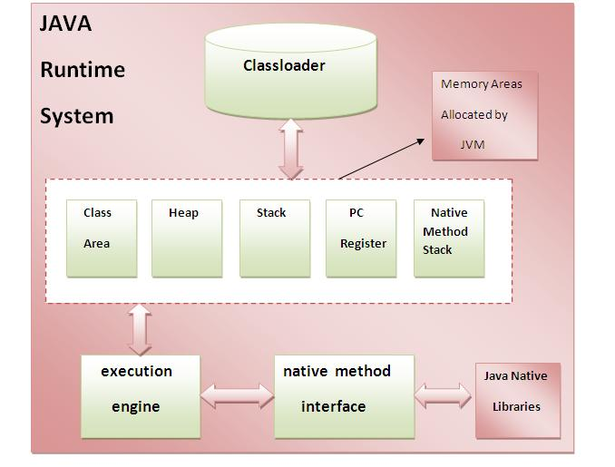

#06 Java虚拟机内部体系结构

JVM(Java虚拟机)是一个抽象机器。 它是一个提供可以执行Java字节码的运行时环境的规范。JVM可用于许多硬件和软件平台(即JVM是平台相关的)。

## 什么是JVM？

**JVM(Java虚拟机)是：**

1. 指定Java虚拟机的工作的规范。 但实现提供程序是独立的选择算法。 其实现是由Sun和其他公司提供。
2. 它的实现被称为JRE(Java运行时环境)。
3. 运行时实例只要在命令提示符上编写java命令来运行java类，就会创建JVM的实例。

## JVM(Java虚拟机)能做什么？

JVM执行以下操作：

- 加载代码
- 验证代码
- 执行代码
- 提供运行时环境

JVM提供了以下定义：

- 内存区
- 类文件格式
- 寄存器集合
- 垃圾收集堆
- 致命错误报告等

## JVM(Java虚拟机)内部体系结构

下面让我们来了解JVM的内部架构。它包含类加载器，内存区域，执行引擎等。

**1)类加载器**

`Classloader`是JVM的一个子系统，用于加载类文件。

**2)类(方法)区域**

类(方法)区域存储每个类结构，例如运行时常量池，字段和方法数据，方法的代码。

**3)堆**

它是分配对象的运行时数据区。

**4)堆栈**
Java堆栈存储帧。它保存局部变量和部分结果，并在方法调用和返回中起作用。
每个线程都有一个私有JVM堆栈，同时创建线程。每次调用方法时都会创建一个新的框架。 框架在其方法调用完成时被销毁。

**5)程序计数器寄存器**

PC(程序计数器)寄存器。 它包含当前正在执行的Java虚拟机指令的地址。

**6)本地方法堆栈**

它包含应用程序中使用的所有本地方法。

**7)执行引擎**

执行引擎包含：

1. **虚拟处理器**
2. **解释器**：读取字节码流，然后执行指令。
3. **即时(JIT)编译器**：它用于提高性能，JIT编译的同时有类似字节代码部分的功能，从而减少编译所需的时间。**编译器**是指从Java虚拟机(JVM)的指令集到特定CPU的指令集的转换器。