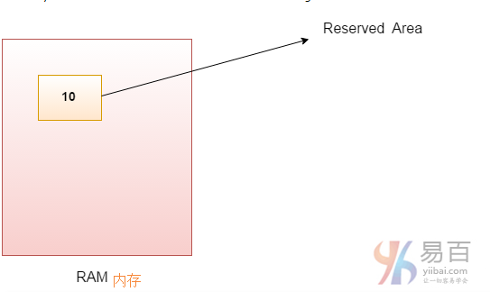
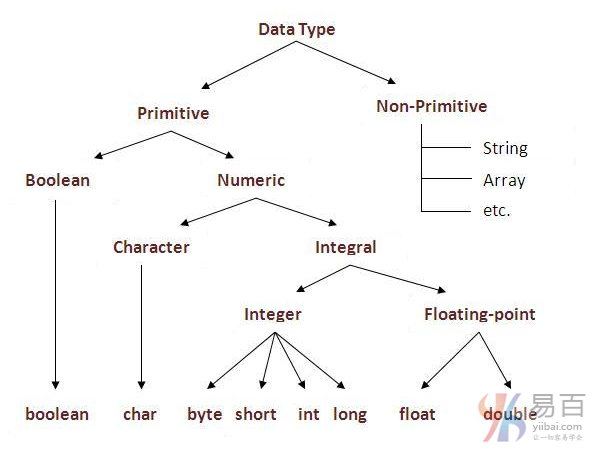

# 07 Java变量和数据类型


变量是一个内存位置的名称。 java中有三种类型的变量：**局部变量**，**实例变量**和**静态变量**。java中有两种类型的数据类型：**原始数据类型**和**非原始数据类型**。

## 变量

变量是在内存中分配的保留区域的名称。换句话说，它是内存位置的名称。这意味着它的值可以改变。



```Java
int data=50;// 这里 data 就是一个变量。
```

## 变量类型

java中有三种类型的变量：

- 局部变量
- 实例变量
- 静态变量


**1)局部变量**

在方法内声明的变量称为局部变量。

**2)实例变量**

在类中声明但在方法外部的变量称为实例变量。但它不被声明为静态(未加`static`修辞符)。

**3)静态变量**

被声明为`static`的变量(加`static`修辞符)称为静态变量。它不能是局部的。

我们将在下一章中详细学习这些变量。

下面看几个示例来了解java中的变量类型。

```java
class A{  
    int data=50;//实例变量
    static int m=100;// 静态变量
    void method(){  
        int n=90;//局部变量
    }  
}//end of class
```

## Java数据类型

数据类型表示要存储在变量中的不同类型的值。 在Java中，有两种类型的数据类型：

- 原始数据类型
- 非原始数据类型



| 数据类型 | 默认值     | 默认长度 |
| -------- | ---------- | -------- |
| boolean  | false      | `1 bit`  |
| char     | `'\u0000'` | 2 byte   |
| byte     | 0          | 1 byte   |
| short    | 0          | 2 byte   |
| int      | 0          | 4 byte   |
| long     | 0L         | 8 byte   |
| float    | 0.0f       | 4 byte   |
| double   | 0.0d       | 8 byte   |

**为什么char在java中使用2个字节以及什么是\u0000？**

这是因为java使用`Unicode`系统而非`ASCII`码系统编码。 `\u0000`是Unicode系统的最低范围。要了解有关Unicode的详细说明，请访问下一页。

### Java变量示例：两个数字相加

```java
class Simple{  
    public static void main(String[] args){  
        int a = 10;  
        int b = 10;  
        int c = a + b;  
        System.out.println(c);  
    }
}
```

输出结果：

```shell
20
```

### Java变量示例：加宽

```java
class Simple{  
    public static void main(String[] args){  
        int a=10;  
        float f=a;  
        System.out.println(a);  
        System.out.println(f);  
    }
}
```

输出结果：

```shell
10
10.0
```

### Java变量示例：缩小(转换)

```Java
class Simple{  
    public static void main(String[] args){  
        float f=10.5f;  
        //int a=f;					//Compile time error  
        int a=(int)f;  				/// 范围缩小，必须显示强转
        System.out.println(f);  
        System.out.println(a);  
    }
}
```

输出结果：

```shell
10.5
10
```

### Java变量示例：溢出

```java
class Simple{  
    public static void main(String[] args){  
        //Overflow  
        int a=130;  
        byte b=(byte)a;  
        System.out.println(a);  
        System.out.println(b);  
    }
}
```

输出结果：

```shell
130
-126
```

### Java变量示例：较低类型相加

```java
class Simple{  
    public static void main(String[] args){  
        byte a=10;  
        byte b=10;  
        //byte c=a+b;			//Compile Time Error: because a+b=20 will be int  
        byte c=(byte)(a+b);  	// must with two()
        System.out.println(c);  
    }
}
```

输出结果：

```shell
20
```