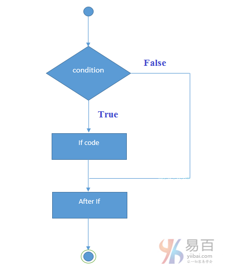
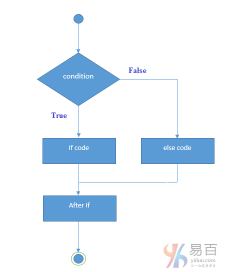
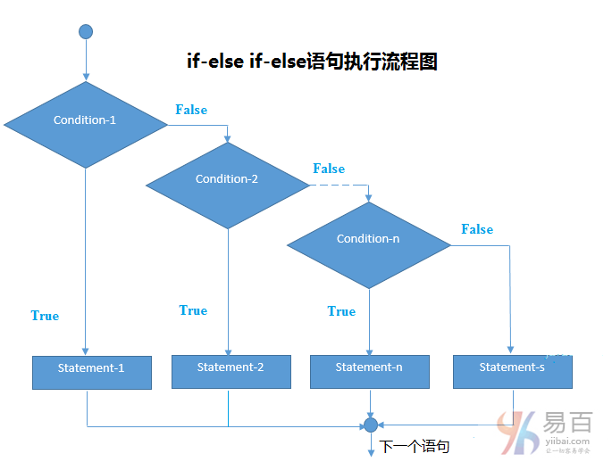

# 10 if else 语句


Java **if语句**用于测试条件。它检查布尔条件为：`true`或`false`。 java中有各种类型的**if语句**，它们分别如下：

- if语句
- if-else语句
- 嵌套if语句
- if-else-if语句

## Java if语句

Java语言中的`if`语句用于测试条件。如果条件为`true`，则执行`if`语句块。

**语法：**

```java
if(condition){  
   // if 语句块 => code to be executed.
}
```

执行流程如下图所示 -



### 1. 示例

```java
public class IfExample {
    public static void main(String[] args) {
        int age = 20;
        if (age > 18) {
            System.out.print("Age is greater than 18");
        }
    }
}
```

输出结果如下 -

```
Age is greater than 18


Java
```

## Java if-else语句

Java `if-else`语句也用于测试条件。如果`if`条件为真(`true`)它执行`if`块中的代码，否则执行`else`块中的代码。

**语法：**

```java
if(condition){  
    //code if condition is true  
}else{  
    //code if condition is false  
}
```

执行流程如下图所示 -



**示例代码：**

```java
public class IfElseExample {
    public static void main(String[] args) {
        int number = 13;
        if (number % 2 == 0) {
            System.out.println("这是一个偶数");
        } else {
            System.out.println("这是一个奇数");
        }
    }
}
```

输出结果如下 -

```java
这是一个奇数
```

## Java if-else-if语句

Java编程中的`if-else-if`语句是从多个语句中执行一个条件。

**语法：**

```java
if(condition1){  
    //code to be executed if condition1 is true  
}else if(condition2){  
    //code to be executed if condition2 is true  
}else if(condition3){  
    //code to be executed if condition3 is true  
}  
...  
else{  
    //code to be executed if all the conditions are false  
}
```

执行流程如下图所示 -



**示例：**

```java
public class IfElseIfExample {
    public static void main(String[] args) {
        int marks = 65;

        if (marks < 50) {
            System.out.println("fail");
        } else if (marks >= 50 && marks < 60) {
            System.out.println("D grade");
        } else if (marks >= 60 && marks < 70) {
            System.out.println("C grade");
        } else if (marks >= 70 && marks < 80) {
            System.out.println("B grade");
        } else if (marks >= 80 && marks < 90) {
            System.out.println("A grade");
        } else if (marks >= 90 && marks < 100) {
            System.out.println("A+ grade");
        } else {
            System.out.println("Invalid!");
        }
    }
}
```

输出结果如下 -

```Shell
C grade
```