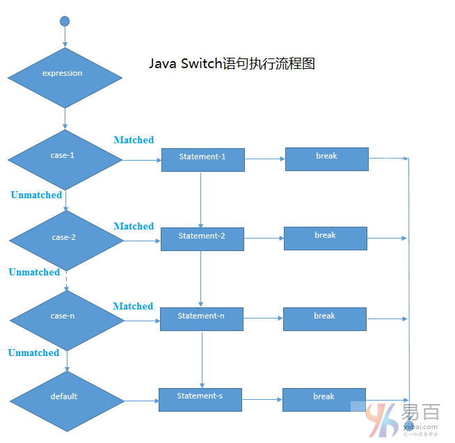

# 11 Switch 语句


Java **switch语句**用于从多个条件执行一个语句。它就像`if-else-if`语句一样。

**语法：**

```java
switch(expression){    
    case value1:    
       //code to be executed;    
       break;  //optional  
    case value2:    
       //code to be executed;    
       break;  //optional  
    ......    

    default:     
       // code to be executed if all cases are not matched;    
}
```

**switch语句**执行流程图如下所示 -



**示例：**

```java
public class SwitchExample {
    public static void main(String[] args) {
        int number = 20;
        switch (number) {
        case 10:
            System.out.println("10");
            break;
        case 20:
            System.out.println("20");
            break;
        case 30:
            System.out.println("30");
            break;
        default:
            System.out.println("Not in 10, 20 or 30");
        }
    }
}
```

执行输出结果如下：

```java
20
```

## Java switch语句落空通过所有case语句

下面我们来看看java `switch`语句落空通过所有条件，即 `case` 子句中的所有条件都未能匹配。也就是如果不在 `switch case` 下使用`break`语句，则它在第一个匹配之后也会执行接下来的所有 `case`中的语句。

**示例：**

```java
public class SwitchExample2 {
    public static void main(String[] args) {
        int number = 20;
        switch (number) {
        case 10:
            System.out.println("10");
        case 20:
            System.out.println("20");
        case 30:
            System.out.println("30");
        default:
            System.out.println("Not in 10, 20 or 30");
        }
    }
}
```

执行输出结果如下：

```Java
20
30
Not in 10, 20 or 30
```