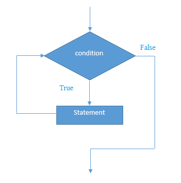

# 13 while 循环


Java **while循环**用于重复程序的一部分几次或重复执行一个代码块。 如果迭代次数不固定，建议使用`while`循环。

**语法：**

```java
while(condition){  
    //code to be executed  
}
```

下面是 `while` 循环的执行流程 -



**示例：**

```java
public class WhileExample {
    public static void main(String[] args) {
        int i = 1;
        while (i <= 10) {
            System.out.println(i);
            i++;
        }
    }
}
```

执行上面的代码，得到下面的结果 -

```Java
1
2
3
4
5
6
7
8
9
10

```

## Java无限while循环

如果在`while`循环中传递`true`作为参数，它将是一个无限`while`循环。

**语法：**

```Java
while(true){  
    //code to be executed  
}
```

**示例：**

```java
public class WhileExample2 {
    public static void main(String[] args) {
        while (true) {
            System.out.println("infinitive while loop");
        }
    }
}
```

执行上面的代码，得到下面的结果 -

```java
infinitive while loop
infinitive while loop
infinitive while loop
infinitive while loop
infinitive while loop
ctrl+c
```

> 注意：由于无限循环程序无法退出，所以您需要按`ctrl + c`退出程序。n