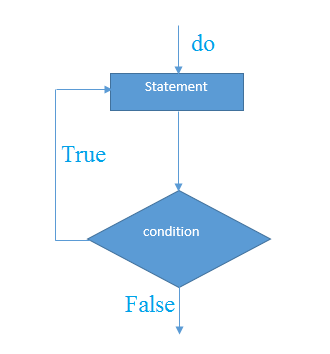

#14 do while


Java `do-while`循环用于多次迭代程序的一部分或重复多次执行一个代码块。 如果迭代次数不固定，必须至少执行一次循环，建议使用`do-while`循环。

Java `do-while`循环至少执行一次，因为它是在循环体之后检查条件。

**语法：**

```Java
do{  
    //code to be executed  
}while(condition); // 后置条件检查			
```

Java `do-while`循环执行流程图如下所示 -


**示例：**

```java
public class DoWhileExample {
    public static void main(String[] args) {
        int i = 1;
        do {
            System.out.println(i);
            i++;
        } while (i <= 10);
    }
}
```

执行结果如下 -

```java
1
2
3
4
5
6
7
8
9
10
```

## Java无限do-while循环

如果在`do-while`循环中传递参数值为：`true`，它将是一个无限`do-while`循环。

**语法：**

```java
do{  
    //code to be executed  
}while(true);
```

**示例：**

```Java
public class DoWhileExample2 {
    public static void main(String[] args) {
        do {
            System.out.println("infinitive do while loop");
        } while (true);
    }
}
```

执行结果如下 -

```java
infinitive do while loop
infinitive do while loop
infinitive do while loop
ctrl+c

```

> 上面的需要按`ctrl + c`退出程序。