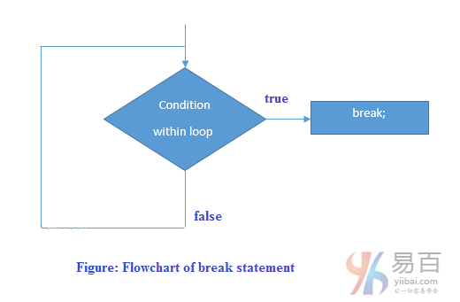

# 15 break

Java break用于断开循环或`switch`语句。它在指定条件下中断程序的当前流程。 在内循环的情况下，它仅中断内循环，外循环仍然可继续执行。

**语法：**

```java
jump-statement;    
break;
```

break语句的执行流程图如下所示 -



## Java Break语句和循环

**示例：**

```java
public class BreakExample {
    public static void main(String[] args) {
        for (int i = 1; i <= 10; i++) {
            if (i == 5) {
                break;
            }
            System.out.println(i);
        }
    }
}
```

执行上面代码得到结果 -

```java
1
2
3
4
```

## Java内部循环语句

它中断了内循环，只有当你在内循环中使用`break`语句。

**示例：**

```Java
public class BreakExample2 {
    public static void main(String[] args) {
        for (int i = 1; i <= 3; i++) {
            for (int j = 1; j <= 3; j++) {
                if (i == 2 && j == 2) {
                    break;
                }
                System.out.println(i + " " + j);
            }
        }
    }
}
```

上面代码输出输出：

```java
1 1
1 2
1 3
2 1
3 1
3 2
3 3
```

**带有Java break语句和Switch语句**

要了解`break`与`switch`语句的示例，请访问这里：[Java switch语句](https://www.yiibai.com/java/www.yiibai.com/java/java-switch.html)。