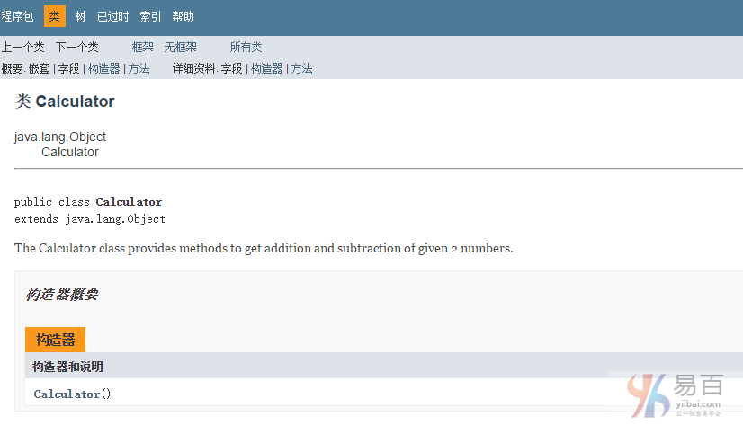

#17 注释

**java注释**是不会被编译器和解释器执行的语句。 注释可以用于提供关于变量，方法，类或任何语句的信息或解释。 它也可以用于在特定时间隐藏程序代码。

## Java注释的类型

在Java中有`3`种类型的注释。它们分别如下 -

1. 单行注释
2. 多行注释
3. 文档注释

### 1)Java单行注释

单行注释仅用于注释一行，它使用的是 `//` 两个字符作为一行注释的开始，如下语法所示 -

**语法：**

```java
// This is single line comment
```

**示例：**

```java
public class CommentExample1 {
    public static void main(String[] args) {
        int i = 10;// Here, i is a variable
        System.out.println(i);
        int j = 20;
        // System.out.println(j); 这是另一行注释，这行代码不会被执行。
    }
}
```

上面示例代码输出结果如下 -

```java
10
```

### 2)Java多行注释

多行注释用于注释多行代码。它以 `/*` 开始，并以 `*/` 结束，在 `/*` 和 `*/`之间的代码块就是一个注释块，其中的代码是不会这被执行的。

**语法：**

```  Java
/* 
This  
is  
multi line  
comment 
*/

```

**示例：**

```  Java
public class CommentExample2 {
    public static void main(String[] args) {
        /*
         * Let's declare and print variable in java.
         *
         *  这是多行注释
         */
        int i = 10;
        System.out.println(i);
    }
}
```

上面示例代码输出结果如下 -

```  Java
10
```

### 3)Java文档注释

文档注释用于创建文档API。 要创建文档API，需要使用`javadoc`工具。

**语法：**

```java
/** 
This  
is  
documentation  
comment 
*/
```

**示例：**

```  Java
/**
 * The Calculator class provides methods to get addition and subtraction of
 * given 2 numbers.
 */
public class Calculator {
        /** The add() method returns addition of given numbers. */
        public static int add(int a, int b) {
            return a + b;
        }

        /** The sub() method returns subtraction of given numbers. */
        public static int sub(int a, int b) {
            return a - b;
        }
}
```

**用intellij 的 Tools —> Generate JavaDoc 即可。**

通过`javac`工具编译：

```Shell
javac Calculator.java
```

通过`javadoc`工具创建文档API：

```Shell
javadoc Calculator.java
```

现在，将在当前目录中为上面的`Calculator`类创建了HTML文件。 打开HTML文件，并查看通过文档注释提供的`Calculator`类的说明。如下所示 -

