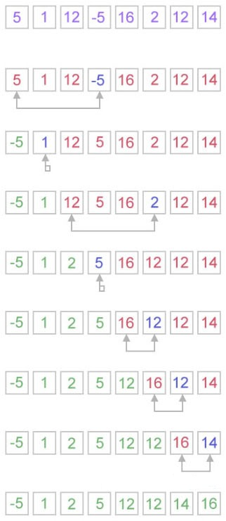
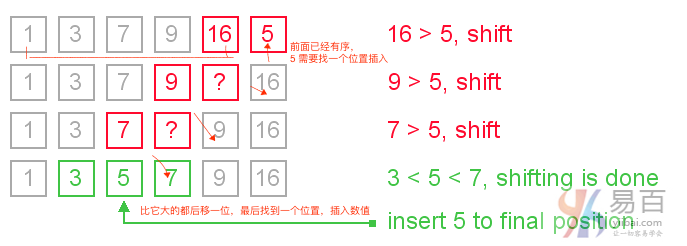

#18 java 基础实例程序

Java基础实例程序在面试中经常提到。这些程序可以从控制语句，数组，字符串，面向对象等等。让我们来看看下面java实例程序的列表。

### 1. 斐波纳契数列

编写一个java程序打印斐波纳契(fibonacci)数列不使用递归和使用递归。示例链接：[斐波纳契数列代码实现](http://www.yiibai.com/java/fibonacci-series-in-java.html)

**输入**: `10`

**输出**: `0 1 1 2 3 5 8 13 21 34`

非递归：

```java
class FibonacciExample1 {
    public static void main(String args[]) {
        int n1 = 0, n2 = 1, n3, i, count = 10;
        System.out.print(n1 + " " + n2);// printing 0 and 1

        for (i = 2; i < count; ++i)// loop starts from 2 because 0 and 1 are
                                    // already printed
        {
            n3 = n1 + n2;
            System.out.print(" " + n3);
            n1 = n2;
            n2 = n3;
        }

    }
}
.......
执行上面代码，得到如下结果 -

0 1 1 2 3 5 8 13 21 34
```

递归实现： 

```java
class FibonacciExample2 {
    static int n1 = 0, n2 = 1, n3 = 0;

    static void printFibonacci(int count) {
        if (count > 0) {
            n3 = n1 + n2;
            n1 = n2;
            n2 = n3;
            System.out.print(" " + n3);
            printFibonacci(count - 1);
        }
    }

    public static void main(String args[]) {
        int count = 10;
        System.out.print(n1 + " " + n2);// printing 0 and 1
        printFibonacci(count - 2);// n-2 because 2 numbers are already printed
    }
}
Java
执行上面代码，得到如下结果 -

0 1 1 2 3 5 8 13 21 34
```

### 2. 素数实例

编写一个java程序来判定给定的一个数字是否为素数。示例链接：[素数实例代码](http://www.yiibai.com/java/prime-number-program-in-java.html)

**输入**: 44

**输出**: `not prime number`

**输入**: 7

**输出**: `prime number`


质数(prime number)又称素数，有无限个。质数定义是：在大于`1`的自然数中，除了`1`和它本身以外不再有其他因数的数称为质数。例如，`2`，`3`，`5`，`7`，`11`，`13`，`17` ….是素数。

> 注意：`0`和`1`不是素数。 `2`是唯一的偶数素数，因为所有其他偶数可以除以`2`。

下面来看看java中的素数程序。 在这个java程序中，我们将读取一个数字变量，并判断这个数字是否为素数。

``` Java
class PrimeExample {
    public static void main(String args[]) {
        int i, m = 0, flag = 0;
        int n = 17;// it is the number to be checked
        m = n / 2; // Math.sqrt(n)
        for (i = 2; i <= m; i++) {
            if (n % i == 0) {
                System.out.println("Number is not prime");
                flag = 1;
                break;
            }
        }
        if (flag == 0)
            System.out.println(n + " is prime");
    }
}
```

执行上面代码，得到以下结果 -

```java
17 is prime
```


### 3. 回文数

编写一个java程序断定给定的字符串是否为一个回文数。示例链接：[回文数示例](http://www.yiibai.com/java/palindrome-program-in-java.html)

**输入：** `123`

**输出：** `not palindrome number`

**输入：** `12321`

**输出：** `palindrome number`

Java中的回文数定义：回文数是反向后与原数字也是相同的数字(即：从左边读和从右边读过来都是同一个数字)。 例如，`545`,`151`,`3454`,`343`,`171`,`4884`都是回文数。

**实现回文数算法**

- 获取要检查回文的数字
- 将数字保存在临时变量中
- 反转数字
- 将临时数字与反转数字进行比较
- 如果两个数字相同，则打印“回文数”
- 否则打印“不回文数”

下面来看看java的回文程序。 在这个java程序中，首先得到一个数字变量，并检查数是否是回文。

```java
class PalindromeExample {
    public static void main(String args[]) {
        int r, sum = 0, temp;
        int n = 454;// It is the number variable to be checked for palindrome

        temp = n;
        while (n > 0) {
            r = n % 10; // getting remainder
            sum = (sum * 10) + r;
            n = n / 10;
        }
        if (temp == sum)
            System.out.println("palindrome number ");
        else
            System.out.println("not palindrome");
    }
}
```

这种复杂度有点高

找规律

```
4884
4884/1000 ?= 4884 % 10
(4884 - 1000*(4884/1000)) /100 ? = (4884/10) % 10
```

这样比较麻烦，转成字符串就好弄了。

改进后的方案如下：

```java
public class Main {

    public static void main(String... args) {
       int data = 4884;
       String d = String.valueOf(data);
       System.out.println(d.length());
       boolean flag = true;
       for( int i =0; i < d.length()/2; i++ ){
            if( d.charAt(i) != d.charAt(d.length()-1 -i) ){
                System.out.println("not huiwen");
                flag = false;
                break;
            }
        }

        if( flag )
            System.out.println("is huiwen");
    }

};

```


### 4. 阶乘

编写一个java程序来打印数字的阶乘。示例链接：[阶乘实现代码](http://www.yiibai.com/java/factorial-program-in-java.html)

**输入：** `5`

**输出：** `120`

**输入：** `6`

**输出：** `720`

```java
public class Main {

    public static void main(String... args) {
        int a = 5;
        int res = 1;
        for( int i =1; i<=a; i++)
            res *= i;       /// 神奇的错误， * = 中间空一格居然有错误

        System.out.println(res);
    }

};
```


### 5. 阿姆斯壮数

编写一个java程序来断定一个数值是否为阿姆斯壮(Armstrong)数。示例链接：[阿姆斯壮数实例](http://www.yiibai.com/java/armstrong-number-in-java.html)

**输入：** `153`

**输出：** `Armstrong number`

**输入：** `22`

**输出：** `not Armstrong number`

Java中的阿姆斯壮数(armstrongnumber) 定义：阿姆斯壮数(armstrongnumber) 是等于其数字的立方数之和的数字，例如：`0`，`1`，`153`，`370`，`371`，`407`等。

现在试着理解为什么`153`是一个阿姆斯壮数字， `153 = (1*1*1)+(5*5*5)+(3*3*3)`。

也就是:

```
153 = (1*1*1)+(5*5*5)+(3*3*3) 
(1*1*1)=1  
(5*5*5)=125  
(3*3*3)=27  
So:  
1+125+27=153


Java
```

再来试着理解为什么`371`也是一个阿姆斯壮数字。

```
371 = (3*3*3)+(7*7*7)+(1*1*1)  
where:  
(3*3*3)=27  
(7*7*7)=343  
(1*1*1)=1  
So:  
27+343+1=371


Java
```

下面来看看如何使用Java来实现检查阿姆斯壮(Armstrong)数字。

```java
class ArmstrongExample {
    public static void main(String[] args) {
        int c = 0, a, temp;
        int n = 153;// It is the number to check armstrong
        temp = n;
        while (n > 0) {
            a = n % 10;	/// 每次取最低数，这种方法还是可取的
            n = n / 10;
            c = c + (a * a * a);
        }
        if (temp == c)
            System.out.println("armstrong number");
        else
            System.out.println("Not armstrong number");
    }
}
```

结果如下：

```java
armstrong number
```


### 6. 气泡排序

编写一个java程序，使用冒泡排序算法对数组元素进行排序。示例链接：[气泡排序实例](http://www.yiibai.com/java/bubble-sort-in-java.html)

**输入：** 18 9 33 4 84 32

**输出：** 4 9 18 32 33 84

在教程中，将创建一个java程序，使用冒泡排序对数组元素排序。 气泡排序算法也被称为最简单的排序算法。

在冒泡排序算法中，数组从第一个元素遍历到最后一个元素。 这里，将当前元素与下一个元素进行比较。如果当前元素大于下一个元素，则交换它们的位置。

```java
public class BubbleSortExample {
    static void bubbleSort(int[] arr) {
        int n = arr.length;
        int temp = 0;
        for (int i = 0; i < n; i++) {
            /// 这里，应该是 n - i, 呈阶梯状上升
            for (int j = 1; j < (n - i); j++) {
                if (arr[j - 1] > arr[j]) {
                    // swap elements
                    temp = arr[j - 1];
                    arr[j - 1] = arr[j];
                    arr[j] = temp;
                }

            }
        }

    }

    public static void main(String[] args) {
        int arr[] = { 3, 60, 35, 2, 45, 320, 5 };

        System.out.println("Array Before Bubble Sort");
        for (int i = 0; i < arr.length; i++) {
            System.out.print(arr[i] + " ");
        }
        System.out.println();

        bubbleSort(arr);// sorting array elements using bubble sort

        System.out.println("Array After Bubble Sort");
        for (int i = 0; i < arr.length; i++) {
            System.out.print(arr[i] + " ");
        }

    }
}
```

执行上面的代码，得到以下结果 -

```java
Array Before Bubble Sort
3 60 35 2 45 320 5 
Array After Bubble Sort
2 3 5 35 45 60 320
```

### 7. 选择排序

编写一个java程序，使用选择排序算法对数组元素进行排序。示例链接：[选择排序实例](http://www.yiibai.com/java/selection-sort-in-java.html)

**输入：** 18 9 33 4 84 32

**输出：** 4 9 18 32 33 84

在这个示例中，我们创建一个java程序，实现使用选择排序对数组元素进行排序。 在选择排序算法中，搜索最低的元素并将其排列到适当的位置。用下一个最小的数字交换当前元素。



选择排序的Java实现代码示例如下 -

```java
public class SelectionSortExample {
    public static void selectionSort(int[] arr) {
        for (int i = 0; i < arr.length - 1; i++) {
            int index = i;
            for (int j = i + 1; j < arr.length; j++) {
                if (arr[j] < arr[index]) {
                    index = j;// searching for lowest index
                }
            }
            /// swap current and index 
            int smallerNumber = arr[index];
            arr[index] = arr[i];
            arr[i] = smallerNumber;
        }
    }

    public static void main(String a[]) {
        int[] arr1 = { 9, 14, 3, 2, 43, 11, 58, 22 };
        System.out.println("Before Selection Sort");
        for (int i : arr1) {
            System.out.print(i + " ");
        }
        System.out.println();

        selectionSort(arr1);// sorting array using selection sort

        System.out.println("After Selection Sort");
        for (int i : arr1) {
            System.out.print(i + " ");
        }
    }
}
```

执行上面代码后，得到以下结果 -

```java
Before Selection Sort
9 14 3 2 43 11 58 22 
After Selection Sort
2 3 9 11 14 22 43 58
```


### 8. 插入排序

编写一个java程序，使用插入排序算法对数组元素进行排序。示例链接：[插入排序实例](http://www.yiibai.com/java/insertion-sort-in-java.html)

下面我们创建一个java程序，实现使用插入排序对数组元素进行排序。 插入排序对于小元素是有好处的，因为排序大量元素它需要更多的时间。



让我们来看看一个简单的java程序，使用插入排序算法对数组进行排序。

```java
public class InsertionSortExample {
    public static void insertionSort(int array[]) {
        int n = array.length;
        /// 从前到后
        for (int j = 1; j < n; j++) {
            int key = array[j];
            int i = j - 1;
            while ((i > -1) && (array[i] > key)) {
                array[i + 1] = array[i];
                i--;
            }
            ///  知道 key 前面的数值都比 key 小
            array[i + 1] = key;
        }
    }

    public static void main(String a[]) {
        int[] arr1 = { 9, 14, 3, 2, 43, 11, 58, 22 };
        System.out.println("Before Insertion Sort");
        for (int i : arr1) {
            System.out.print(i + " ");
        }
        System.out.println();

        insertionSort(arr1);// sorting array using insertion sort

        System.out.println("After Insertion Sort");
        for (int i : arr1) {
            System.out.print(i + " ");
        }
    }
}
```

执行上面代码，输出结果如下：

```java
Before Insertion Sort
9 14 3 2 43 11 58 22 
After Insertion Sort
2 3 9 11 14 22 43 58
```

