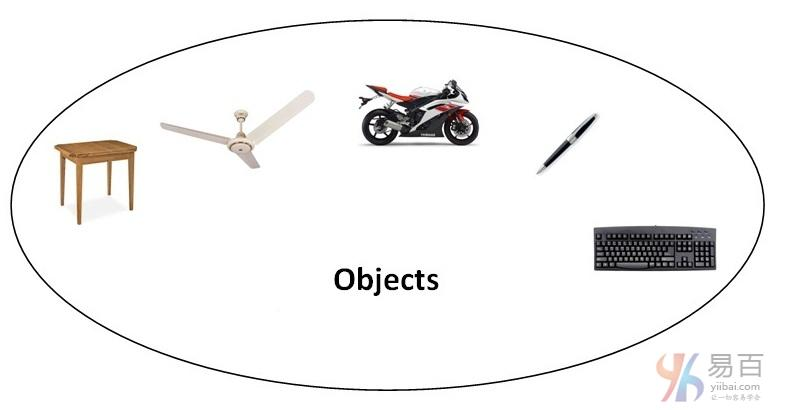
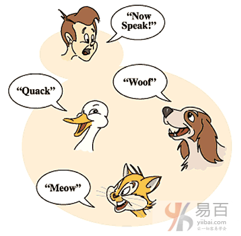
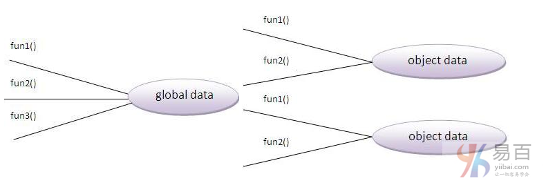

# 19 面向对象OOP 概念

在本节中，我们将了解面向对象(OOP)的基础知识。 面向对象编程只是一个模式，它提供许多概念，如继承，数据绑定，多态等等。

`Simula`是第一种面向对象的编程语言。而一切都可表示为对象的编程模式被称为真正的面向对象的编程语言。

`Smalltalk`是第一个真正的面向对象的编程语言。

## OOPs(面向对象编程系统)

对象意味着真实的单词实体，如：笔，椅子，表等。面向对象编程是一种使用类和对象来设计程序的方法或模式。 它通过提供一些概念简化了软件开发和维护：

- 对象
- 类
- 继承
- 多态性
- 抽象
- 封装

### 1. 对象

任何具有状态和行为的实体都称为**对象**。 例如：椅子，钢笔，桌子，键盘，自行车等。它可以是物理和逻辑的。

### 2. 类

对象的集合称为**类**。 它是一个逻辑实体。

### 3. 继承

当一个对象获取父对象的所有属性和行为，称为**继承**。 它提供代码可重用性。 它用于实现运行时多态性。

### 4. 多态性

当一个任务通过不同的方式执行时，称为**多态性**。 例如：以不同的方式说服客户，画一些东西，如：形状或矩形等。

在java中，我们使用方法重载和方法重写来实现多态性。

另一个例子可以是说话，同是说话，人说话，猫说话和狗说话等，说话的方式都不太一样。

### 5. 抽象

隐藏内部细节和显示功能称为**抽象**。 例如：电话，但我们不知道内部是如何处理通话/通信的。

### 6. 封装

将代码和数据绑定(或包装)在一起成为单个单元称为**封装**。 例如：胶囊，它包裹着不同的药物。

一个java类是封装的例子。 Java bean是完全封装的类，因为所有的数据成员在这里是私有的。

## OOP的优点相对于面向过程的编程语言

1. OOP使开发和维护变得更容易，因为在面向过程的编程语言中，如果代码随着项目规模的增长而增长，则不容易管理。
2. OOP提供数据隐藏，而在面向过程的编程语言中，可以从任何地方访问全局数据。
3. OOP提供更有效地模拟真实世界事件的能力。 如果使用面向对象的编程语言，我们可以提供真实世界里的问题的解决方案。

### 面向对象编程语言和基于对象的编程语言有什么区别？

除了继承，基于对象的编程语言遵循OOP的所有功能。JavaScript和VBScript是基于对象的编程语言。