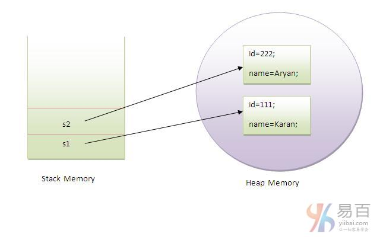

# 21 Java 对象 和 类

1- 五大创造对象的方法

- 通过`new`关键字
- 通过`newInstance()`方法
- 通过`clone()`方法
- 通过反序列化
- 通过工厂方法等

2- 匿名对象: 【**只使用一次的对象**】

```cpp
new Calculation().fact(5);
```

3- 同时创建多个同类的对象

```java
Rectangle r1=new Rectangle(), r2=new Rectangle();//creating two objects
```

4- 


------

原文： https://www.yiibai.com/java/object-and-class-in-java.html

在本节教程中，我们将学习Java对象和类。在面向对象编程技术中，需要设计和使用对象和类的程序。对象是物理和逻辑实体，而类是逻辑实体。

> **提醒：**对于Java初学者来说，对象和类是一个十分重要的概念，能否理解和掌握对之后其他Java知识有直接影响。所以，虽然本节的内容比较多，但建议认真阅读并理解，最好能结合手动实现本节中的所有示例代码。

## 1. Java中的对象

具有状态和行为的实体可称为**对象**(女朋友也可以叫**对象**)。 椅子，自行车，标记，笔，桌子，汽车等。它可以是物理或逻辑(有形和无形)。 无形对象的例子是银行系统。

一个对象有三个特点：

- **状态：** 表示一个对象的数据(值)。
- **行为：** 表示对象的行为(功能)，例如：存款，取款等。
- **标识：** 对象标识通常通过唯一ID实现。该`ID`的值对外部用户不可见。 但是，它由JVM内部使用来唯一地标识每个对象。

**例如：** **汽车**是一个对象。它的名字是：**捷达**，颜色是白色等这些就是它的状态(数据值)。它用于**跑路**，所以**跑路**就是它的行为。

**对象**是**类**的一个实例。 类是创建对象的模板或蓝图。 所以对象是一个类的实例。

**对象定义：**

- 对象是一个现实世界的实体。
- 对象是一个运行时实体。
- 对象是具有状态和行为的实体。
- 对象是类的一个实例。

## 2. Java中的类

类是具有共同属性的一组对象。它是创建对象的模板或蓝图。它是一个逻辑实体。 它不能是物理存在的实体。

**Java中的类可以包含：**

- 字段
- 方法
- 构造函数
- 代码块
- 嵌套类和接口

**声明一个类的语法：**

```java
class <class_name>{  
    field;  
    method;  
}
```

### 2.1. Java中的实例变量

实例变量在类内部，但在方法外部定义的变量称为实例变量。 实例变量在编译时不获取内存。 它在运行时获取对象(实例)创建时的内存。 这是为什么，它被称为实例变量。

### 2.2. Java中的方法

在java中的方法类似函数，用于暴露对象的行为。

**方法的优点**

- 代码可重用性
- 代码优化

### 2.3. Java中的new关键字

`new`关键字用于在运行时分配内存。所有对象在**堆内存区**域中获取内存。

### 2.4. 对象和类示例： main方法和类

在这个例子中，我们创建了一个有两个数据成员:`id`和`name`的`Student`类。并通过使用`new`关键字创建`Student`类的对象，并打印对象的值。

这里，在类中创建`main()`方法。`Student.java` 类文件的代码如下 -

```java
class Student {
    int id;// field or data member or instance variable
    String name;

    public static void main(String args[]) {
        Student s1 = new Student();// creating an object of Student
        System.out.println(s1.id);// accessing member through reference variable
        System.out.println(s1.name);
    }
}
```

上面代码执行结果如下 -

```java
0 
null
```

### 2.5. 对象和类示例：main方法在类外部

在真实的开发中，我们一般创建类并从另一个类中使用它。这是比上面的在同一个类中更好的方法。 让我们来看一个简单的例子，在另一个类中有`main()`方法创建其它类。
在不同的java文件或单个java文件中有多个类。 如果在单个java源文件中定义多个类，则最好使用带有`main()`方法的类名作为保存的文件名。下面来看一个名称为 `TestStudent1.java` 的文件中的代码：

```java
class Student {
    int id;
    String name;
}

class TestStudent1 {
    public static void main(String args[]) {
        Student s1 = new Student();
        System.out.println(s1.id);
        System.out.println(s1.name);
    }
}
```

执行上面代码，得到以下结果 -

```java
0 
null
```

## 3. 初始化对象

在java中初始化对象有`3`种方式，它们分别如下 -

1. 通过引用变量初始化对象
2. 通过方法初始化对象
3. 通过构造函数初始化对象

### 3.1. 通过引用变量初始化对象

初始化对象仅仅是将数据初步地存储到对象中。下面来看看一个简单的例子，通过引用变量初始化对象。这里创建一个 `TestStudent2.java` 类文件，代码如下：

```java
class Student {
    int id;
    String name;
}

class TestStudent2 {
    public static void main(String args[]) {
        Student s1 = new Student();
        s1.id = 101;
        s1.name = "Sonoo";
        System.out.println(s1.id + " " + s1.name);// printing members with a
                                                    // white space
    }
}
```

上面代码输出结果如下 -

```java
101 Sonoo
```

还可以通过引用变量创建多个对象并存储信息在这些对象。这里创建一个 `TestStudent3.java` 类文件，代码如下：

```java
class Student {
    int id;
    String name;
}

class TestStudent3 {
    public static void main(String args[]) {
        // Creating objects
        Student s1 = new Student();
        Student s2 = new Student();
        // Initializing objects
        s1.id = 101;
        s1.name = "Sonoo";
        s2.id = 102;
        s2.name = "Amit";
        // Printing data
        System.out.println(s1.id + " " + s1.name);
        System.out.println(s2.id + " " + s2.name);
    }
}
```

上面代码输出结果如下 -

```java
101 Sonoo
102 Amit
```

### 3.2. 通过方法初始化对象

在本示例中，将创建`Student`类的两个对象，并通过调用`insertRecord`方法来初始化这些对象的值。并通过调用`displayInformation()`方法显示对象的状态(数据)。这里创建一个 `TestStudent4.java` 类文件，代码如下：

```java
class Student {
    int rollno;
    String name;

    void insertRecord(int r, String n) {
        rollno = r;
        name = n;
    }

    void displayInformation() {
        System.out.println(rollno + " " + name);
    }
}

class TestStudent4 {
    public static void main(String args[]) {
        Student s1 = new Student();
        Student s2 = new Student();
        s1.insertRecord(111, "Karan");
        s2.insertRecord(222, "Aryan");
        s1.displayInformation();
        s2.displayInformation();
    }
}
```

执行上面代码，得到如下结果 -

```java
111 Karan
222 Aryan
```

创建对象的示意如下 -



从上图可以看出，对象在堆内存区域获取内存。 引用变量指的是在堆内存区域中分配的对象。 这里，`s1`和`s2`都是引用存储器中分配的对象的引用变量。

### 3.3. 通过构造函数初始化对象

有关于通过构造函数初始化对象，我们将在后面的Java构造函数中学习。

### 3.3.1. 对象和类示例：Employee

下面我们来看看一个例子，实现维护员工信息的记录。这里创建一个 `TestEmployee.java` 类文件，代码如下所示 -

```java
class Employee {
    int id;
    String name;
    float salary;

    void insert(int i, String n, float s) {
        id = i;
        name = n;
        salary = s;
    }

    void display() {
        System.out.println(id + " " + name + " " + salary);
    }
}

public class TestEmployee {
    public static void main(String[] args) {
        Employee e1 = new Employee();
        Employee e2 = new Employee();
        Employee e3 = new Employee();
        e1.insert(101, "ajeet", 45000);
        e2.insert(102, "irfan", 25000);
        e3.insert(103, "nakul", 55000);
        e1.display();
        e2.display();
        e3.display();
    }
}
```

上面代码执行得到结果如下 -

```java
101 ajeet 45000.0
102 irfan 25000.0
103 nakul 55000.0
```

### 3.3.2. 对象和类示例：Rectangle

还有另一个维护`Rectangle`类记录的例子。这里创建一个 `TestRectangle1.java` 类文件，代码如下所示 -

```Java
class Rectangle {
    int length;
    int width;

    void insert(int l, int w) {
        length = l;
        width = w;
    }

    void calculateArea() {
        System.out.println(length * width);
    }
}

class TestRectangle1 {
    public static void main(String args[]) {
        Rectangle r1 = new Rectangle();
        Rectangle r2 = new Rectangle();
        r1.insert(11, 5);
        r2.insert(3, 15);
        r1.calculateArea();
        r2.calculateArea();
    }
}
```

上面代码执行得到结果如下 -

```Java
55 
45
```

## 在Java中创建对象的不同方法有哪些？

在java中有很多方法可以用来创建对象。它们分别是：

五大创造对象的方法

- 通过`new`关键字
- 通过`newInstance()`方法
- 通过`clone()`方法
- 通过反序列化
- 通过工厂方法等

在接下来的章节中，将学习这些方法用来创建对象。

## 匿名对象

匿名只是表示没有名。没有引用的对象(也就是不使用实例变量)称为匿名对象。它只能在创建对象时使用。如果只需要使用一个对象，匿名对象是一个很好的方法。 例如：

```java
new Calculation();//匿名对象
Calculation c = new Calculation();// 使用实例变量，所以不是匿名对象
```

调用方法通过引用：

```java
Calculation c = new Calculation();  
c.fact(5);
```

通过匿名对象调用方法：

```java
new Calculation().fact(5);
```

下面来看看java中的匿名对象的完整示例。

```java
class Calculation {
    void fact(int n) {
        int fact = 1;
        for (int i = 1; i <= n; i++) {
            fact = fact * i;
        }
        System.out.println("factorial is " + fact);
    }

    public static void main(String args[]) {
        new Calculation().fact(5);// calling method with anonymous object
    }
}
```

上面代码执行得到结果如下 -

```java
Factorial is 120
```

## 仅创建同个类型的多个对象

可以按照一种类型创建多个对象，就像在原始数据类型中的情况中一样。
原始变量的初始化：

```Java
int a=10, b=20;
```

引用变量的初始化：

```java
Rectangle r1=new Rectangle(), r2=new Rectangle();//creating two objects
```

下面再看看一个例子：

```java
class Rectangle {
    int length;
    int width;

    void insert(int l, int w) {
        length = l;
        width = w;
    }

    void calculateArea() {
        System.out.println(length * width);
    }
}

class TestRectangle2 {
    public static void main(String args[]) {
        Rectangle r1 = new Rectangle(), r2 = new Rectangle();// creating two
                                                                // objects
        r1.insert(11, 5);
        r2.insert(3, 15);
        r1.calculateArea();
        r2.calculateArea();
    }
}
```

上面代码执行得到结果如下 -

```java
55 
45
```

## 真实的应用示例: Account

在本节的最后部分，我们来看看一个真实应用中的示例，模拟银行账户转帐的实现。这里创建一个 `TestAccount.java` 类文件，代码如下所示 -

```java
class Account {
    int acc_no;
    String name;
    float amount;

    void insert(int a, String n, float amt) {
        acc_no = a;
        name = n;
        amount = amt;
    }

    void deposit(float amt) {
        amount = amount + amt;
        System.out.println(amt + " deposited");
    }

    void withdraw(float amt) {
        if (amount < amt) {
            System.out.println("Insufficient Balance");
        } else {
            amount = amount - amt;
            System.out.println(amt + " withdrawn");
        }
    }

    void checkBalance() {
        System.out.println("Balance is: " + amount);
    }

    void display() {
        System.out.println(acc_no + " " + name + " " + amount);
    }
}

class TestAccount {		/// 主类，居然可以不用public
    public static void main(String[] args) {
        Account a1 = new Account();
        a1.insert(832345, "Ankit", 1000);
        a1.display();
        a1.checkBalance();
        a1.deposit(40000);
        a1.checkBalance();
        a1.withdraw(15000);
        a1.checkBalance();
    }
}
```

上面代码执行得到结果如下 -

```java
832345 Ankit 1000.0
Balance is: 1000.0
40000.0 deposited
Balance is: 41000.0
15000.0 withdrawn
Balance is: 26000.0
```