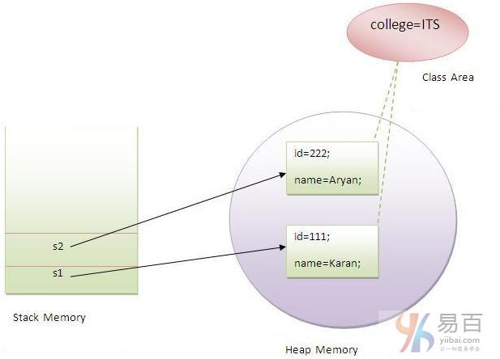

# 20180427 static 关键字

1- 静态(`static`)可以是：

1. 变量(也称为类变量)
2. 方法(也称为类方法)
3. **代码块**
4. 嵌套类

静态变量：使程序存储器高效（节省内存）


------

原文：https://www.yiibai.com/java/static-keyword-in-java.html

java中的`static`关键字主要用于内存管理。我们可以应用java `static`关键字在变量，方法，块和嵌套类中。 `static`关键字属于类，而不是类的实例。

静态(`static`)可以是：

1. 变量(也称为类变量)
2. 方法(也称为类方法)
3. **代码块**
4. 嵌套类

## 1. Java静态变量

如果将一个变量声明为`static`，它就是所谓的静态变量了。

- 静态变量可以用于引用所有对象的公共属性(对于每个对象不是唯一的)。如：员工公司名称，学生所在的大学名称。

**静态变量的优点：**

- 它能**使程序存储器高效(即它节省内存)**。

**理解不使用静态变量的问题**

```java
class Student{  
     int rollno;  
     String name;  
     String college="ITS";  
}
```

假设在一所学校有`500`名学生，现在所有实例数据成员将在每次创建对象时获取内存。所有学生都有其唯一的注册ID：`rollno`和　`name` ，因此实例数据成员没有什么问题。`college` 指的是所有对象的共同属性。如果使它静态化(使用`static`关键字修饲)，这个字段将只获得内存一次。

> Java静态属性被共享给所有对象。

**静态变量的示例**

```java
//Program of static variable  

class Student8 {
    int rollno;
    String name;
    static String college = "ITS";

    Student8(int r, String n) {
        rollno = r;
        name = n;
    }

    void display() {
        System.out.println(rollno + " " + name + " " + college);
    }

    public static void main(String args[]) {
        Student8 s1 = new Student8(111, "Karan");
        Student8 s2 = new Student8(222, "Aryan");

        s1.display();
        s2.display();
    }
}
```

上面代码执行结果如下 -

```java
111 Karan ITS
222 Aryan ITS
```

创建对象示例图如下所示 -



**不使用静态变量的计数器程序**

在这个例子中，我们创建了一个名为`count`的实例变量用来统计创建对象的数目，它在构造函数中执行递增。 由于实例变量在创建对象时要获取内存，每个对象都将具有实例变量的副本，如果它被递增了，它也不会反映到其他对象中。所以每个对象在`count`变量中的值还是`1`。

```java
class Counter {
    int count = 0;// will get memory when instance is created

    Counter() {
        count++;
        System.out.println(count);
    }

    public static void main(String args[]) {

        Counter c1 = new Counter();
        Counter c2 = new Counter();
        Counter c3 = new Counter();

    }
}
```

上面代码执行结果如下 -

```java
1
1
1
```

**计数器静态变量的程序**
如上所述，静态变量将只获取一次内存，如果任何对象更改静态变量的值，它将保留其值，所有实例均可访问同一变量值。

```java
class Counter2 {
    static int count = 0;// will get memory only once and retain its value

    Counter2() {
        count++;
        System.out.println(count);
    }

    public static void main(String args[]) {

        Counter2 c1 = new Counter2();
        Counter2 c2 = new Counter2();
        Counter2 c3 = new Counter2();

    }
}
```

上面代码执行结果如下 -

```java
1
2
3
```

## 2. Java静态方法

如果在任何方法上应用`static`关键字，此方法称为静态方法。

- 静态方法属于类，而不属于类的对象。
- 可以直接调用静态方法，而无需创建类的实例。
- 静态方法可以访问静态数据成员，并可以更改静态数据成员的值。

**静态方法的示例**

```java
//Program of changing the common property of all objects(static field).  

class Student9 {
    int rollno;
    String name;
    static String college = "ITS";

    static void change() {
        college = "BBDIT";
    }

    Student9(int r, String n) {
        rollno = r;
        name = n;
    }

    void display() {
        System.out.println(rollno + " " + name + " " + college);
    }

    public static void main(String args[]) {
        Student9.change();

        Student9 s1 = new Student9(111, "Karan");
        Student9 s2 = new Student9(222, "Aryan");
        Student9 s3 = new Student9(333, "Sonoo");

        s1.display();
        s2.display();
        s3.display();
    }
}
```

上面代码执行输出以下结果 -

```java
111 Karan BBDIT
222 Aryan BBDIT
333 Sonoo BBDIT
```

**执行正常计算的静态方法的另一个示例:**

```Java
//Program to get cube of a given number by static method  

class Calculate {
    static int cube(int x) {
        return x * x * x;
    }

    public static void main(String args[]) {
        int result = Calculate.cube(5);
        System.out.println(result);
    }
}
```

上面代码执行输出以下结果 -

```java
125
```

**静态方法的限制**

静态方法有两个主要限制。它们分别是：

- 静态方法不能直接使用非静态数据成员或调用非静态方法。
- `this`和`super`两个关键字不能在静态上下文中使用。

```Java
class A {
    int a = 40;// non static

    public static void main(String args[]) {
        System.out.println(a);
    }
}
```

上面代码执行输出以下结果 -

```java
[编译错误！]Compile Time Error
```

**为什么java main方法是静态的？**

这是因为对象不需要调用静态方法，如果它是非静态方法，jvm首先要创建对象，然后调用main()方法，这将导致额外的内存分配的问题。

## 3. Java静态块

Java中的静态块主要有两个作用：

- 用于初始化静态数据成员。
- 它在类加载时在main方法之前执行。

**静态块的示例**

```java
class A2 {
    static {
        System.out.println("static block is invoked");
    }

    public static void main(String args[]) {
        System.out.println("Hello main");
    }
}
```

上面代码执行输出以下结果 -

```java
static block is invoked
Hello main
```

**可以执行程序没有main()方法吗？**
**答：**是的，一种方式是静态块，但在以前旧的JDK版本中，不是在JDK 1.7。

```java
class A3 {
    static {
        System.out.println("static block is invoked");
        System.exit(0);
    }
}
```

上面代码执行输出以下结果 -

```Java
static block is invoked
```

在JDK7及以上版本中，输出将为：

```java
错误: 在类 Main 中找不到 main 方法, 请将 main 方法定义为:
   public static void main(String[] args)
```