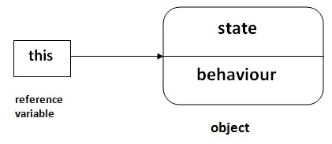
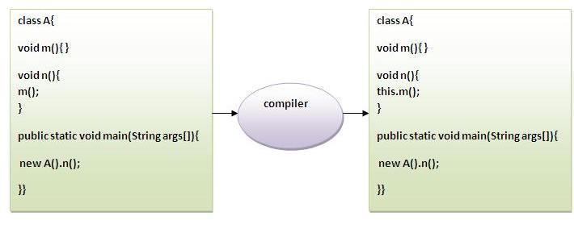

# 24 this 关键字


在java中，`this`关键字有很多种用法。 在java中，这是一个引用当前对象的引用变量。

java `this`关键字的用法如下：

1. `this`关键字可用来引用当前类的实例变量。 【构造函数中作为区分同名变量

   】

   ```java
   class A{
       public A(int Id,String name): this.Id(Id), this.name(name){}
   };
   ```

   ​

2. `this`关键字可用于调用当前类方法(隐式)。

3. `this()`可以用来**调用当前类的构造函数**。

4. `this`关键字可作为调用方法中的参数传递。

5. `this`关键字可作为参数在构造函数调用中传递。

6. `this`关键字可用于**从方法返回当前类的实例**。

> **建议：**如果你是java初学者，只学习 `this` 关键字的前三个用法就可以了。



## 1. this：引用当前类的实例变量

`this`关键字可以用来引用当前类的实例变量。如果实例变量和参数之间存在歧义，则 `this` 关键字可用于明确地指定类变量以解决歧义问题。

**了解没有 this 关键字的问题**

下面先来理解一个不使用 `this` 关键字的示例：

```java
class Student {
    int rollno;
    String name;
    float fee;

    Student(int rollno, String name, float fee) {
        rollno = rollno;
        name = name;
        fee = fee;
    }

    void display() {
        System.out.println(rollno + " " + name + " " + fee);
    }
}

class TestThis1 {
    public static void main(String args[]) {
        Student s1 = new Student(111, "ankit", 5000f);
        Student s2 = new Student(112, "sumit", 6000f);
        s1.display();
        s2.display();
    }
}
```

执行上面代码输出结果如下 -

```java
0 null 0.0
0 null 0.0
```

在上面的例子中，参数(形式参数)和实例变量(`rollno`和`name`)是相同的。 所以要使用`this`关键字来区分局部变量和实例变量。

**使用 this 关键字解决了上面的问题**

```java
class Student {
    int rollno;
    String name;
    float fee;

    Student(int rollno, String name, float fee) {
        this.rollno = rollno;  /// 构造函数中作为区分同名变量
        this.name = name;
        this.fee = fee;
    }

    void display() {
        System.out.println(rollno + " " + name + " " + fee);
    }
}

class TestThis2 {
    public static void main(String args[]) {
        Student s1 = new Student(111, "ankit", 5000f);
        Student s2 = new Student(112, "sumit", 6000f);
        s1.display();
        s2.display();
    }
}
```

执行上面代码输出结果如下 -

```java
111 ankit 5000
112 sumit 6000
```

如果局部变量(形式参数)和实例变量不同，则不需要像下面的程序一样使用`this`关键字：

**不需要 this 关键字的程序示例**

```java
class Student {
    int rollno;
    String name;
    float fee;

    Student(int r, String n, float f) {
        rollno = r;
        name = n;
        fee = f;
    }

    void display() {
        System.out.println(rollno + " " + name + " " + fee);
    }
}

class TestThis3 {
    public static void main(String args[]) {
        Student s1 = new Student(111, "ankit", 5000f);
        Student s2 = new Student(112, "sumit", 6000f);
        s1.display();
        s2.display();
    }
}
```

执行上面代码输出结果如下 -

```java
111 ankit 5000
112 sumit 6000
```

> 对变量使用有意义的名称是一种好的编程习惯。所以使用相同名称的实例变量和参数，并且总是使用`this`关键字。

## 2. this：调用当前类方法

可以使用`this`关键字调用当前类的方法。如果不使用`this`关键字，编译器会在调用方法时自动添加此 `this` 关键字。我们来看看这个例子。


执行上面代码输出结果如下 -

```java
hello n
hello m
```

## 3. this()：调用当前类的构造函数

`this()`构造函数调用可以用来**调用当前类的构造函数。 它用于重用构造函数。 换句话说，它用于构造函数链接。**

**从参数化构造函数调用默认构造函数：**

```java
class A {
    A() {
        System.out.println("hello a");
    }

    A(int x) {
        this();
        System.out.println(x);
    }
}

class TestThis5 {
    public static void main(String args[]) {
        A a = new A(10);
    }
}
```

执行上面代码输出结果如下 -

```java
hello a
10
```

**从默认构造函数调用参数化构造函数：**

```  Java
class A {
    A() {
        this(5);
        System.out.println("hello a");
    }

    A(int x) {
        System.out.println(x);
    }
}

class TestThis6 {
    public static void main(String args[]) {
        A a = new A();
    }
}
```

执行上面代码输出结果如下 -

```java
5
hello a
```

### 使用this()构造函数调用

`this()`构造函数调用用于从构造函数重用构造函数。 它维护构造函数之间的链，即它用于构造函数链接。看看下面给出的示例，显示`this`关键字的实际使用。

```java
class Student {
    int rollno;
    String name, course;
    float fee;

    Student(int rollno, String name, String course) {
        this.rollno = rollno;
        this.name = name;
        this.course = course;
    }

    Student(int rollno, String name, String course, float fee) {
        this(rollno, name, course);// reusing constructor
        this.fee = fee;
    }

    void display() {
        System.out.println(rollno + " " + name + " " + course + " " + fee);
    }
}

class TestThis7 {
    public static void main(String args[]) {
        Student s1 = new Student(111, "ankit", "java");
        Student s2 = new Student(112, "sumit", "java", 6000f);
        s1.display();
        s2.display();
    }
}
```

执行上面代码输出结果如下 -

```java
111 ankit java null
112 sumit java 6000
```

> 注意：调用`this()`必须是构造函数中的第一个语句。

下面示例为不把 `this()` 语句放在第一行，因此编译不通过。

```java
class Student {
    int rollno;
    String name, course;
    float fee;

    Student(int rollno, String name, String course) {
        this.rollno = rollno;
        this.name = name;
        this.course = course;
    }

    Student(int rollno, String name, String course, float fee) {
        this.fee = fee;
        this(rollno, name, course);// C.T.Error
    }

    void display() {
        System.out.println(rollno + " " + name + " " + course + " " + fee);
    }
}

class TestThis8 {
    public static void main(String args[]) {
        Student s1 = new Student(111, "ankit", "java");
        Student s2 = new Student(112, "sumit", "java", 6000f);
        s1.display();
        s2.display();
    }
}
```

执行上面代码输出结果如下 -

```java
Compile Time Error: Call to this must be first statement in constructor
```

## 4. this：作为参数传递给方法

`this`关键字也可以作为方法中的参数传递。 它主要用于事件处理。 看看下面的一个例子：

```java
class S2 {
    void m(S2 obj) {
        System.out.println("method is invoked");
    }

    void p() {
        m(this);
    }

    public static void main(String args[]) {
        S2 s1 = new S2();
        s1.p();
    }
}
```

执行上面代码输出结果如下 -

```java
method is invoked
```

**这个应用程序可以作为参数传递：**

在事件处理(或)的情况下，**必须提供一个类的引用到另一个。 它用于在多个方法中重用一个对象**。

##5 this：在构造函数调用中作为参数传递

也可以在构造函数中传递`this`关键字。 如果必须在多个类中使用一个对象，可以使用这种方式。 看看下面的一个例子：

```java
class B {
    A4 obj;

    B(A4 obj) {
        this.obj = obj;
    }

    void display() {
        System.out.println(obj.data);// using data member of A4 class
    }
}

class A4 {
    int data = 10;

    A4() {
        B b = new B(this);  /// 把自己传递给另一个对象
        b.display();
    }

    public static void main(String args[]) {
        A4 a = new A4();
    }
}
```

执行上面代码输出结果如下 -

```java
10
```

## 6. this关键字用来返回当前类的实例

可以从方法中 `this` 关键字作为语句返回。 在这种情况下，方法的返回类型必须是**类类型(非原始)**。 看看下面的一个例子：

**作为语句返回的语法**

```java
return_type method_name(){  
    return this;  
}
```

**从方法中返回为语句的 this 关键字的示例**

```java
class A {
    A getA() {
        return this;
    }

    void msg() {
        System.out.println("Hello java");
    }
}

class Test1 {
    public static void main(String args[]) {
        new A().getA().msg();
    }
}
```

执行上面代码输出结果如下 -

```java
Hello java
```

**验证 this 关键字**

现在来验证 `this` 关键字引用当前类的实例变量。 在这个程序中将打印参考变量，这两个变量的输出是相同的。

```java
class A5 {
    void m() {
        System.out.println(this);// prints same reference ID
    }

    public static void main(String args[]) {
        A5 obj = new A5();
        System.out.println(obj);// prints the reference ID
        obj.m();
    }
}
```

执行上面代码输出结果如下 -

```java
A5@22b3ea59
A5@22b3ea59
```