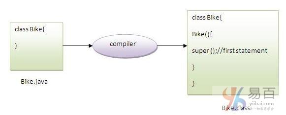

#30 super 关键字


java中的`super`关键字是一个**引用变量，用于引用直接父类对象**。

每当创建子类的实例时，父类的实例被隐式创建，由`super`关键字引用变量引用。

java `super`关键字的用法如下：

- `super`可以用来引**用直接父类的实例变量**。【调用被子类同名变量或字段隐藏的 父类变量】
- `super`可以用来**调用直接父类方法**。【调用父类中被子类覆盖掉的同名方法】
- `super()`可以用于**调用直接父类构造函数**。

## 1. super用于引用直接父类实例变量

可以使用`super`关键字来访问父类的数据成员或字段。 如果父类和子类具**有相同的字段**，则使用`super`来指定为父类数据成员或字段。

```java
class Animal {
    String color = "white";
}

class Dog extends Animal {
    String color = "black";

    void printColor() {
        System.out.println(color);// prints color of Dog class
        System.out.println(super.color);// prints color of Animal class
    }
}

class TestSuper1 {
    public static void main(String args[]) {
        Dog d = new Dog();
        d.printColor();
    }
}
```

执行上面代码，输出结果如下 -

```java
black
white
```

在上面的例子中，`Animal`和`Dog`都有一个共同的属性：`color`。 如果我们打印`color`属性，它将默认打印当前类的颜色。 要访问父属性，需要使用`super`关键字指定。

## 2. 通过 super 来调用父类方法

`super`关键字也可以用于调用父类方法。 如果子类包含与父类相同的方法，则应使用`super`关键字指定父类的方法。 换句话说，如果方法被覆盖就可以使用 `super` 关键字来指定父类方法。

```java
class Animal {
    void eat() {
        System.out.println("eating...");
    }
}

class Dog extends Animal {
    void eat() {
        System.out.println("eating bread...");
    }

    void bark() {
        System.out.println("barking...");
    }

    void work() {
        super.eat();
        bark();
    }
}

class TestSuper2 {
    public static void main(String args[]) {
        Dog d = new Dog();
        d.work();
    }
}
```

执行上面代码，输出结果如下 -

```java
black
white
```

在上面的例子中，`Animal`和`Dog`两个类都有`eat()`方法，如果要调用`Dog`类中的`eat()`方法，它将默认调用`Dog`类的`eat()`方法，因为**当前类的优先级比父类的高**。
所以要调用父类方法，需要使用`super`关键字指定。

## 3. 使用 super 来调用父类构造函数

`super`关键字也可以用于调用父类构造函数。下面来看一个简单的例子：

```  Java
class Animal {
    Animal() {
        System.out.println("animal is created");
    }
}

class Dog extends Animal {
    Dog() {
        super();
        System.out.println("dog is created");
    }
}

class TestSuper3 {
    public static void main(String args[]) {
        Dog d = new Dog();
    }
}
```

> 注意：如果没有使用`super()`或`this()`，则`super()`**在每个类构造函数中由编译器自动添加。**



我们知道，如果没有构造函数，编译器会自动提供默认构造函数。 但是，它还添加了`super()`作为第一个语句。

下面是`super`关键字的另一个例子，这里`super()`由编译器隐式提供。

```  Java
class Animal {
    Animal() {
        System.out.println("animal is created");
    }
}

class Dog extends Animal {
    Dog() {
        System.out.println("dog is created");
    }
}

class TestSuper4 {
    public static void main(String args[]) {
        Dog d = new Dog();
    }
}

```

执行上面代码，输出结果如下 -

```  Java
animal is created
dog is created
```

## super实际使用示例

下面来看看`super`关键字的实际用法。 在这里，`Emp`类继承了`Person`类，所以`Person`的所有属性都将默认继承到`Emp`。 要初始化所有的属性，可使用子类的父类构造函数。 这样，我们重用了父类的构造函数。

```  Java
class Person {
    int id;
    String name;

    Person(int id, String name) {
        this.id = id;
        this.name = name;
    }
}

class Emp extends Person {
    float salary;

    Emp(int id, String name, float salary) {
        super(id, name);		// reusing parent constructor
        this.salary = salary;
    }

    void display() {
        System.out.println(id + " " + name + " " + salary);
    }
}

class TestSuper5 {
    public static void main(String[] args) {
        Emp e1 = new Emp(1, "ankit", 45000f);
        e1.display();
    }
}

```

执行上面代码，输出结果如下 -

```java
1 ankit 45000
```