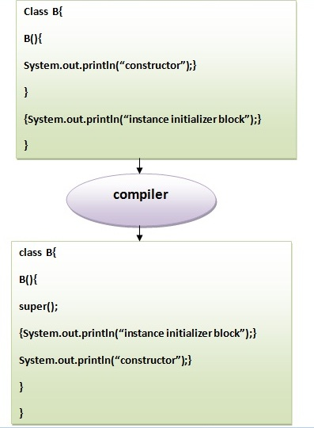

# 31 java 实例初始化程序块

**实例初始化块的规则：**

实例初始化块主要有三个规则。 它们如下：

1. **在创建类的实例时创建实例初始化程序块。**
2. **在父类构造函数被调用之后(即在`super()`构造函数调用之后)调用实例初始化块。**
3. **实例初始化程序块按它们显示的顺序排列。**

------

实例初始化程序块用于初始化实例数据成员。 它**在每次创建类的对象时运行**。**实例变量的初始化可以是直接的，但是可以在初始化实例初始化块中的实例变量时执行额外的操作。**

**什么是实例初始化块的使用，我们可以直接分配一个值在实例数据成员？** 例如：

```  Java
class Bike{  
    int speed=100;  
}
```


## 为什么要使用实例初始化块？

假设在赋值给实例数据成员时必须要执行一些操作。 如：使用`for`循环来填充复杂数组或错误处理等。

**实例初始化程序块的示例**

下面来看看实例初始化块执行初始化的简单例子。

```java
class Bike7 {
    int speed;

    Bike7() {
        System.out.println("speed is " + speed);
    }
	/// 还能这样用？
    {
        speed = 100;
    }

    public static void main(String args[]) {
        Bike7 b1 = new Bike7();
        Bike7 b2 = new Bike7();
    }
}
```

执行上面代码得到以下结果 -

```shell
speed is 100
speed is 100
```

在Java中有三个地方可以执行实例初始化块操作：

1. 方法
2. 构造函数
3. 代码块

**实例初始化块或构造函数哪个先调用？**

看看下面代码就知道了。

```java
class Bike8 {
    int speed;

    Bike8() {
        System.out.println("constructor is invoked");
    }

    {
        System.out.println("instance initializer block invoked");
    }

    public static void main(String args[]) {
        Bike8 b1 = new Bike8();
        Bike8 b2 = new Bike8();
    }
}
```

执行上面代码得到以下结果 -

```  Shell
instance initializer block invoked
constructor is invoked
instance initializer block invoked
constructor is invoked
```

在上面的例子中，似乎首先调用实例初始化块，但是可惜不是。 实例初始化块**在对象创建时被调用**。 java编译器在第一个语句`super()`之后的构造函数中复制实例初始化块。 首先，调用构造函数。 让我们通过下面的图来理解它：

**注意：**java编译器在每个**构造函数中会自动复制实例初始化块的代码**。



**实例初始化块的规则：**

实例初始化块主要有三个规则。 它们如下：

1. **在创建类的实例时创建实例初始化程序块。**
2. **在父类构造函数被调用之后(即在`super()`构造函数调用之后)调用实例初始化块。**
3. **实例初始化程序块按它们显示的顺序排列。**

在`super()`之后调用的实例初始化块的程序示例：

```  Java
class A {
    A() {
        System.out.println("parent class constructor invoked");
    }
}

class B2 extends A {
    B2() {
        super();
        System.out.println("child class constructor invoked");
    }

    {
        System.out.println("instance initializer block is invoked");
    }

    public static void main(String args[]) {
        B2 b = new B2();
    }
}
```

上面代码执行结果如下 -

```Shell
parent class constructor invoked
instance initializer block is invoked
child class constructor invoked
```

**实例块的另一个示例**

```java
class A {
    A() {
        System.out.println("parent class constructor invoked");
    }
}

class B3 extends A {
    B3() {
        super();
        System.out.println("child class constructor invoked");
    }

    B3(int a) {
        super();
        System.out.println("child class constructor invoked " + a);
    }

    {
        System.out.println("instance initializer block is invoked");
    }

    public static void main(String args[]) {
        B3 b1 = new B3();
        B3 b2 = new B3(10);
    }
}
```

上面代码执行结果如下 -

```  Shell
parent class constructor invoked
instance initializer block is invoked
child class constructor invoked
parent class constructor invoked
instance initializer block is invoked
child class constructor invoked 10
```