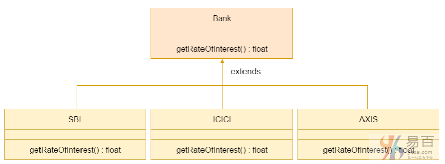

# 33 多态


Java中的多态是一个概念，通过它我们可以通过不同的方式执行单个动作(方法)。 多态性派生自`2`个希腊词：“`poly`”和“`morphs`”。 词语“`poly`”意为许多，“`morphs`”意为形式。 所以多态表示为多种形式。

在Java中有两种类型的多态性：编译时多态性和运行时多态性。 我们可以通过方法重载和方法覆盖在java中执行多态性。

如果在Java中重载静态方法，它就是编译时多态性的例子。 这里，我们将关注Java中的运行时多态性。

## 1. Java运行时多态性

运行时多态性或动态方法分派是一个过程，它对重写方法的调用在运行时体现而不是编译时。

在此过程中，通过超类的引用变量调用重写的方法。 要调用的方法基于引用的对象。

了解运行时多态性之前，让我们先来向上转换。

**向上转换**

当父类的引用变量引用子类的对象时，称为向上转换。 例如：

```  Java
class A{}  
class B extends A{}  
A a=new B();  //向上转换...
```

**Java运行时多态性示例1**

在这个例子中，我们创建两个类：`Bike`和`Splendar`。 `Splendar`类扩展`Bike`类并覆盖其`run()`方法。通过父类(`Bike`)的引用变量调用`run`方法。 因为它引用子类对象，并且子类方法覆盖父类方法，子类方法在运行时被调用。

```  Java
因为方法调用是由JVM不是编译器决定的，所以它被称为运行时多态性。
```

```  Java
class Bike {
    void run() {
        System.out.println("running");
    }
}

class Splender extends Bike {
    void run() {
        System.out.println("running safely with 60km");
    }

    public static void main(String args[]) {
        Bike b = new Splender();// upcasting - 向上转换
        b.run();
    }
}
```

执行上面代码得到以下结果 -

```  Java
running safely with 60km.
```

**Java运行时多态性示例2：Bank**

考虑一种情况，`Bank`类是一个提供获得利率的方法的类。 但是，利率可能因银行而异。 例如，`SBI`，`ICICI`和`AXIS`银行分别提供`8.4％`，`7.3％`和`9.7％`的利率。



> 注意：此示例也在方法覆盖中给出，但没有向上转换。

```  Java
class Bank {
    float getRateOfInterest() {
        return 0;
    }
}

class SBI extends Bank {
    float getRateOfInterest() {
        return 8.4f;
    }
}

class ICICI extends Bank {
    float getRateOfInterest() {
        return 7.3f;
    }
}

class AXIS extends Bank {
    float getRateOfInterest() {
        return 9.7f;
    }
}

class TestPolymorphism {
    public static void main(String args[]) {
        Bank b;
        b = new SBI();
        System.out.println("SBI Rate of Interest: " + b.getRateOfInterest());
        b = new ICICI();
        System.out.println("ICICI Rate of Interest: " + b.getRateOfInterest());
        b = new AXIS();
        System.out.println("AXIS Rate of Interest: " + b.getRateOfInterest());
    }
}

```

上面代码执行结果如下 -

```  Java
SBI Rate of Interest: 8.4
ICICI Rate of Interest: 7.3
AXIS Rate of Interest: 9.7
```

**Java运行时多态性示例3：Shape**

```  Java
class Shape { // 基类(形状)
    void draw() {
        System.out.println("drawing...");
    }
}

class Rectangle extends Shape {
    void draw() {
        System.out.println("drawing rectangle...");
    }
}

class Circle extends Shape {
    void draw() {
        System.out.println("drawing circle...");
    }
}

class Triangle extends Shape {
    void draw() {
        System.out.println("drawing triangle...");
    }
}

class TestPolymorphism2 {
    public static void main(String args[]) {
        Shape s;
        s = new Rectangle();
        s.draw();
        s = new Circle();
        s.draw();
        s = new Triangle();
        s.draw();
    }
}
```

上面代码执行结果如下 -

```Shell
SBI Rate of Interest: 8.4
ICICI Rate of Interest: 7.3
AXIS Rate of Interest: 9.7
```

**Java运行时多态性示例4：Animal**

```  Java
class Animal {
    void eat() {
        System.out.println("eating...");
    }
}

class Dog extends Animal {
    void eat() {
        System.out.println("eating bread...");
    }
}

class Cat extends Animal {
    void eat() {
        System.out.println("eating rat...");
    }
}

class Lion extends Animal {
    void eat() {
        System.out.println("eating meat...");
    }
}

class TestPolymorphism3 {
    public static void main(String[] args) {
        Animal a;
        a = new Dog();
        a.eat();
        a = new Cat();
        a.eat();
        a = new Lion();
        a.eat();
    }
}
```

上面代码执行结果如下 -

```Shell
eating bread...
eating rat...
eating meat...
```

## Java运行时多态性与数据成员

上面示例中，都是有关方法被覆盖而不是数据成员，因此运行时多态性不能由数据成员实现。
在下面给出的例子中，这两个类都有一个数据成员:`speedlimit`，通过引用子类对象的父类的引用变量来访问数据成员。 由于**我们访问的数据成员没有被重写，因此它将访问父类的数据成员。**

> **规则： 运行时多态性不能由数据成员实现。**

```  Java
class Bike {
    int speedlimit = 90;
}

class Honda3 extends Bike {
    int speedlimit = 150;

    public static void main(String args[]){  
        Bike obj=new Honda3();  
        System.out.println(obj.speedlimit);//90 
    }
}
```

上面代码执行结果如下 -

```java
90
```

## Java运行时多态性与多级继承

下面让我们来看看一个带有多级继承的运行时多态性的简单例子。

```  Java
class Animal {
    void eat() {
        System.out.println("eating");
    }
}

class Dog extends Animal {
    void eat() {
        System.out.println("eating fruits");
    }
}

class BabyDog extends Dog {
    void eat() {
        System.out.println("drinking milk");
    }

    public static void main(String args[]) {
        Animal a1, a2, a3;
        a1 = new Animal();
        a2 = new Dog();
        a3 = new BabyDog();
        a1.eat();
        a2.eat();
        a3.eat();
    }
}
```

上面代码执行结果如下 -

```  shell
eating
eating fruits
drinking Milk
```

**尝试下面一段代码的输出：**

```  Java
class Animal {
    void eat() {
        System.out.println("animal is eating...");
    }
}

class Dog extends Animal {
    void eat() {
        System.out.println("dog is eating...");
    }
}

class BabyDog1 extends Dog {
    public static void main(String args[]) {
        Animal a = new BabyDog1();
        a.eat();
    }
}

```

执行上述代码，结果如下：

``` Java
Dog is eating
```

因为，`BabyDog`不会覆盖`eat()`方法，所以这里是`Dog`类的`eat()`方法被调用。