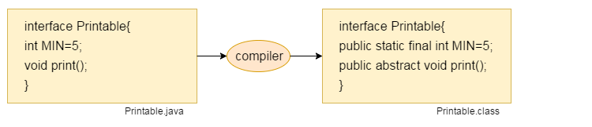
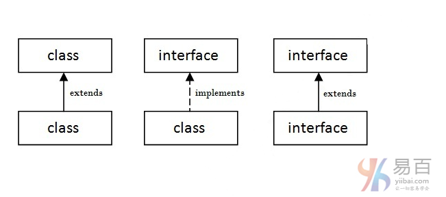
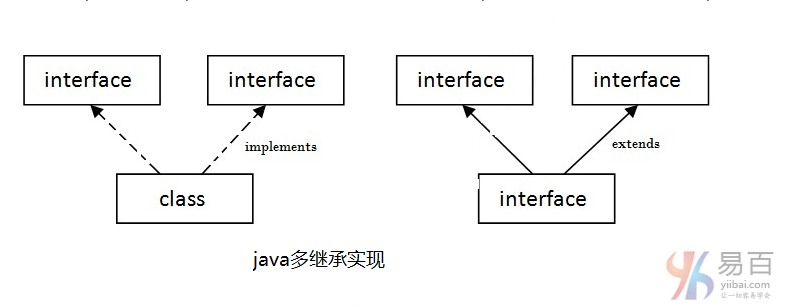

# 37 接口

java中的接口是类的蓝图。 它有静态常量和抽象方法。java中的接口是一种实现抽象的机制。 **接口中只有抽象方法而不是方法体。接口用于在Java中实现抽象和多重继承。**

Java接口也表示IS-A关系。它不能像抽象类一样被实例化。

## 为什么要使用Java接口？

需要使用接口主要有三个原因。如下面给出。

- **它用于实现抽象。**
- **通过接口，可以支持多重继承的功能。**
- **它可用于实现松耦合。**

## Java 8接口的改进

**由于Java 8，接口可以有默认和静态方法**，稍后讨论。

**由编译器内部添加**
java编译器在接口方法之前添加`public`和`abstract`关键字。还有，它在数据成员之前添加`public`，`static`和`final`关键字。

换句话说，接口字段默认是`public`，`static`和`final`，方法默认是`public`和`abstract`。



## 了解类和接口之间的关系

如下图所示，一个类扩展了另一个类，一个接口扩展了另一个接口，一个类实现了一个接口。


**Java接口示例**

在这个例子中，`Printable`接口只有一个方法，它的实现是在`A`类中提供的。

```  Java
interface printable {
    void print();
}

class A6 implements printable {
    public void print() {		/// 这里public 是必须？
        System.out.println("Hello, Interface");
    }

    public static void main(String args[]) {
        A6 obj = new A6();
        obj.print();
    }
}
```

上面代码执行结果如下 -

```  Java
Hello, Interface
```

**Java接口示例：Drawable**

在这个例子中，`Drawable`接口只有一个方法。 它的实现由`Rectangle`和`Circle`类提供。 在实际情况下，接口由一些开发者定义，但实现由不同的实现提供者提供。 并且它被别人使用。实现部分被使用接口的用户隐藏。

创建一个 Java 文件：`TestInterface1.java`，其代码如下 -

```  Java
//Interface declaration: by first user  
interface Drawable {
    void draw();
}

// Implementation: by second user
class Rectangle implements Drawable {
    public void draw() {
        System.out.println("drawing rectangle");
    }
}

class Circle implements Drawable {
    public void draw() {
        System.out.println("drawing circle");
    }
}

// Using interface: by third user
class TestInterface1 {
    public static void main(String args[]) {
        Drawable d = new Circle();// In real scenario, object is provided by
                                    // method e.g. getDrawable()
        d.draw();
    }
}
```

执行上面代码得到以下结果 -

``` shell
drawing circle
```

**Java接口示例：Bank**

让我们来看看另一个提供了`Bank`接口实现的java接口的例子。创建一个 Java 文件：`TestInterface2.java`，其代码如下 -

```  Java
interface Bank {
    float rateOfInterest();
}

class SBI implements Bank {
    public float rateOfInterest() {
        return 9.15f;
    }
}

class PNB implements Bank {
    public float rateOfInterest() {
        return 9.7f;
    }
}

class TestInterface2 {
    public static void main(String[] args) {
        Bank b = new SBI();
        System.out.println("ROI: " + b.rateOfInterest());
    }
}

```

执行上面代码得到以下结果 -

```  Java
ROI: 9.15
```

## Java多继承接口

如果一个类实现了多个接口，或者一个接口扩展了多个接口，即被称为多重继承。



参考以下示例代码的实现 -

```  Java
interface Printable {
    void print();
}

interface Showable {
    void show();
}

class A7 implements Printable, Showable {
    public void print() {
        System.out.println("Hello");
    }

    public void show() {
        System.out.println("Welcome");
    }

    public static void main(String args[]) {
        A7 obj = new A7();
        obj.print();
        obj.show();
    }
}
```

执行上面代码得到以下结果 -

```  Java
Hello
Welcome
```

**问题：在java中不支持通过类实现多继承，但可通过接口实现，为什么？**

正如在继承章节中所解释的，在**类中不支持多重继承是因为模糊。 但是在接口的情况下可以支持**，因为**接口没有歧义**，接口的具体实现由实现类提供。 例如：

```  Java
interface Printable {
    void print();
}

interface Showable {
    void print();
}

class TestTnterface3 implements Printable, Showable {
    public void print() {
        System.out.println("Hello");
    }

    public static void main(String args[]) {
        TestTnterface1 obj = new TestTnterface1();
        obj.print();
    }
}

```

上面代码执行得到以下结果 -

```Shell
Hello
```

从上面的例子可以看到，`Printable`和`Showable`接口有相同的方法，但它的实现是由`TestTnterface1`类提供的，所以没有歧义。

## 接口继承

类可以实现多个接口，但接口也扩展另一个接口。

``` Java
interface Printable {
    void print();
}

interface Showable extends Printable {
    void show();
}

class TestInterface4 implements Showable {
    public void print() {
        System.out.println("Hello");
    }

    public void show() {
        System.out.println("Welcome");
    }

    public static void main(String args[]) {
        TestInterface4 obj = new TestInterface4();
        obj.print();
        obj.show();
    }
}


```

执行上面代码，得到如下结果 -

```  Java
Hello
Welcome
```

### Java 8接口中的默认方法

从Java 8开始，我们可以在接口中有方法体。 但需要使其为默认方法。现在来看看一个例子，创建一个Java文件：`TestInterfaceDefault.java`，其代码如下 ：

```Java
interface Drawable {
    void draw();

    default void msg() {  /// 可以有  default 方法体
        System.out.println("default method");
    }
}

class Rectangle implements Drawable {
    public void draw() {
        System.out.println("drawing rectangle");
    }
}

class TestInterfaceDefault {
    public static void main(String args[]) {
        Drawable d = new Rectangle();
        d.draw();
        d.msg();
    }
}

```

执行上面代码，得到如下结果 -

```Shell
drawing rectangle
default method
```

### Java 8接口中的静态方法

从Java 8开始，我们可以在接口中有静态方法。 让我们来看看下面的一个例子，创建一个Java文件：`TestInterfaceStatic.java` 其代码如下：

```Java
interface Drawable {
    void draw();

    static int cube(int x) {
        return x * x * x;
    }
}

class Rectangle implements Drawable {
    public void draw() {
        System.out.println("drawing rectangle");
    }
}

class TestInterfaceStatic {
    public static void main(String args[]) {
        Drawable d = new Rectangle();
        d.draw();
        System.out.println(Drawable.cube(3));
    }
}
```

执行上面代码，得到如下结果 -

```Shell
drawing rectangle
27
```

**问题：什么是标记或标记的接口？**

没有成员的接口(仅定义一个空的接口)称为标记或标记接口。 例如：可序列化，可克隆，远程等。它们用于向JVM提供一些基本信息，以便JVM可以执行一些有用的操作。

```  Java
//How Serializable interface is written?  
public interface Serializable{  
}
```

**Java嵌套接口**

**注意：** 一个接口中可以有另一个接口，即被称为嵌套接口。有关于这方面的知识，将在[嵌套类](http://www.yiibai.com/java/nested-interface.html)的章节中详细学习。 例如：

```  Java
interface printable {
    void print();

    interface MessagePrintable {
        void msg();
    }
}
```


