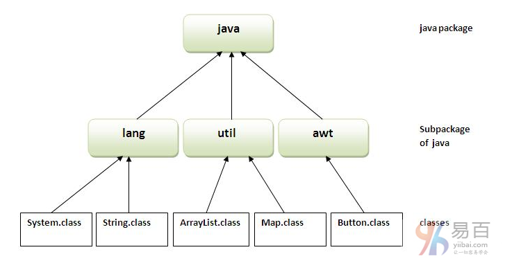
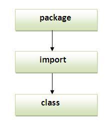
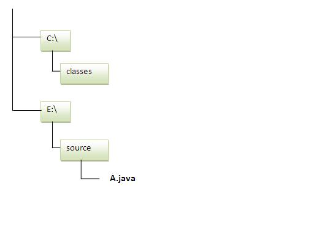

# 39 包


一个java包是一组相似类型的类，接口和子包。java中的包可以分为两种形式，**内置包和用户定义包**。

java中有很多内置的包，如：`java`，`lang`，`awt`，`javax`，`swing`，`net`，`io`，`util`，`sql`等。

在这里，我们将详细学习创建和使用用户定义的包。

**Java包的优点**

1. Java包用于**对类和接口进行分类**，以便更好地维护它们。
2. Java包提供**访问保护**。
3. Java包**消除命名冲突**。



**java包的简单示例**

`package`关键字用于在java中创建一个包。

```java
//save as Simple.java  
package com.yiibai;

public class Simple {
    public static void main(String args[]) {
        System.out.println("Welcome to package");
    }
}
```

**如何编译java包**

如果您没有使用任何IDE，则需要遵循以下语法：

```  Java
javac -d directory javafilename
```

**例如**

```  Java
javac -d . Simple.java
```

`-d` 指定放置生成的类文件的目标位置。 您可以使用任何目录名称，如`/home`(在Linux的情况下)，`D:\workspace`(在Windows的情况下)等。如果想保持包在同一目录，可以使用`.`(点)表示当前目录。

**如何运行java包程序**

您需要使用完全限定(指定)名称。如：`com.yiibai.Simple`等来运行类。

**编译**：`javac -d . Simple.java`
**运行**：`java com.yiibai.Simple`

输出结果如下 -

```  Java
Welcome to package
```

`-d`是一个开关，它告诉编译器放置类文件的位置，即它代表目的地。 `.`(点符号)表示当前文件夹。

**如何从一个包中访问另一个包？**

**有三种方法从包外部来访问一个包**。它们分别如下 -

1. import package.*;
2. import package.classname;
3. 完全限定名

## 1. 使用 packagename.

如果使用`package.*`，那么这个包的**所有**类和接口都是可访问的，而不是子包。
`import`关键字用于使当前包可访问的另一个包的类和接口。
导入`packagename`的包的示例。
一个Java文件：`A.java`，在 `pack` 包下。

```  Java
//save by A.java  
package pack;  
public class A{  
    public void msg(){System.out.println("Hello");}  
}
```

另一个Java文件：`B.java`，在 `mypack` 包下，下面看看它是如何引用 `pack` 包中的 `A.java` 这个类。

```  Java
//save by B.java  
package mypack;  
import pack.*;  

class B{  
  public static void main(String args[]){  
     A obj = new A();  
     obj.msg();  
  }  
}

```

执行上面代码，输出结果如下 -

```Shell
Hello
```

## 2. 使用packagename.classname

如果要导入`package.classname`，那么只有这个包的类声明为可访问的。

**通过导入package.classname的包的示例**
以下是 `A.java` 文件中的代码 -

```  Java
//save by A.java  

package pack;  
public class A{  
  public void msg(){System.out.println("Hello");}  
}
```

以下是 `B.java` 文件中的代码 -

```  Java
//save by B.java  
package mypack;

import pack.A; /// import 具体的类名

class B {
    public static void main(String args[]) {
        A obj = new A();
        obj.msg();
    }
}

```

执行上面代码，输出结果如下 -

```shell
Hello
```

## 3. 使用完全限定名

如果使用完全限定名，那么只有这个包的声明类将可访问。现在没有必要导入，但是需要在每次访问类或接口时使用完全限定名。
它通常**用于两个包具有相同类名**的情况。 `java.util`和`java.sql`包包含`Date`类。

**通过导入完全限定名称的包的示例**
创建一个Java文件：`A.java`，其代码如下所示 -

```  Java
//save by A.java  
package pack;

public class A {
    public void msg() {
        System.out.println("Hello");
    }
}
```

创建另一个Java文件：`B.java`，其代码如下所示 -

```  Java
//save by B.java  
package mypack;

class B {
    public static void main(String args[]) {
        pack.A obj = new pack.A();// using fully qualified name
        obj.msg();
    }
}
```

执行上面代码，得到以下结果 -

```  Shell
Hello
```

> **注意**：如果导入包，则不会导入子包。

如果导入包，则将导入该包的所有类和接口，但不包括子包的类和接口。 因此，您还需要导入子包。

**注意：**程序的序列必须先是包，然后再导入类。



## 在java中的子包

包内的包称为子包。创建它用以进一步分类包。
举个例子，**Sun Microsystem**定义了一个名为`java`的包，其中包含了很多类，比如`System`，`String`，`Reader`，`Writer`，`Socket`等。 `Reader`和`Writer`类用于输入/输出操作，`Socket`和`ServerSocket`类用于网络等等。 所以，Sun已经将java包子类化为子包，如：`lang`，`net`，`io`等，并将输入/输出相关类放在`io`包中，将`Server`和`ServerSocket`类放在`net`包中等等。

> 注：定义包的标准是`domain.company.package`,例如：`com.yiibai.bean`或`org.apache.dao`。

**子包示例**

```  Java
package com.yiibai.core;

class Simple {
    public static void main(String args[]) {
        System.out.println("Hello subpackage");
    }
}
```

**编译执行的命令**：`javac -d . Simple.java`
**运行执行的命令**：`java com.yiibai.core.Simple`

```  Java
Hello subpackage
```

**如何将类文件发送到另一个目录或驱动器？**

有一个场景，想要把`A.java`源文件的类文件放在`C` 盘的`classes`文件夹中。 例如：



首先在 `E:\source` 目录中创建 `A.java` 文件，如下代码 -

```  Java
//save as Simple.java  
package mypack;

public class Simple {
    public static void main(String args[]) {
        System.out.println("Welcome to package");
    }
}
```

**编译：**

```  Shell
E:\sources> javac -d c:\classes Simple.java
```

**运行：**
要在`E:\source`目录运行此程序，需要设置类文件所在目录的类路径。

```  Java
e:\sources> set classpath=c:\classes;.;
e:\sources> java mypack.Simple
```

**另一种方式运行这个程序通过 -classpath切换java：**

`-classpath`切换可以与`javac`和`java`工具一起使用。

要在`E:\source`目录运行此程序，可以使用java的`-classpath`选项，告诉在哪里查找类文件。 例如：

```  Java
e:\sources> java -classpath c:\classes mypack.Simple
```

执行上面代码，得到以下结果 -

```  Java
Welcome to package
```

**加载类文件或jar文件的方式**
有两种方法用来临时和永久加载类文件。

- 加载临时类文件
  - 通过在命令提示符中设置类路径
  - 通过 `-classpath` 开关选项
- 永久加载类文件
  - 通过在环境变量中设置类路径
  - 通过**创建jar文件，其中包含所有类文件，并将jar文件复制到JDK安装目录的`jre/lib/ext`文件夹中。**

> 规则：在java源文件中只能有一个公共类，它必须以公共类的名称保存。

```  Java
//save as C.java otherwise Compilte Time Error  

class A {
}

class B {
}

public class C {
}
```

**如何将两个公共类放在包中？**

如果想把两个公共类放在同一个包中，有两个java源文件都包含一个公共类，**只需保持包名称相同即可**。 例如：
文件：`A.java`，代码如下所示 -

```  Java
//save as A.java  

package yiibai;  
public class A{}
```

文件：`B.java`，代码如下所示 -

```
//save as B.java  

package yiibai;  
public class B{}
```