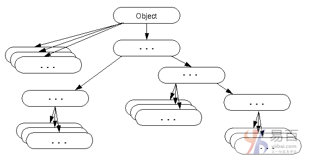

#42 Object类

默认情况下，`Object`类是java中所有类的父类。 换句话说，它是java的顶级类。

如果想引用你不知道的类型的对象，使用`Object`类是没有错的。请注意，父类引用变量可以引用子类对象，称为上转换。

下面举一个例子，有一个`getObject()`方法返回一个对象，但它可以是任何类型，如：`Employee`，`Student`等这样的类，我们可以使用`Object`类引用来引用该对象。 例如：

```  Java
Object obj=getObject();//we don't know what object will be returned from this method
```

`Object`类为所有对象提供了一些常见的行为，如对象可以进行比较，对象可以克隆，对象可以通知等。



## Object类的方法

`Object`类提供了许多方法。 它们如下：

8 大类方法。

| 序号 | 方法                                                         | 描述                                                         |
| ---- | ------------------------------------------------------------ | ------------------------------------------------------------ |
| 1    | `public final Class getClass()`                              | 返回此对象的`Class`类对象。 `Class`类可以进一步用于获取此类的元数据。 |
| 2    | `public int hashCode()`                                      | 返回此对象的哈希码值                                         |
| 3    | `public boolean equals(Object obj)`                          | 将给定对象与此对象进行比较。                                 |
| 4    | `protected Object clone() throws CloneNotSupportedException` | 创建并返回此对象的精确副本(克隆)。                           |
| 5    | `public String toString()`                                   | 返回此对象的字符串表示形式。                                 |
| 6    | `public final void notify()`                                 | 唤醒单线程，等待此对象的监视器。                             |
|      | `public final void notifyAll()`                              | 唤醒所有线程，等待此对象的监视器。                           |
| 7    | `public final void wait(long timeout)throws InterruptedException` | 导致当前线程等待指定的毫秒，直到另一个线程通知(调用`notify()`或`notifyAll()`方法)。 |
|      | `public final void wait(long timeout,int nanos)throws InterruptedException` | 导致当前线程等待指定的毫秒和纳秒，直到另一个线程通知(调用`notify()`或`notifyAll()`方法)。 |
|      | `public final void wait()throws InterruptedException`        | 导致当前线程等待，直到另一个线程通知(调用`notify()`或`notifyAll()`方法)。 |
| 8    | `protected void finalize()throws Throwable`                  | 在对象被垃圾收集之前由垃圾收集器调用。                       |

我们将在下一章详细学习这些方法。