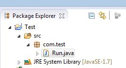
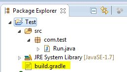
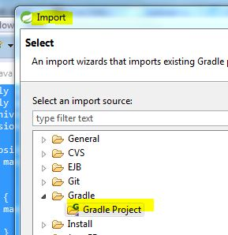
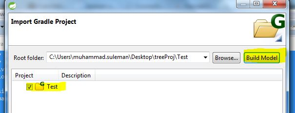
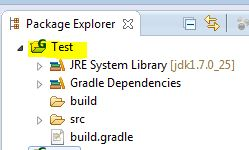
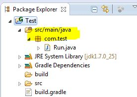

# 新建第一个gradle 项目
已经存在的java项目转成gradle项目，通过buildship插件，转换总是报错，所以就手工来了；也不是很复杂，按照步骤来吧。
假设简单的java项目结构如下：

1:在项目的根目录下 创建文件 `build.gradle`

<br>
2: 根据需要增加gradle脚本,示例如下：

```gradle
apply plugin: 'java'
apply plugin: 'eclipse'
archivesBaseName = 'someJar'
version = '1.0-SNAPSHOT' 
 
repositories {
    mavenCentral()
}
 
jar {
    manifest {
        attributes 'Main-Class': 'com.test.Run'
    }
}
 
dependencies {
   compile  'log4j:log4j:1.2.16'
} 

```

3:关闭或删除项目，然后重新导入至eclipse中，导入时选择gradle项目




现在项目结构如下

<br>
4: 创建文件夹 `src/main/java`,移动所有的包至该文件夹

5:ok啦,手工增加必要的源文件夹及配置文件吧。至此,java项目已经转成gradle项目！


## 参考
本文： https://blog.csdn.net/neweastsun/article/details/52893634

