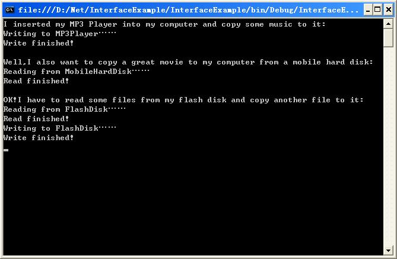
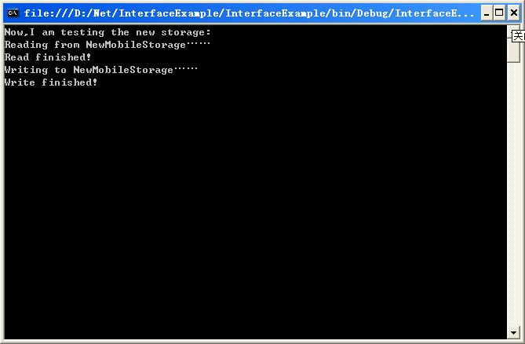
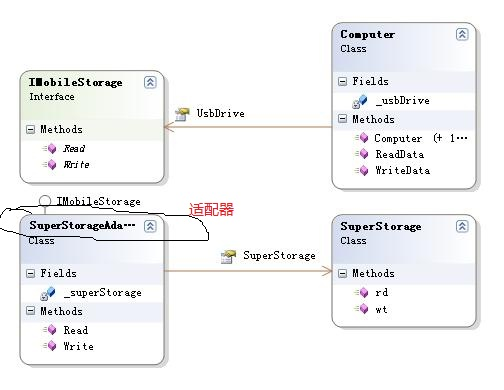
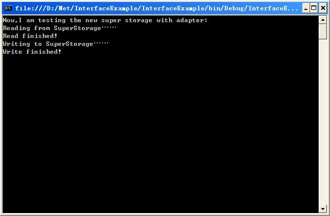

# 20180413 面向接口编程 编程实例 二

```java
1- 为什么要分为两个接口，例如计算机存储接口中的 IRead 和 IWrite 接口，如果有只读光盘，则只需要其中一种接口，所以需要分开写。
2- 本文全程使用的是第三种方法，写一个接口{read() 和 write() 方法}。 然后当出现一个新的设备，没有实现接口中的read() 和 write() 方法时， 只提供了rd() 和 wr() 方法时，增加一个适配器类，实现该接口，并 包装rd() 和 wr() 方法为 read() 和 write(） 方法。 具体详见后面。 
  
```


------------------------------

原文： http://www.cnblogs.com/leoo2sk/archive/2008/04/11/1148236.html

通过上一篇文章的讨论，我想各位朋友对“面接接口编程”有了一个大致的了解。那么在这一篇里，我们用一个例子，让各位对这个重要的编程思想有个直观的印象。为充分考虑到初学者，所以这个例子非常简单，望各位高手见谅。

##**问题的提出** 

------

**定义：**现在我们要开发一个应用，模拟移动存储设备的读写，即计算机与U盘、MP3、移动硬盘等设备进行数据交换。

**上下文（环境）：**已知要实现U盘、MP3播放器、移动硬盘三种移动存储设备，要求计算机能同这三种设备进行数据交换，并且以后可能会有新的第三方的移动存储设备，所以计算机必须有扩展性，能与目前未知而以后可能会出现的存储设备进行数据交换。各个存储设备间读、写的实现方法不同，U盘和移动硬盘只有这两个方法，MP3Player还有一个PlayMusic方法。

**名词定义：**数据交换={读，写}

 看到上面的问题，我想各位脑子中一定有了不少想法，这是个很好解决的问题，很多方案都能达到效果。下面，我列举几个典型的方案。

## **解决方案列举**

------

**方案一：**分别定义FlashDisk、MP3Player、MobileHardDisk三个类，实现各自的Read和Write方法。然后在Computer类中实例化上述三个类，为每个类分别写读、写方法。例如，为FlashDisk写ReadFromFlashDisk、WriteToFlashDisk两个方法。总共六个方法。

**方案二：**定义抽象类MobileStorage，在里面写虚方法Read和Write，三个存储设备继承此抽象类，并重写Read和Write方法。Computer类中包含一个类型为MobileStorage的成员变量，并为其编写get/set器，这样Computer中只需要两个方法：ReadData和WriteData，并通过多态性实现不同移动设备的读写。

**方案三：**与方案二基本相同，只是不定义抽象类，而是定义接口IMobileStorage，移动存储器类实现此接口。Computer中通过依赖接口IMobileStorage实现多态性。

**方案四：**定义接口IReadable和IWritable，两个接口分别只包含Read和Write，然后定义接口IMobileStorage接口继承自IReadable和IWritable，剩下的实现与方案三相同。

 下面，我们来分析一下以上四种方案：

首先，方案一最直白，实现起来最简单，但是它有一个致命的弱点：可扩展性差。或者说，不符合“开放-关闭原则”（注：意为对扩展开放，对修改关闭）。当将来有了第三方扩展移动存储设备时，必须对Computer进行修改。这就如在一个真实的计算机上，为每一种移动存储设备实现一个不同的插口、并分别有各自的驱动程序。当有了一种新的移动存储设备后，我们就要将计算机大卸八块，然后增加一个新的插口，在编写一套针对此新设备的驱动程序。这种设计显然不可取。

此方案的另一个缺点在于，冗余代码多。如果有100种移动存储，那我们的Computer中岂不是要至少写200个方法，这是不能接受的！

我们再来看方案二和方案三，之所以将这两个方案放在一起讨论，是因为他们基本是一个方案（从思想层面上来说），只不过实现手段不同，一个是使用了抽象类，一个是使用了接口，而且最终达到的目的应该是一样的。

我们先来评价这种方案：首先它解决了代码冗余的问题，因为可以动态替换移动设备，并且都实现了共同的接口，所以不管有多少种移动设备，只要一个Read方法和一个Write方法，多态性就帮我们解决问题了。而对第一个问题，由于可以运行时动态替换，而不必将移动存储类硬编码在Computer中，所以有了新的第三方设备，完全可以替换进去运行。这就是所谓的“依赖接口，而不是依赖与具体类”，不信你看看，Computer类只有一个MobileStorage类型或IMobileStorage类型的成员变量，至于这个变量具体是什么类型，它并不知道，这取决于我们在运行时给这个变量的赋值。如此一来，Computer和移动存储器类的耦合度大大下降。

那么这里该选抽象类还是接口呢？还记得第一篇文章我对抽象类和接口选择的建议吗？看动机。这里，我们的动机显然是实现多态性而不是为了代码复用，所以当然要用接口。

最后我们再来看一看方案四，它和方案三很类似，只是将“可读”和“可写”两个规则分别抽象成了接口，然后让IMobileStorage再继承它们。这样做，显然进一步提高了灵活性，但是，这有没有设计过度的嫌疑呢？我的观点是：这要看具体情况。**如果我们的应用中可能会出现一些类，这些类只实现读方法或只实现写方法，如只读光盘，那么这样做也是可以的。**如果我们知道以后出现的东西都是能读又能写的，那这两个接口就没有必要了。其实如果将只读设备的Write方法留空或抛出异常，也可以不要这两个接口。总之一句话：理论是死的，人是活的，一切从现实需要来，防止设计不足，也要防止设计过度。

在这里，我们姑且认为以后的移动存储都是能读又能写的，所以我们**选方案三。**


## 实现

------

下面，我们要将解决方案加以实现。我选择的语言是**C#**，但是在代码中不会用到C#特有的性质，所以使用其他语言的朋友一样可以参考。

首先编写IMobileStorage接口：

Code：IMobileStorage

```C#
namespace InterfaceExample
{
   public interface IMobileStorage
   {
       void Read();//从自身读数据
       void Write();//将数据写入自身
   }
}
```

代码比较简单，只有两个方法，没什么好说的，接下来是三个移动存储设备的具体实现代码：

U盘

Code：FlashDisk

```c#
namespace InterfaceExample
{
    public class FlashDisk : IMobileStorage
    {
        public void Read()
        {
            Console.WriteLine("Reading from FlashDisk……");
            Console.WriteLine("Read finished!");
        }

        public void Write()
        {
            Console.WriteLine("Writing to FlashDisk……");
            Console.WriteLine("Write finished!");
        }
    }
}
```

MP3

Code：MP3Player

```c#
namespace InterfaceExample
{
    public class MP3Player : IMobileStorage
    {
        public void Read()
        {
            Console.WriteLine("Reading from MP3Player……");
            Console.WriteLine("Read finished!");
        }

        public void Write()
        {
            Console.WriteLine("Writing to MP3Player……");
            Console.WriteLine("Write finished!");
        }

        public void PlayMusic()
        {
            Console.WriteLine("Music is playing……");
        }
    }
}
```

移动硬盘

Code：MobileHardDisk

```c#
namespace InterfaceExample
{
    public class MobileHardDisk : IMobileStorage
    {
        public void Read()
        {
            Console.WriteLine("Reading from MobileHardDisk……");
            Console.WriteLine("Read finished!");
        }

        public void Write()
        {
            Console.WriteLine("Writing to MobileHardDisk……");
            Console.WriteLine("Write finished!");
        }
    }
}
```

可以看到，它们都实现了IMobileStorage接口，并重写了各自不同的Read和Write方法。下面，我们来写Computer：

Code：Computer

```cpp
namespace InterfaceExample
{
    public class Computer
    {
        private IMobileStorage _usbDrive;
		
      /// 这种写法倒是第一次见，应该是一个getter 或者 setter类的方法吧。
        public IMobileStorage UsbDrive
        {
            get
            {
                return this._usbDrive;
            }
            set
            {
                this._usbDrive = value;
            }
        }

        public Computer()
        {
        }

        public Computer(IMobileStorage usbDrive)
        {
            this.UsbDrive = usbDrive;
        }
    
        public void ReadData()
        {
            this._usbDrive.Read();
        }

        public void WriteData()
        {
            this._usbDrive.Write();
        }
    }
}
```

其中的UsbDrive就是可替换的移动存储设备，之所以用这个名字，是为了让大家觉得直观，就像我们平常使用电脑上的USB插口插拔设备一样。

OK！下面我们来测试我们的“电脑”和“移动存储设备”是否工作正常。我是用的C#控制台程序，具体代码如下：

Code：测试代码

```c#
namespace InterfaceExample
{
    class Program
    {
        static void Main(string[] args)
        {
            Computer computer = new Computer();
            IMobileStorage mp3Player = new MP3Player();
            IMobileStorage flashDisk = new FlashDisk();
            IMobileStorage mobileHardDisk = new MobileHardDisk();

            Console.WriteLine("I inserted my MP3 Player into my computer and copy some music to it:");
            computer.UsbDrive = mp3Player;  /// 只要在这里设置一下接口即可
            computer.WriteData();
            Console.WriteLine();

            Console.WriteLine("Well,I also want to copy a great movie to my computer from a mobile hard disk:");
            computer.UsbDrive = mobileHardDisk;
            computer.ReadData();
            Console.WriteLine();

            Console.WriteLine("OK!I have to read some files from my flash disk and copy another file to it:");
            computer.UsbDrive = flashDisk;
            computer.ReadData();
            computer.WriteData();
            Console.ReadLine();
        }
    }
}
```

现在编译、运行程序，如果没有问题，将看到如下运行结果：



好的，看来我们的系统工作良好。

**后来……**

------

刚过了一个星期，就有人送来了新的移动存储设备NewMobileStorage，让我测试能不能用，我微微一笑，心想这不是小菜一碟，让我们看看面向接口编程的威力吧！将测试程序修改成如下：

Code：测试代码

```c#
namespace InterfaceExample
{
    class Program
    {
        static void Main(string[] args)
        {
            Computer computer = new Computer();
            IMobileStorage newMobileStorage = new NewMobileStorage();

            Console.WriteLine("Now,I am testing the new mobile storage:");
            computer.UsbDrive = newMobileStorage;
            computer.ReadData();
            computer.WriteData();
            Console.ReadLine();
        }
    }
}

```

编译、运行、看结果：

哈哈，神奇吧，Computer一点都不用改动，就可以使新的设备正常运行。这就是所谓**“对扩展开放，对修改关闭”**。



又过了几天，有人通知我说又有一个叫SuperStorage的移动设备要接到我们的Computer上，我心想来吧，管你是“超级存储”还是“特级存储”，我的“面向接口编程大法”把你们统统搞定。

但是，当设备真的送来，我傻眼了，开发这个新设备的团队**没有拿到我们的IMobileStorage接口，自然也没有遵照这个约定。这个设备的读、写方法不叫Read和Write，而是叫rd和wt，这下完了……不符合接口啊**，插不上。但是，不要着急，我们回到现实来找找解决的办法。我们一起想想：如果你的Computer上只有USB接口，而有人拿来一个PS/2的鼠标要插上用，你该怎么办？想起来了吧，是不是有一种**叫“PS/2-USB”转换器**的东西？也叫适配器，可以进行不同接口的转换。对了！程序中也有转换器。

这里，我要引入一个设计模式，叫**“Adapter”。它的作用就如现实中的适配器一样，把接口不一致的两个插件接合起来**。由于本篇不是讲设计模式的，而且Adapter设计模式很好理解，所以我就不细讲了，先来看我设计的类图吧：
如图所示，虽然SuperStorage没有实现IMobileStorage，但我们定义了一个实现IMobileStorage的SuperStorageAdapter，它聚合了一个SuperStorage，并将rd和wt适配为Read和Write，SuperStorageAdapter



具体代码如下：

Code：SuperStorageAdapter

```c#
namespace InterfaceExample
{
    public class SuperStorageAdapter : IMobileStorage
    {
        private SuperStorage _superStorage;

        public SuperStorage SuperStorage
        {
            get
            {
                return this._superStorage;
            }
            set
            {
                this._superStorage = value;
            }
        }
    	
    	//// 用新的接口重新包装一下即可
        public void Read()
        {
            this._superStorage.rd();
        }

        public void Write()
        {
            this._superStorage.wt();
        }
    }
}
```

好，现在我们来测试适配过的新设备，测试代码如下：

Code：测试代码

```c#
namespace InterfaceExample
{
    class Program
    {
        static void Main(string[] args)
        {
            Computer computer = new Computer();
            SuperStorageAdapter superStorageAdapter = new SuperStorageAdapter();
            SuperStorage superStorage = new SuperStorage();
            superStorageAdapter.SuperStorage = superStorage;

            Console.WriteLine("Now,I am testing the new super storage with adapter:");
            computer.UsbDrive = superStorageAdapter;
            computer.ReadData();
            computer.WriteData();
            Console.ReadLine();
        }
    }
}
```

运行后会得到如下结果：



OK！虽然遇到了一些困难，不过在设计模式的帮助下，我们还是在没有修改Computer任何代码的情况下实现了新设备的运行。

 好了，理论在第一篇讲得足够多了，所以这里我就不多讲了。希望各位朋友结合第一篇的理论和这个例子，仔细思考面向接口的问题。当然，不要忘了结合现实。

下一篇，我将解析经典设计模式中的面向接口编程思想和**.NET平台分层架构中接口的运用.**


