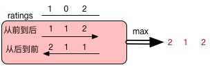

# 135 Candy

There are *N* children standing in a line. Each child is assigned a rating value.

You are giving candies to these children subjected to the following requirements:

- Each child must have at least one candy.
- Children with a higher rating get more candies than their neighbors.

What is the minimum candies you must give?

**Example 1:**

```
Input: [1,0,2]
Output: 5
Explanation: You can allocate to the first, second and third child with 2, 1, 2 candies respectively.
```

**Example 2:**

```
Input: [1,2,2]
Output: 4
Explanation: You can allocate to the first, second and third child with 1, 2, 1 candies respectively.
             The third child gets 1 candy because it satisfies the above two conditions.
```

## 解

只要右边的的得分比左边的大，就在左边的基础上+1；

最少是1；

从左到右遍历一遍，可以保证右边的邻居都比左边的大；

从右到左遍历一遍，可以保证左边的邻居比右边的大；

最后结果取两次遍历的最大值。



解题答案：

```cpp
 class Solution{
    public:
        int candy(vector<int>& ratings){
            if( ratings.size() == 0 ) return 0;
            int len = ratings.size(), ans = 0;          // candy sum up
            vector<int> nums( len, 1);        // all initiates to 1
            for( int i = 1; i < len; i++ ){
                if( ratings[i] > ratings[i-1] ) nums[i] = nums[i-1] + 1;
            }

            for( int i = len-1; i > 0; i--  ){
                if( ratings[i-1] > ratings[i] ){
                    nums[i-1] = max(nums[i-1], nums[i] + 1);
                }
                ans += nums[i];
            }

            return  ans + nums[0];
        }
    };

    void test(){
        Solution sol;
        vector<int> ratings {1,2,2};
        cout << sol.candy(ratings) << endl;
    }
```

参考： https://blog.csdn.net/qq508618087/article/details/51331132

从右到左的遍历，可以不用取最大值，用如下代替：

```cpp
 for(int i = len-1; i >0; i--)  
{  
            if(ratings[i-1] > ratings[i] && nums[i-1]<= nums[i])   // 只有左边比右边 <= 时，才更新
                nums[i-1] = nums[i]+1;  
            ans += nums[i];  
}  
```


