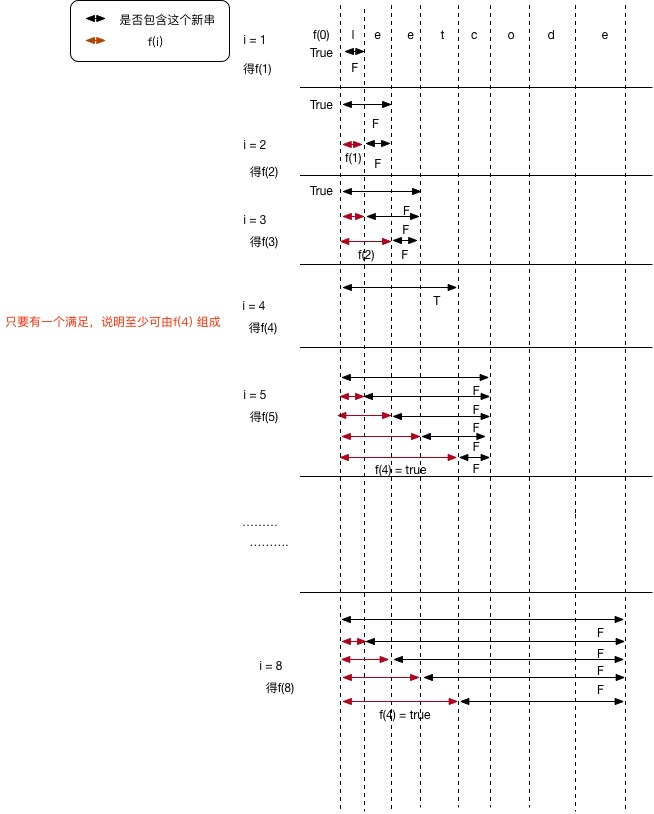

# 139 单词拆分

给定一个**非空**字符串 *s* 和一个包含**非空**单词列表的字典 *wordDict*，判定 *s* 是否可以被空格拆分为一个或多个在字典中出现的单词。

**说明：**

- 拆分时可以重复使用字典中的单词。
- 你可以假设字典中没有重复的单词。

**示例 1：**

```
输入: s = "leetcode", wordDict = ["leet", "code"]
输出: true
解释: 返回 true 因为 "leetcode" 可以被拆分成 "leet code"。
```

**示例 2：**

```
输入: s = "applepenapple", wordDict = ["apple", "pen"]
输出: true
解释: 返回 true 因为 "applepenapple" 可以被拆分成 "apple pen apple"。
     注意你可以重复使用字典中的单词。
```

**示例 3：**

```
输入: s = "catsandog", wordDict = ["cats", "dog", "sand", "and", "cat"]
输出: false
```

------

## 解

F(0, N) = F(0, i) && F(i, j) && F(j, N);  * 这样子，如果我们想知道某个子串是否可由Dict中的几个单词拼接而成就可以用这样的方式得到结果（满足条件为True, 不满足条件为False）存入到一个boolean数组的对应位置上，这样子，最后boolean 数组的最后一位就是F(0, N)的值，为True表示这个字符串S可由Dict中的单词拼接，否则不行！ 

这是一个动态规划问题，只要能将一个大问题划分成子问题即可。



```cpp
class Solution {
public:
    bool wordBreak(string s, vector<string>& wordDict) {
        vector<bool> f(s.size()+1, false);
        f[0] = true;
        for( int i = 1; i <= s.size(); i++ ){		// 因为 i 是从1 开始的，所以是 <= 
            for( int j = 0; j < i; j ++ ){
                if (f[j] && find(wordDict.begin(),wordDict.end(), s.substr(j, i - j))!= wordDict.end() ){
                    f[i] = true;
                    break;			// find one is ok.
                }
            }
        }
        return f[s.size()];
    }
};
```


Java 版本：

```cpp
public class Solution {
    public boolean wordBreak(String s, Set<String> dict) {
        
        boolean[] f = new boolean[s.length() + 1];
        
        f[0] = true;
        
        
        /* First DP
        for(int i = 1; i <= s.length(); i++){
            for(String str: dict){
                if(str.length() <= i){
                    if(f[i - str.length()]){
                        if(s.substring(i-str.length(), i).equals(str)){
                            f[i] = true;
                            break;
                        }
                    }
                }
            }
        }*/
        
        //Second DP
        for(int i=1; i <= s.length(); i++){
            for(int j=0; j < i; j++){
                if(f[j] && dict.contains(s.substring(j, i))){
                    f[i] = true;
                    break;
                }
            }
        }
        
        return f[s.length()];
    }
}
```

